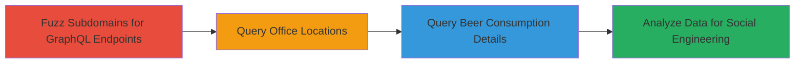

---
tags:
  - graphql
  - information-disclosure
  - reconnaissance
  - api-exploitation
type: attack_chain
tools:
  - '[[tools/wfuzz]]'
  - '[[tools/Burp-Suite]]'
tactics:
  - '[[Reconnaissance]]'
  - '[[Discovery]]'
  - '[[Collection]]'
commands:
  - '[[commands/graphql-query-locations]]'
  - '[[commands/graphql-query-beer-details]]'
platforms:
  - Web
complexity: medium
procedures:
  - '[[procedures/Fuzz-GraphQL-Endpoints-on-Subdomains]]'
  - '[[procedures/Query-GraphQL-for-Office-Locations]]'
  - '[[procedures/Query-GraphQL-for-Beer-Consumption-Data]]'
  - '[[procedures/Analyze-Disclosed-Internal-Data]]'
step_count: 4
techniques:
  - '[[Active Scanning]]'
  - '[[Exploit Public-Facing Application]]'
  - '[[Data from Information Repositories]]'
description: >-
  Multi-stage reconnaissance and exploitation chain targeting an unauthenticated
  GraphQL endpoint to disclose internal office locations and beer consumption
  details from Shopify's beerify service.
skill_level: intermediate
impact_level: high
id: 116cfdf7-8ece-430a-92fd-41dead9b93a3
created_at: '2025-12-14T17:25:59.630Z'
updated_at: '2025-12-14T17:25:59.630Z'
verified: false
validated: true
submitted: true
mitre_tactics:
  - '[[Reconnaissance]]'
  - '[[Discovery]]'
  - '[[Collection]]'
mitre_techniques:
  - '[[Active Scanning]]'
  - '[[Exploit Public-Facing Application]]'
  - '[[Data from Information Repositories]]'
---
# Unauthenticated GraphQL Introspection Leading to Internal Shopify Office and Beer Data Disclosure

## Overview

This attack chain exploits an unauthenticated GraphQL endpoint on beerify.shopifycloud.com, allowing full schema introspection and arbitrary queries without access controls. The process begins with fuzzing subdomains to identify responsive GraphQL endpoints, followed by introspection to map the schema, querying for office locations, retrieving detailed beer tap data, and analyzing it for social engineering opportunities. The disclosure reveals sensitive internal information like office addresses, contacts, and beer preferences, which could aid in targeted phishing or physical social engineering at events. Discovered via subdomain fuzzing and Burp Suite testing, this vulnerability highlights risks in exposed APIs.

## Chain Metrics Dashboard

| Metric | Value |
|--------|-------|
| Chain Status | Unverified |
| Total Steps | 4 |
| Execution Time | ~15 minutes |
| Skill Level | Intermediate |
| Complexity | Medium |
| Impact Level | High |

## Attack Flow Visualization



## Prerequisites & Requirements

### Required Tools

- [[tools/wfuzz]]
- [[tools/Burp-Suite]]

### Target Environment

- Web platform with GraphQL endpoints
- No authentication required
- Access to *.shopifycloud.com subdomains

### Initial Access Requirements

- Public internet access
- No credentials needed
- Basic knowledge of GraphQL and HTTP requests

## Detailed Attack Procedures

### Step 1: Fuzz Subdomains for GraphQL Endpoints
procedure: [[procedures/Fuzz-GraphQL-Endpoints-on-Subdomains]]

**Objective**: Identify active GraphQL endpoints on subdomains of *.shopifycloud.com by sending random queries and filtering for successful responses.

**Instructions**: Use [[tools/wfuzz]] to fuzz /graphql paths across collected subdomains with random GraphQL payloads, then switch to Burp Repeater for introspection after confirming responsiveness.

**Expected Output**: List of responsive endpoints, such as beerify.shopifycloud.com/graphql, with schema downloadable via introspection.

**Success Indicators**:
- 200 OK responses to GraphQL queries
- Successful schema introspection revealing types like allLocations and location

### Step 2: Query Office Locations
procedure: [[procedures/Query-GraphQL-for-Office-Locations]]

**Objective**: Retrieve all configured office locations, including addresses, codes, and contacts, using the identified endpoint.

**Instructions**: Send a POST request to the GraphQL endpoint using [[commands/graphql-query-locations]] in Burp Repeater or curl, ensuring Content-Type: application/json header.

```bash
curl -X POST https://beerify.shopifycloud.com/graphql \
  -H "Content-Type: application/json" \
  -d '{"query": "query allLocations{allLocations{address, code, contact}}"}'
```

**Expected Output**: JSON response with location data, e.g., {"data":{"allLocations":[{"address":"150 Elgin Street, Ottawa, ON, Canada, K2P1L4","code":"OTT150, 8th Floor","contact":"Alana Plomp (@alana.plomp)"}]}}.

**Success Indicators**:
- Locations array populated with internal details
- No authentication errors

### Step 3: Query Beer Consumption Data
procedure: [[procedures/Query-GraphQL-for-Beer-Consumption-Data]]

**Objective**: Use a location code from Step 2 to fetch detailed beer inventory, including brewery, style, ABV, IBU, tasting notes, and tap levels.

**Instructions**: Craft and send a targeted GraphQL query using [[commands/graphql-query-beer-details]] via POST to the same endpoint, substituting the location code.

```bash
curl -X POST https://beerify.shopifycloud.com/graphql \
  -H "Content-Type: application/json" \
  -d '{"query": "query location{location(code:\"OTT150, 8th Floor\"){taps{edges{node{percentRemaining, beer{brewery, ibu, style, tastingNotes, beerLogo, abv}}}}}}"}'
```

**Expected Output**: JSON with tap details, e.g., beers from Beau's Brewing Co with specifics like 89% remaining on American-style Brown Ale.

**Success Indicators**:
- Detailed beer data returned without errors
- Multiple taps with consumption percentages

### Step 4: Analyze Disclosed Internal Data
procedure: [[procedures/Analyze-Disclosed-Internal-Data]]

**Objective**: Review the collected data to identify actionable insights, such as employee preferences for social engineering.

**Instructions**: Parse the JSON responses manually or with jq to extract preferences, e.g., low-remaining Witbier indicating popularity.

**Expected Output**: Insights like "Ottawa office prefers Beau's Witbier (2% remaining), contact Alana Plomp."

**Success Indicators**:
- Identification of beer styles and contacts
- Potential leads for event-based phishing

## Attack Chain Summary

### Key Achievements

1. Discovered unauthenticated GraphQL endpoint via fuzzing
2. Disclosed internal office locations and contacts
3. Retrieved sensitive beer consumption data for social engineering
4. Demonstrated high-impact info disclosure without auth

## Technique & Tactic Coverage

### MITRE ATT&CK Techniques

- [[Active Scanning]]
- [[Exploit Public-Facing Application]]
- [[Data from Information Repositories]]

### MITRE ATT&CK Tactics

- [[Reconnaissance]]
- [[Discovery]]
- [[Collection]]

---

*Last updated: 2023-10-01*
