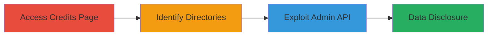

# Unauthenticated Jira Admin API Access for Project and User Information Disclosure

Multi-stage attack chain demonstrating unauthenticated access to Jira Server's sensitive pages and APIs, leading to disclosure of internal project data, user information, and admin configurations. This exploits known vulnerabilities in Jira Server (JRASERVER-73060 and CVE-2020-14179), allowing attackers to enumerate projects, resolutions, usernames, and potentially chain to arbitrary code execution on internal servers.

## Chain Metrics Dashboard

| Metric | Value |
|--------|-------|
| Chain Status | Unverified |
| Total Steps | 3 |
| Execution Time | ~5 minutes |
| Skill Level | Intermediate |
| Complexity | Medium |
| Impact Level | High |

## Attack Flow Visualization



## Prerequisites & Requirements

### Required Tools

- [[tools/curl]]

### Target Environment

- Jira Server instance (versions prior to 9.0 or without proper feature flags)
- Web platform with HTTP/HTTPS access
- No authentication required for public-facing endpoints

### Initial Access Requirements

- Network access to the Jira instance (e.g., via browser or HTTP client)
- No credentials needed due to unauthenticated nature
- Target URL: https://target.com/secure/JiraCreditsPage!default.jspa

## Detailed Attack Procedures

### Step 1: Access Credits Page
procedure: [[procedures/Access-Jira-Credits-Page-for-Instance-Enumeration]]

**Objective**: Gain initial unauthenticated access to the Jira credits page to expose instance details and developer information.

**Instructions**: Open a web browser and navigate to the target Jira credits page. This page is accessible without authentication, even if public access is disabled.

**Expected Output**: HTML page displaying Jira version, build details, and developer credits, indicating potential exposure points.

**Success Indicators**:
- Page loads without login prompt
- Instance information (e.g., version, plugins) is visible

### Step 2: Identify Sensitive Directories
procedure: [[procedures/Identify-Sensitive-Jira-Directories]]

**Objective**: Analyze the credits page response to discover sensitive directories or paths that may lead to further enumeration.

**Instructions**: Inspect the page source or network requests triggered by loading the credits page to identify any referenced directories related to Jira's internal structure.

**Expected Output**: Identification of paths like /rest/menu/latest/admin, hinting at unprotected API endpoints.

**Success Indicators**:
- Sensitive directory paths extracted from page metadata or redirects
- Confirmation of exposed internal resources

### Step 3: Exploit Admin API
procedure: [[procedures/Exploit-Unauthenticated-Admin-Menu-API]]

**Objective**: Send unauthenticated requests to the admin menu API to retrieve project categories, resolutions, usernames, and admin data.

**Instructions**: Use [[commands/curl-jira-admin-api]] to send a GET request to the admin endpoint with a high maxResults parameter:

```bash
curl -X GET 'https://target.com/rest/menu/latest/admin?maxResults=1000' -H 'Host: target.com' -H 'Connection: keep-alive' -H 'Pragma: no-cache' -H 'Cache-Control: no-cache' -H 'sec-ch-ua-platform: "Mac OS"' -H 'Sec-Fetch-Site: same-origin' -H 'Sec-Fetch-Mode: cors'
```

Validate the response for sensitive data exposure.

**Expected Output**: JSON response containing admin menu items, project categories (e.g., "projectCategory": {"id":1,"name":"Software"}), resolutions, and usernames.

**Success Indicators**:
- JSON payload includes internal data without auth errors
- Usernames and project details enumerated successfully

## Attack Chain Summary

### Key Achievements

1. Unauthenticated access to Jira credits page exposing instance metadata
2. Discovery of sensitive API endpoints through page analysis
3. Retrieval of admin-level data including projects and users, enabling further attacks like RCE chaining

## Technique & Tactic Coverage

### MITRE ATT&CK Techniques

- [[File and Directory Discovery]] File and Directory Discovery
- [[Exploit Public-Facing Application]] Exploit Public-Facing Application

### MITRE ATT&CK Tactics

- [[Discovery]] Discovery

---
*Last updated: 2023-10-01T00:00:00Z*
