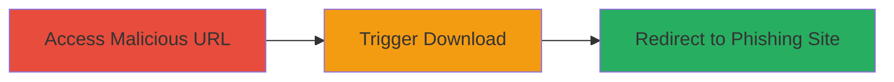

---
tags:
  - open-redirect
  - phishing
  - unauthenticated
  - owncloud
type: attack_chain
tools: []
tactics:
  - '[[Initial Access]]'
verified: false
platforms:
  - Web
submitted: true
complexity: medium
created_at: '2024-01-01T00:00:00Z'
procedures:
  - '[[procedures/Access-Malicious-PDF-Viewer-URL]]'
  - '[[procedures/Trigger-Download-Redirect]]'
  - '[[procedures/Observe-Phishing-Redirect]]'
step_count: 3
techniques:
  - '[[Exploit Public-Facing Application]]'
  - '[[T1566.001]]'
updated_at: '2025-12-14T17:24:30.475Z'
description: >-
  Multi-stage attack exploiting an open redirect vulnerability in ownCloud's
  files_pdfviewer app to enable unauthenticated phishing by redirecting users to
  malicious external domains via the download functionality.
skill_level: intermediate
impact_level: high
id: 1e818f88-ae90-4abd-b8a8-864e330f7c10
validated: true
mitre_tactics:
  - '[[Initial Access]]'
mitre_techniques:
  - '[[Exploit Public-Facing Application]]'
  - '[[T1566.001]]'
---
---

# Unauthenticated Open Redirect in ownCloud PDF Viewer for Phishing Attacks

Multi-stage attack chain demonstrating a complete attack workflow exploiting the open redirect in ownCloud's files_pdfviewer app.

## Chain Metrics Dashboard

| Metric | Value |
|--------|-------|
| Chain Status | Unverified |
| Total Steps | 3 |
| Execution Time | ~2 minutes |
| Skill Level | Intermediate |
| Complexity | Medium |
| Impact Level | High |

## Attack Flow Visualization

## Prerequisites & Requirements

### Required Tools

- Web browser (e.g., Chrome, Firefox)

### Target Environment

- ownCloud instance with files_pdfviewer app enabled
- Web platform
- No specific ports or services beyond standard HTTP/HTTPS

### Initial Access Requirements

- No credentials required (unauthenticated)
- Public access to the ownCloud PDF viewer endpoint
- No prior access needed

## Detailed Attack Procedures

### Step 1: Access Malicious PDF Viewer URL
procedure: [[procedures/Access-Malicious-PDF-Viewer-URL]]

**Objective**: Load the ownCloud PDF viewer with a malicious external URL in the 'file' parameter to set up the redirect trap.

**Instructions**: Construct and visit the vulnerable endpoint URL, replacing the domain and file path with a controlled malicious resource. For example, use https://target-owncloud.com/index.php/apps/files_pdfviewer?file=https://evildomain.xx/EvilFile.xx. The viewer will attempt to load the external file but fail to auto-load it, displaying an error or blank state.

**Expected Output**: The ownCloud PDF viewer interface loads without redirecting, showing the interface ready for interaction.

**Success Indicators**:
- PDF viewer page loads successfully
- No immediate redirect occurs
- Malicious URL is reflected in the page context

### Step 2: Trigger Download Redirect
procedure: [[procedures/Trigger-Download-Redirect]]

**Objective**: Interact with the download button to initiate the redirect to the external malicious domain.

**Instructions**: In the loaded PDF viewer, locate and click the download button (typically in the upper right corner of the viewer interface). This action bypasses validation and directly redirects the browser to the specified external URL.

**Expected Output**: Browser begins downloading the file from the external domain and navigates away from the ownCloud site.

**Success Indicators**:
- Download action initiates
- Browser URL changes to the external domain
- File download starts from evildomain.xx

### Step 3: Observe Phishing Redirect
procedure: [[procedures/Observe-Phishing-Redirect]]

**Objective**: Confirm the successful redirect and potential phishing impact, where the user is tricked into visiting and interacting with a malicious site.

**Instructions**: Monitor the browser behavior post-download trigger. The redirect should navigate to the full malicious URL, potentially serving a phishing page or malicious payload without any authentication checks on the ownCloud side.

**Expected Output**: Full navigation to https://evildomain.xx/EvilFile.xx, with the malicious content loaded or file downloaded.

**Success Indicators**:
- Successful redirect to external domain
- User isolated from ownCloud instance
- Phishing site or file interaction enabled

## Attack Chain Summary

### Key Achievements

1. Bypassed ownCloud's internal resource restrictions via unvalidated 'file' parameter
2. Enabled unauthenticated access to arbitrary external domains through UI interaction
3. Facilitated phishing attacks by tricking users into downloading and visiting malicious resources

## Technique & Tactic Coverage

### MITRE ATT&CK Techniques

- [[Exploit Public-Facing Application]] Exploit Public-Facing Application
- [[T1566.001]] Phishing: Spearphishing Attachment

### MITRE ATT&CK Tactics

- [[Initial Access]] Initial Access

---

*Last updated: 2024-01-01T00:00:00Z*
