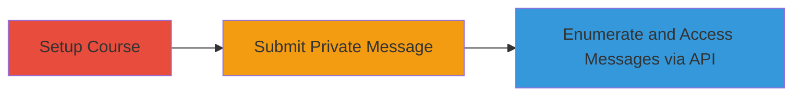

---
tags:
  - idor
  - information-disclosure
  - wordpress
  - rest-api
  - lms
type: attack_chain
tools: []
tactics:
  - '[[Discovery]]'
  - '[[Collection]]'
verified: false
platforms:
  - Web
submitted: true
complexity: medium
created_at: '2023-10-01T00:00:00Z'
procedures:
  - '[[procedures/Create-Course-in-Sensei-LMS]]'
  - '[[procedures/Submit-Private-Question-in-Sensei-LMS]]'
  - '[[procedures/Access-Private-Sensei-Messages-via-REST-API]]'
step_count: 3
techniques:
  - '[[Account Discovery]]'
  - '[[Data from Information Repositories]]'
updated_at: '2025-12-14T17:32:29.198Z'
description: >-
  Multi-stage demonstration of exploiting improper permissions in Sensei LMS
  WordPress plugin to disclose private student-teacher messages via
  unauthenticated REST API access and ID enumeration.
skill_level: intermediate
impact_level: high
id: 8620b732-6d41-4d59-a5b6-38aec04d7b77
validated: true
mitre_tactics:
  - '[[Discovery]]'
  - '[[Collection]]'
mitre_techniques:
  - '[[Account Discovery]]'
  - '[[Data from Information Repositories]]'
---
# Unauthenticated Private Messages Disclosure in Sensei LMS via REST API IDOR

Multi-stage attack chain demonstrating exploitation of improper permissions in the Sensei LMS WordPress plugin (versions <= 4.4.3) to access private student-teacher messages without authentication via the REST API endpoint.

## Chain Metrics Dashboard

| Metric | Value |
|--------|-------|
| Chain Status | Unverified |
| Total Steps | 3 |
| Execution Time | ~5 minutes |
| Skill Level | Intermediate |
| Complexity | Medium |
| Impact Level | High |

## Attack Flow Visualization

## Prerequisites & Requirements

### Required Tools

- None (manual setup and browser/curl for API access)

### Target Environment

- WordPress site with Sensei LMS plugin (versions <= 4.4.3)
- Required services/ports: HTTP/HTTPS on port 80/443
- Network access requirements: Public access to the WordPress site

### Initial Access Requirements

- No credentials required for exploitation phase
- Ability to interact with the frontend as a student (optional for setup)
- Network position: External unauthenticated access

## Detailed Attack Procedures

### Step 1: Setup Course
procedure: [[procedures/Create-Course-in-Sensei-LMS]]

**Objective**: Enable the contact teacher feature by creating a course, which generates the environment for private messaging.

**Instructions**: Access the WordPress admin dashboard or frontend course creation interface to set up a new course. Ensure the Sensei LMS plugin is active and the contact feature is enabled.

**Expected Output**: A new course is created, visible in the LMS interface.

**Success Indicators**:
- Course listed in the dashboard
- Contact teacher option available in the course page

### Step 2: Submit Private Question
procedure: [[procedures/Submit-Private-Question-in-Sensei-LMS]]

**Objective**: Generate a private sensei-message object with a numeric ID by submitting a question as a student.

**Instructions**: Log in as a student (or simulate via frontend), navigate to the course, and use the private messaging feature to ask a question to the teacher.

**Expected Output**: Question submitted successfully, creating a backend sensei-message entry.

**Success Indicators**:
- Confirmation message on submission
- Message appears in teacher/student interface (if authenticated)

### Step 3: Access Private Messages via API
procedure: [[procedures/Access-Private-Sensei-Messages-via-REST-API]]

**Objective**: Retrieve private messages without authentication by enumerating numeric IDs on the REST API endpoint.

**Instructions**: Identify potential message IDs (e.g., starting from 1 or known IDs), then use [[commands/curl-retrieve-sensei-message]] to send unauthenticated GET requests to the endpoint.

**Expected Output**: JSON response containing private message details, including content and user info.

**Success Indicators**:
- Unauthorized access to message content
- Exposure of sensitive student-teacher interactions

## Attack Chain Summary

### Key Achievements

1. Bypassed authentication on private messaging endpoint
2. Enabled enumeration of sequential numeric IDs to discover messages
3. Disclosed sensitive communications to unauthenticated attackers

## Technique & Tactic Coverage

### MITRE ATT&CK Techniques

- [[Account Discovery]] Account Discovery (enumerating message IDs reveals user interactions)
- [[Data from Information Repositories]] Data from Information Repositories (accessing private messages via API)

### MITRE ATT&CK Tactics

- [[Discovery]] Discovery
- [[Collection]] Collection

---
*Last updated: 2023-10-01T00:00:00Z*
