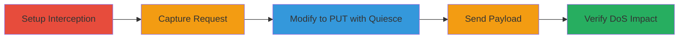

# Unauthenticated Quiesce State Change in PlayStation API Leading to Denial of Service

Multi-stage attack chain demonstrating exploitation of unrestricted access to the quiesce functionality in the dss.api.playstation.com REST API, allowing any unauthenticated user to trigger a denial-of-service by modifying the application state.

## Chain Metrics Dashboard

| Metric | Value |
|--------|-------|
| Chain Status | Unverified |
| Total Steps | 5 |
| Execution Time | ~5 minutes |
| Skill Level | Intermediate |
| Complexity | Medium |
| Impact Level | High |

## Attack Flow Visualization

## Prerequisites & Requirements

### Required Tools

- [[tools/Burp-Suite]]
- [[tools/Firefox-Developer-Tools]]

### Target Environment

- Web platform with access to https://dss.api.playstation.com
- No authentication required
- Network access to the public API endpoint

### Initial Access Requirements

- No credentials needed
- Direct internet access to the target API
- No prior access required

## Detailed Attack Procedures

### Step 1: Launch Interception Tool and Visit Endpoint
procedure: [[procedures/Intercept-and-Capture-API-Request-with-Burp-Suite]]

**Objective**: Set up traffic interception and access the target API state endpoint to capture the initial GET request.

**Instructions**: Launch the embedded browser in Burp Suite and navigate to the endpoint. Enable interception in the Proxy tab to capture outgoing requests.

**Expected Output**: The browser loads the endpoint, and the GET request appears in Burp's HTTP history.

**Success Indicators**:
- Embedded Chromium browser opens successfully
- GET request to /api/application/state is captured

### Step 2: Capture and Forward Request to Repeater
procedure: [[procedures/Intercept-and-Capture-API-Request-with-Burp-Suite]]

**Objective**: Isolate the captured GET request for modification by sending it to Burp Repeater.

**Instructions**: From the Proxy HTTP history, select the GET request and send it to Repeater for editing.

**Expected Output**: The request loads in the Repeater tab, ready for changes.

**Success Indicators**:
- Request appears in Repeater interface
- Original GET method and headers are visible

### Step 3: Modify Request Method and Payload
procedure: [[procedures/Modify-HTTP-Request-to-Quiesce-Payload]]

**Objective**: Transform the GET request into an unauthorized PUT request with the quiesce state payload.

**Instructions**: In Repeater, change the method to PUT, add JSON content-type header, and insert the quiesce body. Burp auto-fills Content-Length.

**Expected Output**: Modified request shows PUT method, application/json header, and {"appState":"quiesce"} body.

**Success Indicators**:
- Method updated to PUT
- Payload JSON is valid and included

### Step 4: Execute the Modified Request
procedure: [[procedures/Modify-HTTP-Request-to-Quiesce-Payload]]

**Objective**: Send the crafted PUT request to trigger the quiesce state change without authentication.

**Instructions**: Click Send in Repeater to transmit the request to the target endpoint.

**Expected Output**: Server accepts the PUT request, potentially returning a success status, initiating the quiesce process.

**Success Indicators**:
- Request sent successfully (200 or similar response)
- No authentication error

### Step 5: Validate Denial of Service Impact
procedure: [[procedures/Send-Modified-Request-and-Verify-DoS]]

**Objective**: Confirm the application is quiesced by checking for errors on related endpoints.

**Instructions**: Refresh the original page or access another API endpoint like /api/application.wadl to observe the outage.

**Expected Output**: Within 15 seconds, requests return 502 Bad Gateway errors, indicating unavailability lasting over an hour with repeated invocations.

**Success Indicators**:
- 502 errors on API calls
- Sustained unavailability confirmed

## Attack Chain Summary

### Key Achievements

1. Bypassed authorization to modify application state
2. Induced extended denial-of-service on the PlayStation DSS API
3. Demonstrated impact with minimal effort using standard tools

## Technique & Tactic Coverage

### MITRE ATT&CK Techniques

- [[Exploit Public-Facing Application]]
- [[Network Denial of Service]]

### MITRE ATT&CK Tactics

- [[Initial Access]]
- [[Privilege Escalation]]

---

*Last updated: 2024-01-01T00:00:00Z*
