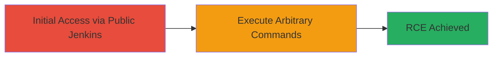

# Unauthenticated RCE in Jenkins via OS Command Injection

Multi-stage attack chain demonstrating exploitation of unauthenticated OS command injection in Jenkins to achieve remote code execution.

## Chain Metrics Dashboard

| Metric | Value |
|--------|-------|
| Chain Status | Unverified |
| Total Steps | 1 |
| Execution Time | ~5 minutes |
| Skill Level | Intermediate |
| Complexity | Medium |
| Impact Level | High |

## Attack Flow Visualization



## Prerequisites & Requirements

### Required Tools

- None (uses standard HTTP client like curl)

### Target Environment

- Publicly accessible Jenkins instance on port 80/443
- Web platform with Jenkins CI/CD server
- No authentication required

### Initial Access Requirements

- Internet access to the target URL (e.g., https://djangoci.com/)
- No credentials needed due to unauthenticated nature
- Basic knowledge of Jenkins endpoints

## Detailed Attack Procedures

### Step 1: Exploit Unauthenticated RCE
procedure: [[procedures/Exploit-Jenkins-Unauthenticated-RCE]]

**Objective**: Leverage OS command injection vulnerabilities in Jenkins to execute arbitrary commands on the server without authentication.

**Instructions**: Identify the vulnerable Jenkins instance and send a crafted payload to a susceptible endpoint, such as a build trigger or script console, exploiting CVEs like CVE-2018-1000861, CVE-2019-1003005, or CVE-2019-1003029. Use [[commands/curl-jenkins-rce-payload]] to inject and execute a command like 'id' to verify RCE:

```bash
curl -X POST 'https://djangoci.com/scriptText' --data 'import subprocess; subprocess.call("id", shell=True)'
```

Monitor the response or server logs for command output. If successful, escalate to more destructive actions.

**Expected Output**: Command execution result, e.g., server returns output like 'uid=1000(jenkins) gid=1000(jenkins)' or evidence of execution in Jenkins logs.

**Success Indicators**:
- Arbitrary command output visible in response or logs
- No authentication prompt during access
- Server-side effects observable (e.g., file creation or process listing)

## Attack Chain Summary

### Key Achievements

1. Gained unauthenticated access to execute OS commands on the Jenkins server
2. Demonstrated critical impact allowing full server compromise
3. Highlighted risks of exposed CI/CD tools without proper security controls

## Technique & Tactic Coverage

### MITRE ATT&CK Techniques

- [[Exploit Public-Facing Application]]
- [[Command-Line Interface]]

### MITRE ATT&CK Tactics

- [[Initial Access]]
- [[Execution]]

---
*Last updated: 2023-10-01T00:00:00Z*
