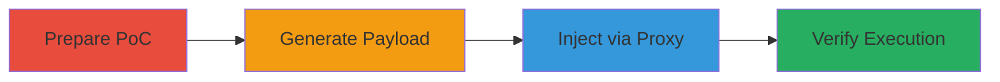

# Unauthenticated RCE in SharePoint via CVE-2019-0604 Deserialization

The vulnerability CVE-2019-0604 in Microsoft SharePoint allows unauthenticated remote code execution by deserializing untrusted user-supplied XAML data without validation. This attack chain demonstrates exploiting a U.S. Department of Defense SharePoint site shortly after patch release, using a public PoC to inject a malicious XAML payload via the picker.aspx endpoint, resulting in arbitrary Windows command execution under the SharePoint service account context. The chain covers preparation, payload generation, injection, and verification, potentially enabling full server compromise, privilege escalation, or lateral movement.

## Chain Metrics Dashboard

| Metric | Value |
|--------|-------|
| Chain Status | Unverified |
| Total Steps | 4 |
| Execution Time | ~15 minutes |
| Skill Level | Intermediate |
| Complexity | Medium |
| Impact Level | High |

## Attack Flow Visualization

## Prerequisites & Requirements

### Required Tools

- [[tools/Git]]
- [[tools/ConsoleApplication1]]
- [[tools/Burp-Suite]]
- [[tools/tcpdump]]

### Target Environment

- Microsoft SharePoint (Enterprise Server 2016, Foundation 2013 SP1, Server 2010 SP2, Server 2019)
- Vulnerable endpoint: /_layouts/15/picker.aspx
- Unpatched CVE-2019-0604
- Network access to the SharePoint site

### Initial Access Requirements

- No credentials required (unauthenticated)
- Direct internet access to the public-facing SharePoint site
- External server for ICMP listener (e.g., Linux VPS)

## Detailed Attack Procedures

### Step 1: Prepare PoC Repository
procedure: [[procedures/Prepare-SharePoint-CVE-2019-0604-PoC]]

**Objective**: Clone and configure the public PoC for CVE-2019-0604 to prepare the XAML payload template.

**Instructions**: Use [[commands/git-clone-poc]] to download the repository, then manually edit the t.xml file to customize the command for injection.

**Expected Output**: Local copy of the PoC with modified t.xml containing the desired command (e.g., ping to external host).

**Success Indicators**:
- Repository cloned successfully
- t.xml edited with custom command like `/c ping cloudbox2.legithost.info`

### Step 2: Generate Encoded Payload
procedure: [[procedures/Generate-Encoded-XAML-Payload]]

**Objective**: Build and encode the malicious XAML payload into a base64-like string for HTTP injection.

**Instructions**: Navigate to the build directory using [[commands/cd-to-poc-build]], then run [[commands/consoleapp-encode-payload]] to generate the encoded string from t.xml.

**Expected Output**: Long encoded string starting with '__' (e.g., __bp4b7135009700370047005600d600e200...).

**Success Indicators**:
- Directory changed successfully
- Encoded payload generated and copied

### Step 3: Inject Payload via Proxy
procedure: [[procedures/Inject-Payload-via-Picker-Endpoint]]

**Objective**: Intercept an HTTP request to the vulnerable picker.aspx endpoint and inject the encoded payload into the hiddenSpanDataValue parameter.

**Instructions**: Configure [[tools/Burp-Suite]] as a proxy, browse to the target URL (e.g., https://target/_layouts/15/picker.aspx), intercept the request, and replace the 'ctl00$PlaceHolderDialogBodySection$ctl05$hiddenSpanDataValue=' parameter with the encoded payload. Forward the request.

**Expected Output**: Modified request sent; server processes the deserialization leading to command execution.

**Success Indicators**:
- Request intercepted and modified in Burp Suite
- No immediate errors in response

### Step 4: Verify RCE with ICMP Listener
procedure: [[procedures/Verify-RCE-with-ICMP-Listener]]

**Objective**: Confirm command execution by monitoring for ICMP echo requests from the target server.

**Instructions**: On an external Linux server, run [[commands/tcpdump-icmp-listen]] to capture pings, then release the injected request and observe incoming packets.

**Expected Output**: tcpdump captures ICMP type 8 packets from the target's IP to the listener.

**Success Indicators**:
- ICMP requests received from target IP (e.g., ████████)
- Confirms RCE via observable network traffic

## Attack Chain Summary

### Key Achievements

1. Unauthenticated access to SharePoint without credentials
2. Successful deserialization of malicious XAML for cmd.exe execution
3. Demonstrated RCE with external ping, proving server compromise potential

## Technique & Tactic Coverage

### MITRE ATT&CK Techniques

- [[Exploit Public-Facing Application]]
- [[Windows Command Shell]]

### MITRE ATT&CK Tactics

- [[Initial Access]]
- [[Execution]]

---
*Last updated: 2023-10-01T00:00:00Z*
