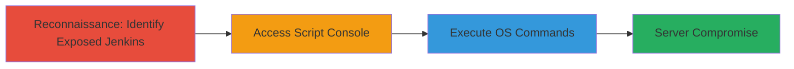

# Unauthenticated RCE on Exposed Jenkins Instance via Groovy Script Console

Multi-stage attack chain demonstrating exploitation of an unauthenticated Jenkins instance for remote code execution. The attack targets a publicly exposed Jenkins server, typically identified during reconnaissance of government or organizational web assets, and leverages the unprotected Groovy script console to inject and execute OS commands, leading to full server compromise.

## Chain Metrics Dashboard

| Metric | Value |
|--------|-------|
| Chain Status | Unverified |
| Total Steps | 2 |
| Execution Time | ~2 minutes |
| Skill Level | Intermediate |
| Complexity | Low |
| Impact Level | High |

## Attack Flow Visualization



## Prerequisites & Requirements

### Required Tools

- Web browser or [[tools/curl]]

### Target Environment

- Publicly accessible Jenkins instance (port 8080 or similar, web platform)
- No authentication enabled on the /_script endpoint
- Underlying OS supporting shell commands (e.g., Linux with 'ls' and 'whoami')

### Initial Access Requirements

- Internet access to the target URL
- No credentials required due to unauthenticated exposure
- Prior reconnaissance to confirm Jenkins via SSL certificate or directory structure

## Detailed Attack Procedures

### Step 1: Access Jenkins Script Console
procedure: [[procedures/Access-Jenkins-Script-Console]]

**Objective**: Gain access to the unauthenticated Groovy script console to enable script execution.

**Instructions**: Navigate to the target's Jenkins instance and directly access the script console endpoint. Use a web browser to visit the URL in the format https://target.com/_script. No login is required if the instance is misconfigured.

**Expected Output**: The Groovy script console interface loads, allowing input of Groovy code for execution.

**Success Indicators**:
- Script console page renders without authentication prompt
- Input field for Groovy scripts is available

### Step 2: Execute OS Commands via Groovy
procedure: [[procedures/Execute-OS-Commands-via-Groovy]]

**Objective**: Inject and execute arbitrary OS commands using Groovy scripting to confirm RCE and potentially compromise the server.

**Instructions**: In the script console, enter and execute Groovy code that invokes shell commands via the .execute() method. Start with reconnaissance commands like listing directories or identifying the user.

First, execute a directory listing using [[commands/groovy-ls-execute]]:

```groovy
println "ls".execute().text
```

Then, identify the executing user with [[commands/groovy-whoami-execute]]:

```groovy
println "whoami".execute().text
```

**Expected Output**: Output from the commands is printed in the console, such as a list of files for 'ls' or the Jenkins process username for 'whoami'.

**Success Indicators**:
- Command output appears in the console without errors
- Evidence of RCE, such as system file listings or user details

## Attack Chain Summary

### Key Achievements

1. Unauthenticated access to Jenkins script console
2. Successful execution of OS commands confirming RCE
3. Potential for full server compromise, including data exfiltration or persistence

## Technique & Tactic Coverage

### MITRE ATT&CK Techniques

- [[Exploit Public-Facing Application]]
- [[Command-Line Interface]]

### MITRE ATT&CK Tactics

- [[Initial Access]]
- [[Execution]]

---
*Last updated: 2023-10-01T00:00:00Z*
