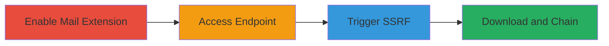

# Unauthenticated SSRF in Nextcloud Mail Extension via cerdic/csstidy for Internal Network Reconnaissance

Multi-stage attack chain demonstrating exploitation of an SSRF vulnerability in Nextcloud's mail extension to perform internal network reconnaissance and potential data exfiltration.

## Chain Metrics Dashboard

| Metric | Value |
|--------|-------|
| Chain Status | Unverified |
| Total Steps | 4 |
| Execution Time | ~5 minutes |
| Skill Level | Intermediate |
| Complexity | Medium |
| Impact Level | High |

## Attack Flow Visualization



## Prerequisites & Requirements

### Required Tools

- Browser or [[commands/curl-request]]

### Target Environment

- Nextcloud instance with mail app installable
- Web server exposing /apps/mail/vendor/cerdic/css-tidy/css_optimiser.php
- No authentication required

### Initial Access Requirements

- Public access to Nextcloud instance
- No credentials needed
- Network position: External attacker

## Detailed Attack Procedures

### Step 1: Enable Mail Extension
procedure: [[procedures/Enable-Nextcloud-Mail-Extension]]

**Objective**: Install and enable the Nextcloud mail extension to expose the vulnerable cerdic/csstidy module.

**Instructions**: Log in to the Nextcloud admin interface (if attacker has access) or assume the extension is enabled. Verify by checking for the /apps/mail path.

**Expected Output**: Mail app active, endpoint accessible.

**Success Indicators**:
- Mail app listed in apps section
- No errors on extension enablement

### Step 2: Access CSS Optimizer Endpoint
procedure: [[procedures/Access-CSS-Optimizer-Endpoint]]

**Objective**: Locate and visit the publicly accessible test interface for the CSS optimizer.

**Instructions**: Use a browser or [[commands/curl-request]] to access the endpoint:

```bash
curl -i http://target.com/apps/mail/vendor/cerdic/css-tidy/css_optimiser.php
```

**Expected Output**: PHP interface loads without authentication prompt.

**Success Indicators**:
- 200 OK response
- Interface form visible

### Step 3: Trigger SSRF with URL Parameter
procedure: [[procedures/Trigger-SSRF-with-URL-Parameter]]

**Objective**: Force the server to make an arbitrary HTTP request to test SSRF, such as to localhost.

**Instructions**: Append the url parameter to target internal resources using [[commands/curl-ssrf-trigger]]:

```bash
curl "http://target.com/apps/mail/vendor/cerdic/css-tidy/css_optimiser.php?url=http://localhost/test"
```

**Expected Output**: Server responds with content from the internal URL or error indicating request made.

**Success Indicators**:
- Response includes internal resource data
- No 403/401 blocks

### Step 4: Download Remote Data as CSS
procedure: [[procedures/Download-Remote-Data-as-CSS]]

**Objective**: Download external or internal data as a CSS file to the temp directory, enabling chaining with LFI/RFI.

**Instructions**: Use additional parameters to fetch and save CSS using [[commands/curl-css-download]]:

```bash
curl "http://target.com/apps/mail/vendor/cerdic/css-tidy/css_optimiser.php?url=http://target.com/apps/richdocuments/docs/custom.css&custom=1&template=4"
```

**Expected Output**: File saved to /apps/mail/vendor/cerdic/css-tidy/temp/ with fetched content as CSS.

**Success Indicators**:
- Temp file created with remote content
- Potential for further exploitation via LFI

## Attack Chain Summary

### Key Achievements

1. Unauthenticated access to SSRF endpoint
2. Internal network reconnaissance via arbitrary requests
3. Download of remote data to server filesystem
4. Potential chaining for RFI or deeper access

## Technique & Tactic Coverage

### MITRE ATT&CK Techniques

- [[Exploit Public-Facing Application]]

### MITRE ATT&CK Tactics

- [[Initial Access]]
- [[Reconnaissance]]

---

*Last updated: 2023-10-01T12:00:00Z*
