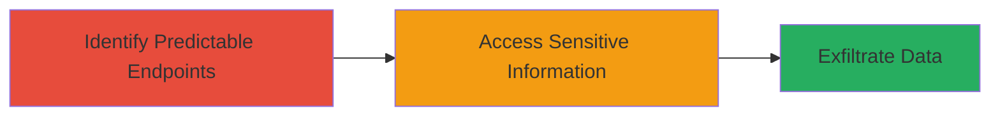

---
tags:
  - wordpress
  - information-disclosure
  - ajax
  - md5
  - cve-2021-38314
type: attack_chain
tools: []
tactics:
  - '[[Reconnaissance]]'
verified: false
platforms:
  - Web
submitted: true
complexity: medium
created_at: '2023-10-01T00:00:00Z'
procedures:
  - '[[procedures/Identify-Predictable-AJAX-Endpoints-in-Redux-Framework]]'
  - '[[procedures/Access-Sensitive-Information-via-Computed-AJAX-Endpoints]]'
step_count: 2
techniques:
  - '[[Gather Victim Host Information]]'
  - '[[Exploit Public-Facing Application]]'
updated_at: '2025-12-14T17:25:17.958Z'
description: >-
  Exploit predictable MD5-hashed AJAX endpoints in the Gutenberg Template
  Library & Redux Framework WordPress plugin to retrieve sensitive system
  information without authentication.
skill_level: intermediate
impact_level: medium
id: 14b15f52-275f-4229-a066-ce9b9e864413
validated: true
mitre_tactics:
  - '[[Reconnaissance]]'
mitre_techniques:
  - '[[Gather Victim Host Information]]'
  - '[[Exploit Public-Facing Application]]'
---
# Unauthenticated Sensitive Information Disclosure via Predictable AJAX Endpoints in Redux Framework

Multi-stage attack chain demonstrating exploitation of CVE-2021-38314 in the Gutenberg Template Library & Redux Framework WordPress plugin (versions 4.2.11 and below). The plugin registers AJAX actions with predictable endpoints based on MD5 hashes of the site URL concatenated with salts '-redux' and '-support', allowing unauthenticated attackers to guess endpoints and retrieve sensitive system information.

## Chain Metrics Dashboard

| Metric | Value |
|--------|-------|
| Chain Status | Unverified |
| Total Steps | 2 |
| Execution Time | ~5 minutes |
| Skill Level | Intermediate |
| Complexity | Medium |
| Impact Level | Medium |

## Attack Flow Visualization



## Prerequisites & Requirements

### Required Tools

- None (uses built-in commands like md5sum and curl)

### Target Environment

- WordPress site with Gutenberg Template Library & Redux Framework plugin (v4.2.11 or below)
- Web platform accessible over HTTP/HTTPS
- No authentication required

### Initial Access Requirements

- Publicly accessible WordPress site URL
- Network access to the target (no credentials needed)
- No prior access required

## Detailed Attack Procedures

### Step 1: Identify Predictable AJAX Endpoints
procedure: [[procedures/Identify-Predictable-AJAX-Endpoints-in-Redux-Framework]]

**Objective**: Analyze the plugin's endpoint generation to compute predictable MD5 hashes for AJAX actions.

**Instructions**: Obtain the target site's URL (e.g., https://example.com). Compute the MD5 hash of the site URL concatenated with the known salts '-redux' and '-support' using [[commands/compute-md5-hash]]:

```bash
echo -n "https://example.com-redux" | md5sum
```

Repeat for the '-support' salt. These hashes form the predictable endpoints for unauthenticated AJAX requests.

**Expected Output**: Hexadecimal MD5 hash values, e.g., 'a1b2c3d4e5f67890...' for each salt.

**Success Indicators**:
- Valid MD5 hashes computed for both salts
- Hashes match the plugin's endpoint generation pattern

### Step 2: Access Sensitive Information
procedure: [[procedures/Access-Sensitive-Information-via-Computed-AJAX-Endpoints]]

**Objective**: Send unauthenticated AJAX requests to the computed endpoints to retrieve sensitive system information.

**Instructions**: Use the computed hashes to construct the AJAX endpoint URL, typically /wp-admin/admin-ajax.php with action parameters tied to the hashes. Send a POST request using [[commands/curl-ajax-request]]:

```bash
curl -X POST 'https://example.com/wp-admin/admin-ajax.php' \
  -d 'action=redux_support&endpoint=computed_hash_here' \
  -H 'Content-Type: application/x-www-form-urlencoded'
```

Replace 'computed_hash_here' with the MD5 output from Step 1. Inspect the response for sensitive data like system configuration or plugin details.

**Expected Output**: JSON or serialized response containing sensitive system information.

**Success Indicators**:
- Response returns unauthorized sensitive data
- No authentication prompt or error

## Attack Chain Summary

### Key Achievements

1. Bypassed authentication via predictable endpoint guessing
2. Retrieved sensitive system information from WordPress backend
3. Demonstrated medium-severity impact (CVSS 4.6) without user interaction

## Technique & Tactic Coverage

### MITRE ATT&CK Techniques

- [[Gather Victim Host Information]] Gather Victim Host Information
- [[Exploit Public-Facing Application]] Exploit Public-Facing Application

### MITRE ATT&CK Tactics

- [[Reconnaissance]] Reconnaissance

---
*Last updated: 2023-10-01T00:00:00Z*
