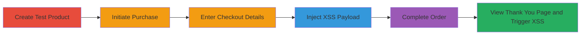

# Unauthenticated Stored XSS in Shopify Checkout Leading to Arbitrary JavaScript Execution on Store Domains

Multi-stage attack chain demonstrating a complete attack workflow exploiting an unauthenticated stored XSS in Shopify's checkout process. The vulnerability allows injection of HTML tags like <html> into the first name field, which is rendered unsanitized in the <title> tag of the post-order thank you page. This leads to arbitrary JavaScript execution on any .myshopify.com domain when admins or users view the thank you page, enabling theft of CSRF tokens, sensitive data, and malicious actions.

## Chain Metrics Dashboard

| Metric | Value |
|--------|-------|
| Chain Status | Unverified |
| Total Steps | 6 |
| Execution Time | ~5 minutes |
| Skill Level | Intermediate |
| Complexity | Medium |
| Impact Level | High |

## Attack Flow Visualization

## Prerequisites & Requirements

### Required Tools

- Web browser (e.g., Chrome with developer tools for payload testing)

### Target Environment

- Shopify store on .myshopify.com domain
- Access to checkout.shopify.com
- Admin access to create products

### Initial Access Requirements

- Valid Shopify admin account for product creation
- No authentication required for checkout exploitation
- Network access to the target store and checkout domains

## Detailed Attack Procedures

### Step 1: Create Test Product
procedure: [[procedures/Create-Zero-Price-Product-for-Testing]]

**Objective**: Set up a low-friction product to enable testing of the checkout process without financial barriers.

**Instructions**: Log in to the Shopify admin dashboard and create a new product with zero price and zero shipping taxes to simulate a purchase easily.

**Expected Output**: A product listed in the store catalog ready for purchase.

**Success Indicators**:
- Product visible on the store frontend
- Price set to $0 with no taxes

### Step 2: Initiate Purchase
procedure: [[procedures/Initiate-Purchase-as-User]]

**Objective**: Start the checkout flow as an unauthenticated user to reach the customer details form.

**Instructions**: Navigate to the store's product page, select the test product, and click the buy button to redirect to checkout.shopify.com.

**Expected Output**: Redirect to the checkout form.

**Success Indicators**:
- Checkout page loads
- Product added to cart

### Step 3: Enter Customer Details
procedure: [[procedures/Enter-Customer-Details-in-Checkout]]

**Objective**: Fill in basic required fields to progress through the checkout while preparing for payload injection.

**Instructions**: On the checkout form at checkout.shopify.com, input valid details for last name, address, email, and other required fields, leaving first name for the next step.

**Expected Output**: Form validation passes for entered fields.

**Success Indicators**:
- No errors on form submission
- Progress to shipping or payload injection step

### Step 4: Inject XSS Payload
procedure: [[procedures/Inject-XSS-Payload-in-First-Name-Field]]

**Objective**: Exploit the weak input validation in the first name field to inject a malicious HTML payload that bypasses filters.

**Instructions**: In the first name input field, enter the payload `'</title></head><html onmouseover=alert(2)>` and submit the form.

**Expected Output**: Payload accepted without rejection.

**Success Indicators**:
- Input field accepts the <html> tag
- Checkout proceeds to next stage

### Step 5: Complete Checkout
procedure: [[procedures/Complete-Checkout-Process]]

**Objective**: Finalize the order to store the injected payload and generate the thank you page.

**Instructions**: Continue to shipping method (select free or $0 option), then payment method (use a test or skipped payment since price is $0), and click 'Complete order'.

**Expected Output**: Order confirmation and redirect to thank you page.

**Success Indicators**:
- Order completes successfully
- Thank you page URL generated with checkout ID

### Step 6: Trigger XSS
procedure: [[procedures/Trigger-XSS-on-Thank-You-Page]]

**Objective**: Render the thank you page to execute the injected JavaScript, demonstrating arbitrary code execution.

**Instructions**: View the thank you page at checkout.shopify.com. For store domain execution, navigate to `<store>.myshopify.com/0/checkouts/<checkout_id>/thank_you` (e.g., https://example.myshopify.com/14372648/checkouts/5e566284338e71d6adc542b6567b4cf0/thank_you). Hover over the page to trigger the onmouseover alert.

**Expected Output**: Alert box pops up with '2', confirming XSS execution.

**Success Indicators**:
- JavaScript alert triggers
- Potential for stealing CSRF tokens or sensitive data via modified payload

## Attack Chain Summary

### Key Achievements

1. Bypassed input validation to inject <html> tag in first name field
2. Achieved stored XSS persistence on thank you pages
3. Enabled arbitrary JS execution on any .myshopify.com domain for admins and users

## Technique & Tactic Coverage

### MITRE ATT&CK Techniques

- [[JavaScript]]

### MITRE ATT&CK Tactics

- [[Execution]]
- [[Collection]]

---
*Last updated: 2023-10-01T00:00:00Z*
