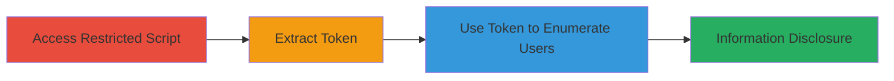

# Unauthenticated User Enumeration via Authorization Bypass in ImpressCMS

Multi-stage attack chain demonstrating exploitation of incorrect authorization checks in ImpressCMS's /include/findusers.php, allowing unauthenticated attackers to disclose usernames and real names of registered users by leveraging a security token from public pages.

## Chain Metrics Dashboard

| Metric | Value |
|--------|-------|
| Chain Status | Unverified |
| Total Steps | 3 |
| Execution Time | ~5 minutes |
| Skill Level | Intermediate |
| Complexity | Medium |
| Impact Level | High |

## Attack Flow Visualization



## Prerequisites & Requirements

### Required Tools

- Web browser with developer tools (e.g., Chrome DevTools)
- Optional: [[tools/curl]] for scripted access

### Target Environment

- ImpressCMS web application
- PHP-based web server
- Accessible via HTTP/HTTPS on standard ports (80/443)

### Initial Access Requirements

- No credentials required
- Direct network access to the target web application
- No prior access needed

## Detailed Attack Procedures

### Step 1: Access Findusers Script Without Authentication
procedure: [[procedures/Access-Findusers-Script-Without-Authentication]]

**Objective**: Verify that the /include/findusers.php endpoint is accessible but restricted without proper authorization, setting up for token-based bypass.

**Instructions**: Open a web browser and navigate directly to the target's /include/findusers.php without logging in. Observe any error or restriction messages indicating access denial.

For scripted verification, use [[commands/curl-access-findusers]]:

```bash
curl -i "http://target.com/include/findusers.php"
```

**Expected Output**: HTTP response showing access denied or blank/error page without user data.

**Success Indicators**:
- Endpoint responds but does not disclose user information
- Confirms unauthenticated access is blocked initially

### Step 2: Extract Security Token from Misc Page
procedure: [[procedures/Extract-Security-Token-from-Misc-Page]]

**Objective**: Obtain a valid XOOPS security token from an unauthenticated public page to use in the bypass.

**Instructions**: Navigate to /misc.php?action=showpopups&type=friend in the browser. Right-click and view page source, then search for 'XOOPS_TOKEN_REQUEST' to locate and copy the token value (a string like a hash or session ID).

For scripted extraction, use [[commands/curl-extract-token]] followed by grep:

```bash
curl "http://target.com/misc.php?action=showpopups&type=friend" | grep -o 'XOOPS_TOKEN_REQUEST[^<]*'
```

**Expected Output**: Token value extracted from HTML, e.g., XOOPS_TOKEN_REQUEST=abc123def456.

**Success Indicators**:
- Valid token retrieved without authentication
- Token is present in the public page source

### Step 3: Bypass Authorization with Token for User Enumeration
procedure: [[procedures/Bypass-Authorization-with-Token-for-User-Enumeration]]

**Objective**: Use the extracted token to access the findusers script and enumerate registered users' usernames and real names.

**Instructions**: Append the token to the URL and access /include/findusers.php?token=[TOKEN_VALUE]. The script will process the request, bypassing auth checks, and return search results for users.

For scripted access, use [[commands/curl-bypass-with-token]]:

```bash
curl "http://target.com/include/findusers.php?token=abc123def456"
```

**Expected Output**: List of usernames and real names from the database.

**Success Indicators**:
- User data disclosed without login
- Search functionality works, revealing registered users

## Attack Chain Summary

### Key Achievements

1. Confirmed authorization flaw in findusers.php
2. Extracted token from public misc.php
3. Achieved unauthenticated user enumeration

## Technique & Tactic Coverage

### MITRE ATT&CK Techniques

- [[Exploit Public-Facing Application]]
- [[Account Discovery]]

### MITRE ATT&CK Tactics

- [[Discovery]]

---
*Last updated: 2023-10-01T00:00:00Z*
