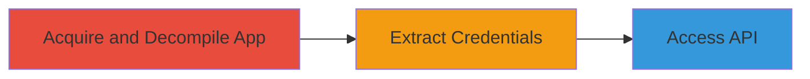

# Unauthorized API Access via Hardcoded Credentials in 8x8 Android App

Multi-stage attack chain demonstrating the discovery and exploitation of hardcoded credentials in the 8x8 Android mobile application, enabling unauthorized access to a third-party bug capture API for pushing bug information.

## Chain Metrics Dashboard

| Metric | Value |
|--------|-------|
| Chain Status | Unverified |
| Total Steps | 3 |
| Execution Time | ~15 minutes |
| Skill Level | Intermediate |
| Complexity | Medium |
| Impact Level | High |

## Attack Flow Visualization



## Prerequisites & Requirements

### Required Tools

- [[tools/apktool]]
- [[tools/jadx]]

### Target Environment

- Android mobile platform
- Access to the 8x8 APK file (e.g., from app stores or direct download)
- Local development environment with Java JDK installed

### Initial Access Requirements

- No prior credentials needed
- Internet access for downloading the APK
- Basic reverse engineering knowledge

## Detailed Attack Procedures

### Step 1: Acquire and Decompile App
procedure: [[procedures/Download-and-Decompile-Android-APK]]

**Objective**: Obtain the 8x8 Android APK and decompile it to access the application's resources and code.

**Instructions**: Download the 8x8 APK from a trusted source like the Google Play Store using a tool like [[commands/apk-download]]. Then decompile it using [[commands/apktool-decompile]]:

```bash
apktool d 8x8.apk -o decompiled_app
```

Follow up by opening the decompiled resources in [[tools/jadx]] for bytecode analysis:

```bash
jadx -d jadx_output 8x8.apk
```

**Expected Output**: Decompiled smali code, resources, and manifest files in the output directories.

**Success Indicators**:
- APK successfully decompiled without errors
- Access to AndroidManifest.xml and res/ directories

### Step 2: Extract Credentials
procedure: [[procedures/Extract-Hardcoded-Credentials-from-APK]]

**Objective**: Search the decompiled app for hardcoded credentials embedded in URLs or configuration files.

**Instructions**: Use [[commands/grep-search-strings]] to scan for potential credential patterns in the decompiled files:

```bash
grep -r "api_key\|token\|credential\|https://bugcapture" decompiled_app/
```

Examine the output for URLs pointing to third-party bug capture APIs, such as those containing embedded username/password pairs.

**Expected Output**: Lines showing hardcoded credentials, e.g., a URL like "https://bugcapture.example.com?user=hardcoded_user&pass=hardcoded_pass".

**Success Indicators**:
- Identification of credentials in app code or resources
- Confirmation of API endpoint details

### Step 3: Access API
procedure: [[procedures/Access-Third-Party-API-with-Exfiltrated-Credentials]]

**Objective**: Use the extracted credentials to authenticate and interact with the third-party bug capture API.

**Instructions**: Construct an API request using [[commands/curl-api-test]] with the hardcoded credentials:

```bash
curl -X POST "https://bugcapture.example.com/push" -d "bug_data=test" -u "hardcoded_user:hardcoded_pass"
```

Monitor the response for successful pushes or error messages indicating valid access.

**Expected Output**: API response confirming bug information push, e.g., JSON with success status.

**Success Indicators**:
- Successful API authentication
- Ability to push data without additional authorization

## Attack Chain Summary

### Key Achievements

1. Decompilation of the 8x8 Android app to reveal internal structure
2. Extraction of sensitive hardcoded credentials for a third-party API
3. Demonstration of unauthorized access leading to potential information disclosure

## Technique & Tactic Coverage

### MITRE ATT&CK Techniques

- [[Unsecured Credentials]] Unsecured Credentials
- [[Credentials In Files]] Embedded Credentials

### MITRE ATT&CK Tactics

- [[Credential Access]] Credential Access

---
*Last updated: 2023-10-01T12:00:00Z*
