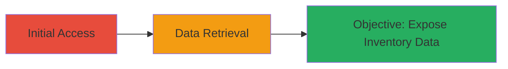

---
tags:
  - authentication-bypass
  - unauthorized-access
  - web-vulnerability
type: attack_chain
tools: []
tactics:
  - '[[Initial Access]]'
commands:
  - '[[commands/curl-access-inventory-endpoint]]'
verified: false
platforms:
  - Web
submitted: true
complexity: low
procedures:
  - '[[procedures/Access-Unauthenticated-Sell-Mode-Inventory-Endpoint]]'
step_count: 2
techniques:
  - '[[Exploit Public-Facing Application]]'
description: >-
  A simple attack chain exploiting an unauthenticated endpoint to access
  sensitive sell mode inventory data on CS Money, potentially exposing
  user-related information.
skill_level: beginner
impact_level: medium
id: 4d92045c-5a36-4bb9-977e-f875a0e79c1a
created_at: '2025-12-14T17:30:58.964Z'
updated_at: '2025-12-14T17:30:58.964Z'
validated: true
mitre_tactics:
  - '[[Initial Access]]'
mitre_techniques:
  - '[[Exploit Public-Facing Application]]'
---
# Unauthorized Access to CS Money Sell Mode Inventory via Unauthenticated Endpoint

Multi-stage attack chain demonstrating unauthorized access to sensitive inventory data through a misconfigured web endpoint.

## Chain Metrics Dashboard

| Metric | Value |
|--------|-------|
| Chain Status | Unverified |
| Total Steps | 2 |
| Execution Time | ~1 minute |
| Skill Level | Beginner |
| Complexity | Low |
| Impact Level | Medium |

## Attack Flow Visualization



## Prerequisites & Requirements

### Required Tools

- Web browser or [[commands/curl-access-inventory-endpoint]]

### Target Environment

- Web platform
- Access to public internet
- No special services or ports required beyond standard HTTPS (443)

### Initial Access Requirements

- No credentials needed
- Direct network access to https://cs.money
- No prior access required

## Detailed Attack Procedures

### Step 1: Access the Endpoint Directly
procedure: [[procedures/Access-Unauthenticated-Sell-Mode-Inventory-Endpoint]]

**Objective**: Gain unauthorized entry to the sell mode inventory endpoint without authentication to retrieve sensitive data.

**Instructions**: Open a web browser and navigate to the target URL, or use [[commands/curl-access-inventory-endpoint]] to simulate the request:

```bash
curl https://cs.money/load_sell_mode_inventory
```

**Expected Output**: JSON response containing sell mode inventory data, including user-related inventory details.

**Success Indicators**:
- Response returns without authentication prompt
- Inventory data visible in the output

### Step 2: Observe and Analyze Response
procedure: [[procedures/Access-Unauthenticated-Sell-Mode-Inventory-Endpoint]]

**Objective**: Review the retrieved data for sensitive information exposure.

**Instructions**: Inspect the response from the previous step for inventory details. In a browser, the data loads directly; with curl, parse the JSON output manually or using tools like jq.

**Expected Output**: Detailed inventory information that should typically require login.

**Success Indicators**:
- User inventories exposed
- No login redirection or error

## Attack Chain Summary

### Key Achievements

1. Bypassed authentication to access protected endpoint
2. Retrieved sell mode inventory data
3. Demonstrated potential for information disclosure

## Technique & Tactic Coverage

### MITRE ATT&CK Techniques

- [[Exploit Public-Facing Application]]

### MITRE ATT&CK Tactics

- [[Initial Access]]

---
*Last updated: 2023-10-01*
