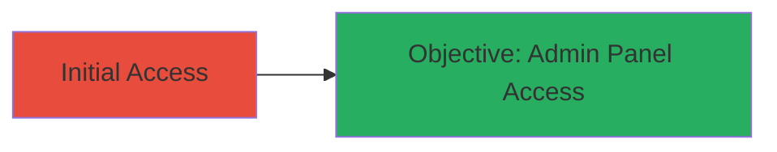

# Unauthorized Access to Control Panel via Missing Authorization

## Overview

This attack chain demonstrates how missing authorization enforcement on the choice.av.ru control panel allows any unauthenticated user to access administrative features. Discovered during a security assessment, the vulnerability enables unauthorized viewing and potentially modifying sensitive data or actions without login credentials. The impact is medium severity, as it exposes administrative functions to the public.

## Chain Metrics Dashboard

| Metric | Value |
|--------|-------|
| Chain Status | Unverified |
| Total Steps | 1 |
| Execution Time | ~1 minute |
| Skill Level | Beginner |
| Complexity | Low |
| Impact Level | Medium |

## Attack Flow Visualization



## Prerequisites & Requirements

### Required Tools

- Web browser or [[commands/curl-access-endpoint]]

### Target Environment

- Web platform
- Accessible via public internet
- No specific ports required beyond standard HTTP/HTTPS (80/443)

### Initial Access Requirements

- No credentials needed
- Direct network access to choice.av.ru
- No prior access required

## Detailed Attack Procedures

### Step 1: Access Control Panel Without Authentication
procedure: [[procedures/Bypass-Authorization-for-Control-Panel-Access]]

**Objective**: Gain unauthorized entry to the administrative control panel by directly accessing restricted endpoints, bypassing any authorization checks.

**Instructions**: Use a web browser to navigate to the control panel URL, such as `https://choice.av.ru/admin` or similar administrative paths. Alternatively, verify access using [[commands/curl-access-endpoint]] to fetch the panel content:

```bash
curl -v https://choice.av.ru/admin
```

If the response returns administrative interface elements (e.g., HTML forms for user management or settings), the bypass is successful. Inspect the response for sensitive data like user lists or configuration options.

**Expected Output**: HTTP 200 response with control panel HTML, including admin features, instead of a 401/403 error or redirect to login.

**Success Indicators**:
- Access to admin dashboard without login prompt
- Visibility of sensitive administrative functions
- Ability to perform actions like viewing or editing data

## Attack Chain Summary

### Key Achievements

1. Bypassed authorization to access restricted admin endpoints
2. Exposed potential for data manipulation or sensitive information disclosure
3. Demonstrated medium-impact vulnerability in web application access controls

## Technique & Tactic Coverage

### MITRE ATT&CK Techniques

- [[Exploit Public-Facing Application]]

### MITRE ATT&CK Tactics

- [[Initial Access]]

---
*Last updated: 2023-10-01T00:00:00Z*
