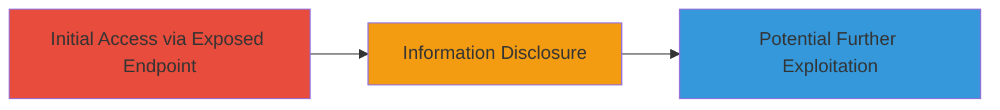

# Unauthorized Access to Exposed Script on Unikrn CRM Server Leading to Information Disclosure

Multi-stage attack chain demonstrating unauthorized access to a publicly exposed script on the Unikrn CRM server, followed by extraction of sensitive configuration data, potentially enabling further exploitation.

## Chain Metrics Dashboard

| Metric | Value |
|--------|-------|
| Chain Status | Unverified |
| Total Steps | 2 |
| Execution Time | ~1 minutes |
| Skill Level | Beginner |
| Complexity | Low |
| Impact Level | High |

## Attack Flow Visualization



## Prerequisites & Requirements

### Required Tools

- None (uses standard web browser or curl)

### Target Environment

- Web platform
- Mautic CRM service running on PHP/Symfony
- No specific ports required (HTTPS/443 implied)

### Initial Access Requirements

- Internet access to the target URL
- No credentials or prior access needed

## Detailed Attack Procedures

### Step 1: Access Exposed Script File
procedure: [[procedures/Access-Exposed-Script-File]]

**Objective**: Gain unauthorized access to the exposed script file on the CRM server to retrieve its contents.

**Instructions**: Directly navigate to the exposed URL using a web browser or execute [[commands/curl-access-exposed-url]] to fetch the script content.

```bash
curl -k https://crm.unikrn.com/███████
```

**Expected Output**: The raw content of the script file, including any embedded code or configuration.

**Success Indicators**:
- Script file loads without authentication prompt
- Server responds with 200 OK and file contents

### Step 2: Extract Sensitive Configuration from Script
procedure: [[procedures/Extract-Sensitive-Configuration-from-Script]]

**Objective**: Review the accessed script for hardcoded sensitive data, such as Mautic configuration keys, to identify exploitable secrets.

**Instructions**: Inspect the output from the previous step for configuration values. Use grep or manual review to locate items like 'mautic.secret_key'. No additional command execution is needed beyond inspection.

**Expected Output**: Identification of sensitive strings, e.g., 'mautic.secret_key' values that could be used for further attacks.

**Success Indicators**:
- Sensitive keys or configurations found in the script
- Potential for using disclosed secrets in subsequent exploits

## Attack Chain Summary

### Key Achievements

1. Bypassed authentication to access server-side script
2. Disclosed hardcoded sensitive configuration from Mautic
3. Enabled potential unauthorized server operations or further compromise

## Technique & Tactic Coverage

### MITRE ATT&CK Techniques

- [[Exploit Public-Facing Application]]
- [[File and Directory Discovery]]

### MITRE ATT&CK Tactics

- [[Initial Access]]

---

*Last updated: 2023-10-01T00:00:00Z*
