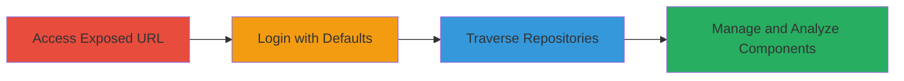

---
tags:
  - nexus
  - default-credentials
  - misconfiguration
  - unauthorized-access
  - repository
type: attack_chain
tools: []
tactics:
  - '[[Initial Access]]'
commands:
  - '[[commands/curl-access-nexus-url]]'
  - '[[commands/curl-login-nexus-anonymous]]'
verified: false
platforms:
  - Web
submitted: true
complexity: low
created_at: '2023-10-01T00:00:00Z'
procedures:
  - '[[procedures/Access-Exposed-Nexus-Repository-URL]]'
  - '[[procedures/Login-with-Default-Anonymous-Credentials]]'
  - '[[procedures/View-and-Traverse-Repository-Contents]]'
step_count: 3
techniques:
  - '[[Valid Accounts]]'
  - '[[Default Accounts]]'
  - '[[Exploit Public-Facing Application]]'
updated_at: '2025-12-14T17:29:27.912Z'
description: >-
  A multi-stage attack exploiting an exposed Nexus Repository Manager instance
  using default anonymous credentials to gain unauthorized read/write access to
  repositories, allowing dependency management, component deletion, and
  application analysis.
skill_level: beginner
impact_level: high
id: f5d5f674-6c70-4b71-b80b-79898464d165
validated: true
mitre_tactics:
  - '[[Initial Access]]'
mitre_techniques:
  - '[[Valid Accounts]]'
  - '[[Default Accounts]]'
  - '[[Exploit Public-Facing Application]]'
---
# Unauthorized Access to Nexus Repository Manager via Default Anonymous Credentials

Multi-stage attack chain demonstrating unauthorized access to an exposed Nexus Repository Manager instance through default credentials, enabling repository management and data exposure.

## Chain Metrics Dashboard

| Metric | Value |
|--------|-------|
| Chain Status | Unverified |
| Total Steps | 3 |
| Execution Time | ~2 minutes |
| Skill Level | Beginner |
| Complexity | Low |
| Impact Level | High |

## Attack Flow Visualization



## Prerequisites & Requirements

### Required Tools

- Web browser or [[commands/curl-access-nexus-url]]

### Target Environment

- Web platform with Nexus Repository Manager service exposed
- Publicly accessible URL without authentication restrictions
- Default anonymous user enabled

### Initial Access Requirements

- Internet access to the target URL
- No prior credentials needed; defaults suffice
- No special network position required

## Detailed Attack Procedures

### Step 1: Access the Exposed Nexus Repository URL
procedure: [[procedures/Access-Exposed-Nexus-Repository-URL]]

**Objective**: Confirm the Nexus Repository Manager is publicly accessible without restrictions.

**Instructions**: Navigate to the target Nexus URL using a web browser or execute [[commands/curl-access-nexus-url]] to verify accessibility:

```bash
curl -I https://nexus.imgur.com/
```

If using a browser, directly visit https://nexus.imgur.com/ and observe the login page or dashboard without errors.

**Expected Output**: HTTP 200 OK response or login interface loads, indicating public exposure.

**Success Indicators**:
- Page loads without access denial
- No authentication prompt before initial access

### Step 2: Login with Default Anonymous Credentials
procedure: [[procedures/Login-with-Default-Anonymous-Credentials]]

**Objective**: Authenticate using unchanged default credentials to bypass security controls.

**Instructions**: On the login page, enter username 'anonymous' and password 'anonymous'. Alternatively, simulate with [[commands/curl-login-nexus-anonymous]]:

```bash
curl -u anonymous:anonymous https://nexus.imgur.com/service/rest/v1/status
```

Submit the form or run the command to authenticate.

**Expected Output**: Successful login redirect to dashboard or API response with status 200 and repository access.

**Success Indicators**:
- Dashboard or repository list appears
- No authentication error messages

### Step 3: View and Traverse Repository Contents
procedure: [[procedures/View-and-Traverse-Repository-Contents]]

**Objective**: Explore and potentially manipulate repository data, including dependencies and components.

**Instructions**: After login, navigate to the repositories section in the UI. Use browser developer tools or API calls to list contents, e.g., via curl to browse assets:

```bash
curl -u anonymous:anonymous https://nexus.imgur.com/service/rest/v1/search?repository=ALL
```

Traverse paths to view, proxy, or delete components as permitted by anonymous role.

**Expected Output**: List of repositories, assets, and components visible; ability to download or manage items.

**Success Indicators**:
- Repository traversal without restrictions
- Access to manage/delete components confirmed

## Attack Chain Summary

### Key Achievements

1. Confirmed public exposure of Nexus instance
2. Gained unauthorized authentication via defaults
3. Accessed and potentially manipulated sensitive repository data

## Technique & Tactic Coverage

### MITRE ATT&CK Techniques

- [[Valid Accounts]] Valid Accounts
- [[Default Accounts]] Default Accounts
- [[Exploit Public-Facing Application]] Exploit Public-Facing Application

### MITRE ATT&CK Tactics

- [[Initial Access]] Initial Access

---

*Last updated: 2023-10-01T00:00:00Z*
