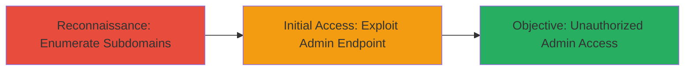

---
tags:
  - access-control
  - unauthorized-access
  - enumeration
  - web-vulnerability
type: attack_chain
tools: []
tactics:
  - '[[Initial Access]]'
commands: []
platforms:
  - Web
complexity: low
procedures:
  - '[[procedures/Enumerate-Subdomains-and-Admin-Endpoints]]'
  - '[[procedures/Access-Unprotected-Admin-Interface]]'
step_count: 2
techniques:
  - '[[Exploit Public-Facing Application]]'
  - '[[Active Scanning]]'
description: >-
  An attack chain exploiting improper access control on the PageSpeed Global
  Admin endpoint through subdomain discovery and direct navigation, leading to
  unauthorized administrative access.
skill_level: beginner
impact_level: high
id: a7f832bf-1eb5-4b8e-ac14-0ec45e5520cf
created_at: '2025-12-14T17:29:10.074Z'
updated_at: '2025-12-14T17:29:10.074Z'
verified: false
validated: true
submitted: true
mitre_tactics:
  - '[[Initial Access]]'
mitre_techniques:
  - '[[Exploit Public-Facing Application]]'
  - '[[Active Scanning]]'
---
# Unauthorized Access to PageSpeed Global Admin via Subdomain Enumeration

Multi-stage attack chain demonstrating a complete attack workflow.

## Chain Metrics Dashboard

| Metric | Value |
|--------|-------|
| Chain Status | Unverified |
| Total Steps | 2 |
| Execution Time | ~5 minutes |
| Skill Level | Beginner |
| Complexity | Low |
| Impact Level | High |

## Attack Flow Visualization

## Prerequisites & Requirements

### Required Tools

- Web browser (e.g., Chrome or Firefox)

### Target Environment

- Web platform
- Publicly accessible subdomain (e.g., webtools.paloalto.com)
- No authentication required for enumeration

### Initial Access Requirements

- Internet access
- No credentials needed
- Direct network connectivity to the target subdomain

## Detailed Attack Procedures

### Step 1: Subdomain and Endpoint Enumeration
procedure: [[procedures/Enumerate-Subdomains-and-Admin-Endpoints]]

**Objective**: Identify the target subdomain and discover accessible admin endpoints without authentication.

**Instructions**: Manually explore the target domain's subdomains using a web browser. Start by navigating to known or guessed subdomains like webtools.paloalto.com. Once on the subdomain's main page, inspect the site structure, common paths, or use browser developer tools to enumerate potential admin endpoints such as /pagespeed-global-admin/.

**Expected Output**: Identification of the /pagespeed-global-admin/ path as publicly accessible.

**Success Indicators**:
- Subdomain (webtools.paloalto.com) is reachable
- Admin endpoint path is discovered and loads without errors

### Step 2: Access the Vulnerable Admin Endpoint
procedure: [[procedures/Access-Unprotected-Admin-Interface]]

**Objective**: Gain unauthorized access to the PageSpeed Global Admin interface by directly navigating to the unprotected endpoint.

**Instructions**: Use a web browser to directly visit the identified admin URL: https://webtools.paloalto.com/pagespeed-global-admin/. No login or authentication prompts should appear, confirming the vulnerability.

**Expected Output**: Full access to the admin dashboard or functions without any authentication barriers.

**Success Indicators**:
- Page loads successfully without redirecting to a login
- Administrative features are visible and interactive

## Attack Chain Summary

### Key Achievements

1. Successful enumeration of the vulnerable subdomain and admin path
2. Direct unauthorized access to sensitive administrative functions
3. Potential exposure of PageSpeed configuration or data

## Technique & Tactic Coverage

### MITRE ATT&CK Techniques

- [[Active Scanning]]
- [[Exploit Public-Facing Application]]

### MITRE ATT&CK Tactics

- [[Initial Access]]

---
*Last updated: 2023-10-01*
