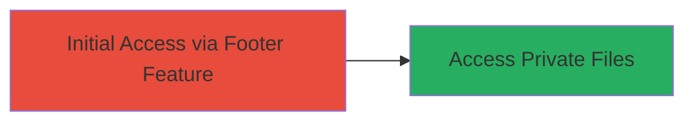

# Unauthorized Access to Private Files via Lark Footer Improper Access Control

Multi-stage attack chain demonstrating a complete attack workflow.

## Chain Metrics Dashboard

| Metric | Value |
|--------|-------|
| Chain Status | Unverified |
| Total Steps | 1 |
| Execution Time | ~1 minutes |
| Skill Level | Beginner |
| Complexity | Low |
| Impact Level | High |

## Attack Flow Visualization



## Prerequisites & Requirements

### Required Tools

- None (uses standard HTTP client like curl)

### Target Environment

- Target OS/Platform: Web application (Lark platform)
- Required services/ports: HTTP/HTTPS on port 80/443
- Network access requirements: Direct internet access to Lark's public-facing web application

### Initial Access Requirements

- Credential requirements: None (bypasses authentication)
- Network position: External attacker with internet access
- Prior access needed: None

## Detailed Attack Procedures

### Step 1: Exploit Footer Feature for Unauthorized Access
procedure: [[procedures/Exploit-Lark-Footer-Access-Control-Bypass]]

**Objective**: Bypass authorization checks in the Lark footer feature to retrieve private files without proper permissions.

**Instructions**: Identify the footer feature endpoint in the Lark web application, typically accessible via a public URL. Craft a request to load a private file through the footer without authentication. Use a tool like curl to send an HTTP request to the vulnerable endpoint, specifying a private file path.

For example, if the footer endpoint is `/footer` and it accepts a file parameter, request a known or guessed private file:

```bash
curl -X GET "https://lark.example.com/footer?file=/path/to/private/file.txt" -H "User-Agent: Mozilla/5.0"
```

This exploits the lack of authorization checks, causing the server to return the private file content.

**Expected Output**: The response body contains the contents of the private file, such as document text or sensitive data, instead of an access denied error.

**Success Indicators**:
- HTTP 200 response with private file contents
- No authentication prompt or redirect to login

## Attack Chain Summary

### Key Achievements

1. Bypassed access controls in the footer feature
2. Retrieved unauthorized private files
3. Demonstrated potential for data exfiltration from Lark's web platform

## Technique & Tactic Coverage

### MITRE ATT&CK Techniques

- [[Exploit Public-Facing Application]]

### MITRE ATT&CK Tactics

- [[Initial Access]]

---
*Last updated: 2023-10-01T00:00:00Z*
