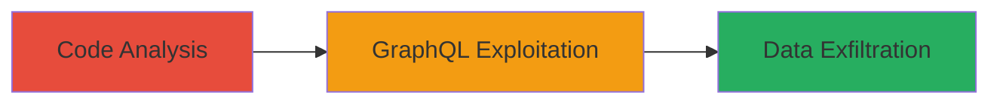

# Unauthorized Access to Private Program Structured Scopes via GraphQL Node Interface

Multi-stage attack chain demonstrating exploitation of a missing authorization check in HackerOne's Ruby on Rails application, allowing authenticated pentesters to access structured scope objects from private programs they are not authorized for. The vulnerability stems from the StructuredScope protector class failing to verify user association with a Pentest object or program invitation, relying only on the H1_PENTESTER role.

## Chain Metrics Dashboard

| Metric | Value |
|--------|-------|
| Chain Status | Unverified |
| Total Steps | 2 |
| Execution Time | ~5 minutes |
| Skill Level | Intermediate |
| Complexity | Medium |
| Impact Level | High |

## Attack Flow Visualization



## Prerequisites & Requirements

### Required Tools

- GraphQL client (e.g., curl or Postman)

### Target Environment

- HackerOne platform (Ruby on Rails with GraphQL API)
- Authenticated access as H1_PENTESTER role
- No specific ports; web-based API access

### Initial Access Requirements

- Valid HackerOne pentester account with H1_PENTESTER role
- API access to GraphQL endpoint
- Knowledge of target StructuredScope global IDs (e.g., from prior recon or enumeration)

## Detailed Attack Procedures

### Step 1: Analyze Authorization Logic
procedure: [[procedures/Analyze-StructuredScope-Protector-Authorization-Logic]]

**Objective**: Identify the missing authorization check in the StructuredScope protector to confirm the bypass opportunity.

**Instructions**: Review the source code in app/protectors/protected_structured_scope.rb around line 42. Look for the policy that grants access based solely on the H1_PENTESTER role without verifying Pentest association or program invitation.

**Expected Output**: Confirmation of improper access logic allowing broad access to StructuredScope objects.

**Success Indicators**:
- Code review reveals no program-specific permission checks
- Understanding gained of exploitation vector via GraphQL node interface

### Step 2: Exploit GraphQL Node Interface
procedure: [[procedures/Exploit-GraphQL-Node-Interface-for-StructuredScope-Access]]

**Objective**: Use the GraphQL node interface to fetch unauthorized StructuredScope data from a private program.

**Instructions**: Authenticate to the HackerOne GraphQL API and submit a query using the node interface with a base64-encoded global ID of a target StructuredScope from a private program. Use [[commands/graphql-query-fetch-structuredscope]] to retrieve sensitive fields.

```graphql
query { node(id: "Z2lkOi8vaGFja2Vyb25lL1N0cnVjdHVyZWRTY29wZS8x") { ... on StructuredScope { _id asset_identifier asset_type } } }
```

Replace the ID with a valid global ID (e.g., "Z2lkOi8vaGFja2Vyb25lL1N0cnVjdHVyZWRTY29wZS8x" for gid://hackerone/StructuredScope/1).

**Expected Output**: JSON response exposing _id, asset_identifier, and asset_type from the private program's scope.

**Success Indicators**:
- Sensitive attributes returned without authorization errors
- Confirmation of information disclosure from unauthorized program

## Attack Chain Summary

### Key Achievements

1. Identified authorization flaw in Ruby protector class
2. Exploited GraphQL endpoint to access private program data
3. Demonstrated high-severity information leakage (CVSS 8.3)

## Technique & Tactic Coverage

### MITRE ATT&CK Techniques

- [[Exploit Public-Facing Application]]

### MITRE ATT&CK Tactics

- [[Initial Access]]

---
*Last updated: 2023-10-01T00:00:00Z*
