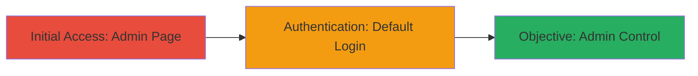

# Unauthorized Access to Remedy SSO via Default Admin Credentials

Multi-stage attack chain demonstrating unauthorized access to an internet-exposed Remedy Single Sign-On server using default credentials, leading to full administrative control over the SSO system.

## Chain Metrics Dashboard

| Metric | Value |
|--------|-------|
| Chain Status | Unverified |
| Total Steps | 2 |
| Execution Time | ~2 minutes |
| Skill Level | Beginner |
| Complexity | Low |
| Impact Level | High |

## Attack Flow Visualization

## Prerequisites & Requirements

### Required Tools

- Web browser (e.g., Chrome, Firefox)

### Target Environment

- Remedy Single Sign-On server exposed on the internet
- Web platform with HTTPS access
- No specific ports beyond standard 443 (HTTPS)

### Initial Access Requirements

- Internet connectivity
- No prior credentials or access needed
- Target URL publicly accessible

## Detailed Attack Procedures

### Step 1: Access Admin Login Page
procedure: [[procedures/Access-Remedy-SSO-Admin-Page]]

**Objective**: Locate and navigate to the Remedy SSO administrative login interface to prepare for authentication attempts.

**Instructions**: Open a web browser and directly navigate to the admin login endpoint of the target Remedy SSO server.

**Expected Output**: The admin login page loads, displaying fields for username and password.

**Success Indicators**:
- Page title or URL indicates "/rsso/admin/#/
- Login form is visible and interactive

### Step 2: Attempt Login with Default Credentials
procedure: [[procedures/Login-with-Default-Remedy-SSO-Credentials]]

**Objective**: Authenticate using known default administrator credentials to bypass security and gain admin access.

**Instructions**: On the login page, enter the default username and password, then submit the form.

**Expected Output**: Successful login redirects to the admin dashboard, granting access to SSO configuration and user data.

**Success Indicators**:
- Dashboard loads without errors
- Administrative functions (e.g., user management, config changes) are accessible

## Attack Chain Summary

### Key Achievements

1. Exposed admin interface discovery via direct URL access
2. Successful authentication with unchanged defaults, violating secure configuration practices
3. Full control over SSO, enabling sensitive data retrieval and system modifications for the organization (MTN Group)

## Technique & Tactic Coverage

### MITRE ATT&CK Techniques

- [[Default Accounts]]

### MITRE ATT&CK Tactics

- [[Initial Access]]

---
*Last updated: 2023-10-01T00:00:00Z*
