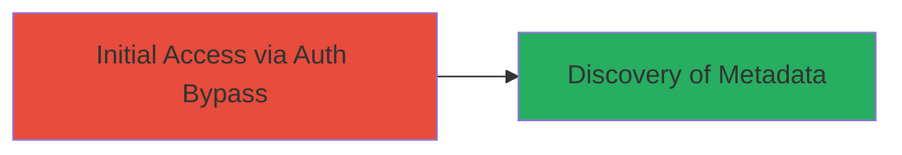

# Unauthorized Access to Slack Workspace Metadata via Improper Authentication

Multi-stage attack chain demonstrating a complete attack workflow.

## Chain Metrics Dashboard

| Metric | Value |
|--------|-------|
| Chain Status | Unverified |
| Total Steps | 1 |
| Execution Time | ~1 minutes |
| Skill Level | Beginner |
| Complexity | Low |
| Impact Level | Medium |

## Attack Flow Visualization



## Prerequisites & Requirements

### Required Tools

- None (uses standard HTTP client like curl)

### Target Environment

- Target Platform: Web
- Required services/ports: Slack API endpoints (HTTPS/443)
- Network access requirements: Internet access to Slack's public endpoints

### Initial Access Requirements

- Credential requirements: None (exploits improper auth)
- Network position: External attacker
- Prior access needed: None

## Detailed Attack Procedures

### Step 1: Exploit Authentication Bypass
procedure: [[procedures/Exploit-Slack-Improper-Authentication-for-Metadata-Access]]

**Objective**: Bypass authentication checks to access sensitive workspace metadata and settings without valid credentials.

**Instructions**: Use a standard HTTP client to send unauthorized requests to Slack's metadata endpoints. For example, execute [[commands/curl-slack-metadata-access]] to fetch workspace details:

```bash
curl -X GET "https://slack.com/api/team.info?token=invalid_or_missing" -H "Accept: application/json"
```

This request targets endpoints that fail to enforce proper authentication, returning workspace metadata such as team name, domain, and settings.

**Expected Output**: JSON response containing workspace metadata, e.g., {"team":{"name":"Example Workspace","domain":"example.slack.com","...":{...}}}

**Success Indicators**:
- JSON response with workspace details without requiring a valid token
- No authentication error (e.g., 401 Unauthorized)

## Attack Chain Summary

### Key Achievements

1. Bypassed authentication to access protected endpoints
2. Retrieved sensitive workspace metadata including settings and configuration
3. Demonstrated potential for information disclosure without credentials

## Technique & Tactic Coverage

### MITRE ATT&CK Techniques

- [[Exploit Public-Facing Application]]
- [[Account Discovery]]

### MITRE ATT&CK Tactics

- [[Initial Access]]
- [[Discovery]]

---
*Last updated: 2023-10-01T00:00:00Z*
