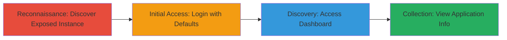

# Unauthorized Access to Spring Boot Admin Dashboard via Default Credentials

Multi-stage attack chain demonstrating unauthorized access to a Spring Boot Admin dashboard through reconnaissance and exploitation of default credentials, leading to potential information disclosure from the administrative interface.

## Chain Metrics Dashboard

| Metric | Value |
|--------|-------|
| Chain Status | Unverified |
| Total Steps | 3 |
| Execution Time | ~5 minutes |
| Skill Level | Beginner |
| Complexity | Low |
| Impact Level | Medium |

## Attack Flow Visualization



## Prerequisites & Requirements

### Required Tools

- Web browser (e.g., Chrome or Firefox)
- Optional: [[tools/curl]] for command-line access

### Target Environment

- Web platform with Spring Boot applications
- Exposed administrative interface on port 80/443 (HTTP/HTTPS)
- No specific services beyond web server

### Initial Access Requirements

- Public network access to the target instance
- No prior credentials needed; relies on defaults
- Knowledge of common Spring Boot Admin paths (e.g., /admin, /applications)

## Detailed Attack Procedures

### Step 1: Discover Exposed Spring Boot Admin Instance
procedure: [[procedures/Discover-Exposed-Spring-Boot-Admin-Instance]]

**Objective**: Identify publicly accessible Spring Boot Admin instances through reconnaissance and enumeration of common administrative paths.

**Instructions**: Begin by scanning the target domain or IP for common Spring Boot Admin endpoints using a web browser or command-line tool. Manually navigate to suspected paths like http://target.com/admin or http://target.com/applications. Alternatively, use [[commands/curl-check-path]] to probe for the presence of the dashboard:

```bash
curl -I http://target.com/admin
```

If the response indicates a 200 OK or redirects to a login page, the instance is exposed. Verify by checking for Spring Boot Admin-specific headers or titles in the response.

**Expected Output**: HTTP response confirming the endpoint exists, such as a login page or dashboard redirect.

**Success Indicators**:
- Endpoint responds without 404 error
- Page title or content mentions "Spring Boot Admin"

### Step 2: Attempt Login with Default Credentials
procedure: [[procedures/Attempt-Login-with-Default-Credentials]]

**Objective**: Authenticate to the admin dashboard using unchanged default credentials to bypass authentication.

**Instructions**: Navigate to the login page of the discovered instance in a web browser. Enter the default username "admin" and password "admin" (common for Spring Boot Admin). If the form is POST-based, use [[commands/curl-login-attempt]] to simulate the login:

```bash
curl -X POST http://target.com/admin/login -d "username=admin&password=admin" -c cookies.txt
```

Capture any session cookies for subsequent requests. If successful, the response will redirect to the dashboard or set authentication cookies.

**Expected Output**: Successful authentication redirect or session cookie indicating logged-in state.

**Success Indicators**:
- No authentication error; redirect to dashboard
- Valid session cookie received

### Step 3: Access Spring Boot Admin Dashboard
procedure: [[procedures/Access-Spring-Boot-Admin-Dashboard]]

**Objective**: Gain access to the administrative interface to view application metrics and potentially disclose sensitive information.

**Instructions**: With authentication established, load the dashboard in the browser or use the session cookie with [[commands/curl-access-dashboard]] to fetch dashboard contents:

```bash
curl -b cookies.txt http://target.com/admin/applications
```

Review the dashboard for application health, logs, metrics, and any environmental details. Note any exposed endpoints or configurations.

**Expected Output**: Dashboard interface displaying Spring Boot application instances, health status, and metrics.

**Success Indicators**:
- Dashboard loads with administrative views
- Application information visible without errors

## Attack Chain Summary

### Key Achievements

1. Identified exposed administrative interface via path enumeration
2. Bypassed authentication using default credentials
3. Accessed dashboard for potential information gathering, confirming vulnerability despite no sensitive data present

## Technique & Tactic Coverage

### MITRE ATT&CK Techniques

- [[Active Scanning]] Active Scanning
- [[Default Accounts]] Default Accounts
- [[Exploit Public-Facing Application]] Exploit Public-Facing Application

### MITRE ATT&CK Tactics

- [[Reconnaissance]] Reconnaissance
- [[Initial Access]] Initial Access

---
*Last updated: 2023-10-01T00:00:00Z*
