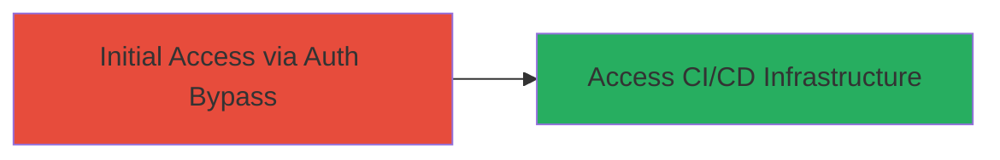

---
tags:
  - improper-authentication
  - ci-cd
  - unauthorized-access
  - cloud
type: attack_chain
tools: []
tactics:
  - '[[Initial Access]]'
verified: false
platforms:
  - Cloud
submitted: true
complexity: low
procedures:
  - '[[procedures/Exploit-Improper-Authentication-in-CI-CD-System]]'
step_count: 1
techniques:
  - '[[Valid Accounts]]'
description: >-
  A single-stage attack exploiting improper authentication to gain unauthorized
  access to sensitive CI/CD infrastructure.
skill_level: low
impact_level: high
id: 0477f68e-1962-43ce-a1ab-b1a88f9c01b4
created_at: '2025-12-14T17:29:36.280Z'
updated_at: '2025-12-14T17:29:36.280Z'
validated: true
mitre_tactics:
  - '[[Initial Access]]'
mitre_techniques:
  - '[[Valid Accounts]]'
---
# Unauthorized Access to Starbucks CI/CD System via Improper Authentication

Multi-stage attack chain demonstrating a complete attack workflow.

## Chain Metrics Dashboard

| Metric | Value |
|--------|-------|
| Chain Status | Unverified |
| Total Steps | 1 |
| Execution Time | ~1 minutes |
| Skill Level | Low |
| Complexity | Low |
| Impact Level | High |

## Attack Flow Visualization



## Prerequisites & Requirements

### Required Tools

- None (uses standard HTTP client like curl)

### Target Environment

- Cloud-based CI/CD platform
- Exposed web endpoints for CI/CD management
- No specific ports required beyond standard HTTPS (443)

### Initial Access Requirements

- Public internet access to the target endpoint
- No credentials needed due to improper authentication
- Basic knowledge of HTTP requests

## Detailed Attack Procedures

### Step 1: Exploit Improper Authentication
procedure: [[procedures/Exploit-Improper-Authentication-in-CI-CD-System]]

**Objective**: Gain unauthorized access to the CI/CD system by bypassing authentication checks, allowing viewing or manipulation of build pipelines and sensitive configurations.

**Instructions**: Identify the exposed CI/CD endpoint (e.g., a management dashboard or API). Use [[commands/curl-unauth-access]] to send an HTTP request without any authentication headers or tokens:

```bash
curl -v https://ci-cd.starbucks.com/dashboard
```

If the vulnerability exists, the server will respond with internal content without prompting for credentials. Verify the response for signs of successful access, such as pipeline logs or configuration data.

**Expected Output**: HTTP 200 response containing sensitive CI/CD data, such as build histories, deployment scripts, or access tokens, instead of a 401/403 error.

**Success Indicators**:
- Access to restricted pages or APIs without login
- Exposure of internal system details in the response
- No authentication challenge issued

## Attack Chain Summary

### Key Achievements

1. Bypassed authentication to access CI/CD management interface
2. Potential exposure of sensitive build artifacts and configurations
3. Demonstrated high-impact risk to production deployment integrity

## Technique & Tactic Coverage

### MITRE ATT&CK Techniques

- [[Valid Accounts]]

### MITRE ATT&CK Tactics

- [[Initial Access]]

---
*Last updated: 2023-10-01*
