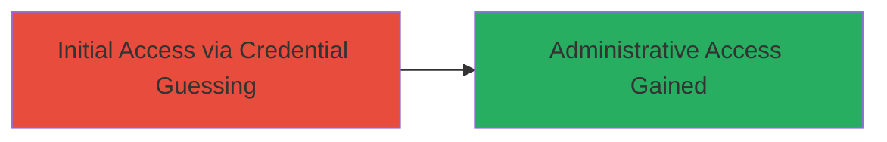

# Unauthorized Admin Access via Guessable Default Credentials in ownCloud

Multi-stage attack chain demonstrating a complete attack workflow.

## Chain Metrics Dashboard

| Metric | Value |
|--------|-------|
| Chain Status | Unverified |
| Total Steps | 1 |
| Execution Time | ~1 minutes |
| Skill Level | Beginner |
| Complexity | Low |
| Impact Level | High |

## Attack Flow Visualization



## Prerequisites & Requirements

### Required Tools

- Browser or HTTP client for login attempts

### Target Environment

- Web platform
- ownCloud instance publicly accessible
- No specific ports required beyond standard HTTPS (443)

### Initial Access Requirements

- Public network access to the target URL
- No prior credentials needed
- Knowledge of common default credentials like 'admin/admin'

## Detailed Attack Procedures

### Step 1: Credential Guessing on Login Page
procedure: [[procedures/Exploit-Default-Admin-Credentials-on-ownCloud]]

**Objective**: Gain unauthorized access to the admin account by attempting default credentials on the ownCloud login page.

**Instructions**: Navigate to the ownCloud instance URL and attempt login with username 'admin' and password 'admin'. This exploits the use of guessable default credentials on a test server.

For manual testing, open a browser and enter the credentials in the login form. Alternatively, simulate with an HTTP POST request using a tool like curl:

```bash
curl -X POST https://test1.owncloud.com/owncloud6/index.php/login -d "user=admin&password=admin"
```

**Expected Output**: Successful login redirect or session cookie indicating admin access.

**Success Indicators**:
- Login succeeds without errors
- Access to admin dashboard or file management interface
- No sensitive data present, but full administrative privileges granted

## Attack Chain Summary

### Key Achievements

1. Discovered and exploited default 'admin' credentials on public test instance
2. Gained full administrative access to ownCloud environment
3. Demonstrated impact of weak authentication configurations

## Technique & Tactic Coverage

### MITRE ATT&CK Techniques

- [[Valid Accounts]] Valid Accounts
- [[Default Accounts]] Default Accounts

### MITRE ATT&CK Tactics

- [[Initial Access]] Initial Access

---
*Last updated: 2023-10-01T00:00:00Z*
