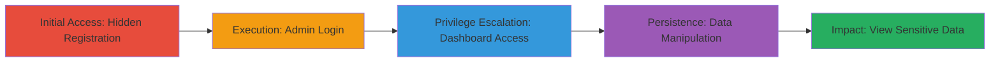

# Unauthorized Admin Access via Hidden Registration Endpoint in MTN Group App

Multi-stage attack chain demonstrating exploitation of a hidden registration endpoint in the MTN Group web application, allowing unauthorized creation of an admin account and subsequent full administrative access to sensitive financial and operational data.

## Chain Metrics Dashboard

| Metric | Value |
|--------|-------|
| Chain Status | Unverified |
| Total Steps | 5 |
| Execution Time | ~5 minutes |
| Skill Level | Intermediate |
| Complexity | Low |
| Impact Level | High |

## Attack Flow Visualization

## Prerequisites & Requirements

### Required Tools

- Web browser (e.g., Chrome with Developer Tools)
- Optional: [[tools/Burp-Suite]] for intercepting requests

### Target Environment

- Web platform
- Services: Merchant management, Supervisor accounts, Cashier accounts, Station accounts, Admin portal
- No specific ports required (standard HTTPS)

### Initial Access Requirements

- Public network access to the MTN Group application
- No prior credentials needed

## Detailed Attack Procedures

### Step 1: Register Unauthorized Admin
procedure: [[procedures/Register-Unauthorized-Admin-via-Hidden-Endpoint]]

**Objective**: Exploit the hidden registration endpoint to create a new admin account without UI restrictions.

**Instructions**: Use a web browser or HTTP client to send a registration request to the hidden endpoint. Provide admin-level details such as username, email, and password.

**Expected Output**: Successful registration response confirming account creation.

**Success Indicators**:
- HTTP 200/201 response with account confirmation
- No authentication barriers encountered

### Step 2: Login to Admin Dashboard
procedure: [[procedures/Login-to-Admin-Dashboard]]

**Objective**: Authenticate with the new admin credentials to gain access to the administrative dashboard.

**Instructions**: Submit login credentials to the authentication endpoint, which redirects to the admin dashboard upon success.

**Expected Output**: Redirection to the admin dashboard with access to transaction approval/decline features.

**Success Indicators**:
- Successful login and dashboard load
- Visibility of admin functionalities

### Step 3: Manipulate Merchant Accounts
procedure: [[procedures/Manipulate-Merchant-Accounts]]

**Objective**: Access and modify merchant account details, including credentials and financial information.

**Instructions**: Navigate to the merchant list endpoint from the dashboard and perform edit, disable, or delete actions on accounts.

**Expected Output**: Updated merchant data, such as changed account numbers or disabled status.

**Success Indicators**:
- List of merchants loaded
- Successful data modifications confirmed

### Step 4: Edit or Delete Cashier, Station, and Supervisor Data
procedure: [[procedures/Edit-Delete-Cashier-Station-Supervisor-Data]]

**Objective**: View, edit, or delete operational data for cashiers, stations, and supervisors.

**Instructions**: Access specific management endpoints for each entity type and apply administrative actions.

**Expected Output**: Modified or removed records for the targeted entities.

**Success Indicators**:
- Access to entity lists
- Confirmation of edits or deletions

### Step 5: View Supervisor Passcodes
procedure: [[procedures/View-Supervisor-Passcodes]]

**Objective**: Retrieve sensitive passcodes for supervisor accounts to enable further compromise.

**Instructions**: Navigate to the supervisor passcode endpoint to list and view passcodes.

**Expected Output**: Exposed passcodes for multiple supervisor accounts.

**Success Indicators**:
- Passcode list retrieved
- Potential for account takeover

## Attack Chain Summary

### Key Achievements

1. Unauthorized admin account creation via hidden endpoint
2. Full dashboard access enabling data manipulation
3. Compromise of financial details leading to fraud potential
4. Exposure of passcodes for supervisor escalation

## Technique & Tactic Coverage

### MITRE ATT&CK Techniques

- [[Exploit Public-Facing Application]]

### MITRE ATT&CK Tactics

- [[Initial Access]]

---
*Last updated: 2023-10-01T00:00:00Z*
