# Unauthorized Admin Account Creation via Unprotected Directories in DoD Web Application

Multi-stage attack chain demonstrating exploitation of improper authentication in a U.S. Department of Defense web application, allowing attackers to bruteforce directories, access unprotected admin endpoints, create new admin accounts, and gain full site control.

## Chain Metrics Dashboard

| Metric | Value |
|--------|-------|
| Chain Status | Unverified |
| Total Steps | 7 |
| Execution Time | ~10 minutes |
| Skill Level | Intermediate |
| Complexity | Medium |
| Impact Level | High |

## Attack Flow Visualization

```mermaid
graph LR
    A[Directory Discovery] --> B[Access Unprotected Admin]
    B --> C[Create New User]
    C --> D[Receive Credentials]
    D --> E[Login as Admin]
    E --> F[Privilege Escalation]
    F --> G[Full Site Compromise]

    style A fill:#e74c3c
    style B fill:#f39c12
    style C fill:#3498db
    style D fill:#9b59b6
    style E fill:#1abc9c
    style F fill:#f1c40f
    style G fill:#27ae60
```



## Prerequisites & Requirements

### Required Tools

- [[tools/Gobuster]]

### Target Environment

- Web platform
- Required services/ports: HTTP/HTTPS on standard ports, with admin directories exposed
- Network access requirements: Direct internet access to the target DoD web application

### Initial Access Requirements

- No prior credentials needed
- External network position (public-facing web app)
- No prior access required beyond ability to visit the site

## Detailed Attack Procedures

### Step 1: Visit the Main Website Login Page
procedure: [[procedures/Directory-Bruteforcing-for-Unprotected-Endpoints]]

**Objective**: Establish initial access to the target web application and identify the login endpoint for reconnaissance.

**Instructions**: Navigate to the main login page of the DoD web application using a web browser.

**Expected Output**: A login prompt appears, confirming the base URL structure (e.g., redacted URL ending in :1:0:::::).

**Success Indicators**:
- Login page loads successfully
- Base URL confirmed for further manipulation

### Step 2: Modify the URL to Access the Unprotected Admin Directory
procedure: [[procedures/Access-Unprotected-Admin-Directory]]

**Objective**: Bypass authentication by accessing an unprotected administrative directory through URL modification or bruteforcing.

**Instructions**: Use a directory bruteforcing tool like [[tools/Gobuster]] to scan for hidden directories, or manually modify the URL by changing the '1' to '9' in the path (e.g., from ████████:1:0::::: to ████████:9:0:::::). Alternatively, directly visit the modified redacted URL.

```bash
gobuster dir -u https://target-url.com/ -w /path/to/wordlist.txt -x php,html
```

**Expected Output**: Access to the admin directory without authentication prompts.

**Success Indicators**:
- Unprotected admin interface loads
- No login required

### Step 3: Navigate to the 'Add New User' Feature
procedure: [[procedures/Access-Unprotected-Admin-Directory]]

**Objective**: Locate and access the user management functionality within the unprotected admin area.

**Instructions**: From the unprotected admin directory, navigate to the user creation interface.

**Expected Output**: 'Add New User' form or page becomes available.

**Success Indicators**:
- User management features visible
- Form fields for new user creation present

### Step 4: Enter User Details to Create a New Account
procedure: [[procedures/Create-Unauthorized-Admin-Account]]

**Objective**: Fill in details for a new administrative user account.

**Instructions**: In the 'Add New User' form, input an email address, first name, last name, and select agency as 'Non-Agency'. Ensure the account is set with admin privileges if the option is available.

**Expected Output**: Form populated and ready for submission.

**Success Indicators**:
- All required fields completed without errors
- Admin role selectable

### Step 5: Submit the Form to Add the New User
procedure: [[procedures/Create-Unauthorized-Admin-Account]]

**Objective**: Process the new user creation request to generate account credentials.

**Instructions**: Click the 'Add New User' button to submit the form.

**Expected Output**: Confirmation message or redirect indicating successful user addition.

**Success Indicators**:
- No errors on submission
- User added to the system

### Step 6: Receive Credentials via Email
procedure: [[procedures/Create-Unauthorized-Admin-Account]]

**Objective**: Retrieve the generated username and password for the new admin account.

**Instructions**: Check the email inbox associated with the entered email address for the automated credential delivery.

**Expected Output**: Email containing username and temporary password.

**Success Indicators**:
- Credentials received
- Email delivery confirmed

### Step 7: Login with the New Admin Credentials
procedure: [[procedures/Login-with-New-Admin-Credentials]]

**Objective**: Authenticate using the newly created admin account to gain elevated privileges.

**Instructions**: Return to the main login page and enter the received username and password.

**Expected Output**: Successful login as an admin user with full access to site controls.

**Success Indicators**:
- Admin dashboard accessible
- Ability to modify user privileges confirmed

## Attack Chain Summary

### Key Achievements

1. Discovered and accessed unprotected admin directories without authentication
2. Created a new admin account leading to unauthorized privilege escalation
3. Gained full control over the DoD web application's user base and site functions

## Technique & Tactic Coverage

### MITRE ATT&CK Techniques

- [[File and Directory Discovery]] File and Directory Discovery
- [[Exploit Public-Facing Application]] Exploit Public-Facing Application
- [[Valid Accounts]] Valid Accounts

### MITRE ATT&CK Tactics

- [[Initial Access]] Initial Access
- [[Lateral Movement]] Lateral Movement

---

*Last updated: 2023-10-01T00:00:00Z*
