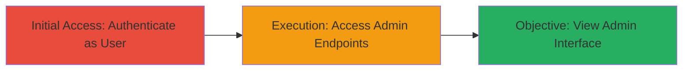

# Unauthorized Admin Panel Access via Improper Access Controls in lemlist

Multi-stage attack chain demonstrating unauthorized access to administrative interfaces on app.lemlist.com due to missing authorization checks.

## Chain Metrics Dashboard

| Metric | Value |
|--------|-------|
| Chain Status | Unverified |
| Total Steps | 2 |
| Execution Time | ~1 minute |
| Skill Level | Beginner |
| Complexity | Low |
| Impact Level | Informational |

## Attack Flow Visualization

## Prerequisites & Requirements

### Required Tools

- Web browser (e.g., Chrome, Firefox)

### Target Environment

- Web platform
- Target: app.lemlist.com
- Required services/ports: HTTPS (443)
- Network access requirements: Internet access to the target domain

### Initial Access Requirements

- Valid user credentials for a standard account on lemlist
- No elevated privileges needed initially
- Direct network access to the login page

## Detailed Attack Procedures

### Step 1: Authenticate as Normal User
procedure: [[procedures/Authenticate-as-Normal-User-on-lemlist]]

**Objective**: Gain authenticated session as a standard user to bypass initial login barriers.

**Instructions**: Navigate to the login page and enter standard user credentials to establish a session.

**Expected Output**: Successful login redirect to the user dashboard, with session cookies set in the browser.

**Success Indicators**:
- User dashboard loads without errors
- Account menu shows standard user permissions

### Step 2: Access Admin Panel Endpoints
procedure: [[procedures/Access-Admin-Panel-Endpoints]]

**Objective**: Exploit missing authorization to view sensitive admin interfaces.

**Instructions**: With an active session, directly navigate to unprotected admin URLs in the browser address bar.

**Expected Output**: Admin panel loads, displaying administrative views such as dashboard, i18n settings, or mailbox configurations.

**Success Indicators**:
- Admin interface elements visible (e.g., admin menus, data tables)
- No access denied errors; page renders successfully

## Attack Chain Summary

### Key Achievements

1. Authenticated access to the application as a standard user
2. Unauthorized viewing of admin panel without performing destructive actions
3. Exposure of potential sensitive administrative information through view-only access

## Technique & Tactic Coverage

### MITRE ATT&CK Techniques

- [[Valid Accounts]]
- [[Exploit Public-Facing Application]]

### MITRE ATT&CK Tactics

- [[Initial Access]]

---
*Last updated: 2023-10-01T00:00:00Z*
