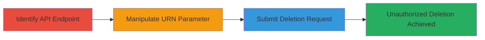

---
tags:
  - access-control-bypass
  - api
  - idor
  - linkedin
type: attack_chain
tools: []
tactics:
  - '[[Execution]]'
verified: false
platforms:
  - Web
submitted: true
complexity: medium
created_at: '2024-01-01T00:00:00Z'
procedures:
  - '[[procedures/Identify-LinkedIn-Learning-Comment-API]]'
  - '[[procedures/Manipulate-Comment-URN-for-Deletion]]'
  - '[[procedures/Execute-Unauthorized-Comment-Deletion]]'
step_count: 3
techniques:
  - '[[Exploit Public-Facing Application]]'
updated_at: '2025-12-14T17:32:29.112Z'
description: >-
  An authenticated attacker exploits improper access control in the LinkedIn
  Learning API to delete other users' comment replies by manipulating the
  comment URN parameter, disrupting Q&A discussions.
skill_level: intermediate
impact_level: high
id: e9159e04-792a-485b-83f6-0910f1eb0d91
validated: true
mitre_tactics:
  - '[[Execution]]'
mitre_techniques:
  - '[[Exploit Public-Facing Application]]'
---
# Unauthorized Deletion of LinkedIn Learning Comment Replies via API Access Control Bypass

Multi-stage attack chain demonstrating exploitation of improper access control in the LinkedIn Learning Q&A API to delete other users' comments.

## Chain Metrics Dashboard

| Metric | Value |
|--------|-------|
| Chain Status | Unverified |
| Total Steps | 3 |
| Execution Time | ~5 minutes |
| Skill Level | Intermediate |
| Complexity | Medium |
| Impact Level | High |

## Attack Flow Visualization



## Prerequisites & Requirements

### Required Tools

- Browser developer tools for inspecting network requests
- [[commands/curl-delete-comment]]

### Target Environment

- LinkedIn Learning platform
- Authenticated session to the API
- Web browser or API testing tool

### Initial Access Requirements

- Valid LinkedIn account with access to Learning courses
- Ability to view Q&A sections in courses
- Network access to LinkedIn APIs

## Detailed Attack Procedures

### Step 1: Identify Comment Deletion Functionality
procedure: [[procedures/Identify-LinkedIn-Learning-Comment-API]]

**Objective**: Locate and understand the API endpoint responsible for deleting comments in the Q&A section.

**Instructions**: Use browser developer tools to inspect network requests while interacting with the Q&A section of a LinkedIn Learning course. Look for DELETE requests to comment-related endpoints, noting the comment URN parameter that identifies specific comments.

**Expected Output**: Identification of the deletion API endpoint, such as `/comments/{urn}` or similar, and confirmation of the URN format (e.g., `urn:li:comment:12345`).

**Success Indicators**:
- API endpoint URL captured
- URN parameter observed in requests

### Step 2: Modify Comment URN to Target Other Users' Comments
procedure: [[procedures/Manipulate-Comment-URN-for-Deletion]]

**Objective**: Alter the comment URN in the deletion request to reference a comment owned by another user, bypassing ownership validation.

**Instructions**: Capture a legitimate deletion request for your own comment using developer tools. Replace the URN with one from another user's reply in the same thread. Prepare the modified request for submission using [[commands/curl-delete-comment]]:

```bash
curl -X DELETE 'https://api.linkedin.com/learning/comments/{modified_urn}' \
  -H 'Authorization: Bearer {your_access_token}' \
  -H 'Content-Type: application/json'
```

**Expected Output**: Prepared request with altered URN pointing to unauthorized comment.

**Success Indicators**:
- URN successfully modified without syntax errors
- Request body validated

### Step 3: Submit Modified Deletion Request
procedure: [[procedures/Execute-Unauthorized-Comment-Deletion]]

**Objective**: Send the tampered request to the API, resulting in the deletion of the targeted comment.

**Instructions**: Execute the modified deletion request using [[commands/curl-delete-comment]]. Monitor the response for success (e.g., 200 OK or 204 No Content). Verify in the UI that the other user's comment reply has been removed.

```bash
curl -X DELETE 'https://api.linkedin.com/learning/comments/{target_urn}' \
  -H 'Authorization: Bearer {access_token}' \
  -H 'Content-Type: application/json'
```

**Expected Output**: API response indicating successful deletion, such as `{"status": "deleted"}`.

**Success Indicators**:
- HTTP 2xx response received
- Target comment no longer visible in Q&A section

## Attack Chain Summary

### Key Achievements

1. Identified vulnerable API endpoint for comment deletion
2. Bypassed ownership checks via URN manipulation
3. Successfully deleted unauthorized content, demonstrating potential for abuse

## Technique & Tactic Coverage

### MITRE ATT&CK Techniques

- [[Exploit Public-Facing Application]]

### MITRE ATT&CK Tactics

- [[Execution]]

---
*Last updated: 2024-01-01T00:00:00Z*
