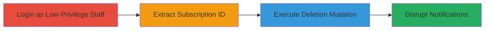

---
tags:
  - improper-authorization
  - authorization-bypass
  - shopify
  - graphql
type: attack_chain
tools: []
tactics:
  - '[[Privilege Escalation]]'
commands:
  - '[[commands/staffOrderNotificationSubscriptionDelete-Mutation]]'
platforms:
  - Web
  - Shopify
complexity: low
procedures:
  - '[[procedures/Login-to-Shopify-Admin-as-Low-Privilege-Staff]]'
  - '[[procedures/Extract-Staff-Order-Notification-Subscription-ID]]'
  - '[[procedures/Delete-Subscription-via-GraphQL-Mutation]]'
step_count: 3
techniques:
  - '[[Exploitation for Privilege Escalation]]'
description: >-
  Attack chain exploiting improper authorization in Shopify's GraphQL API to
  allow low-privilege staff members to delete order notification subscriptions,
  disrupting admin workflows.
skill_level: intermediate
impact_level: low
id: 2f930b73-5339-468b-9d76-f6c19f22d1d6
created_at: '2025-12-14T17:29:29.031Z'
updated_at: '2025-12-14T17:29:29.031Z'
verified: false
validated: true
submitted: true
mitre_tactics:
  - '[[Privilege Escalation]]'
mitre_techniques:
  - '[[Exploitation for Privilege Escalation]]'
---
# Unauthorized Deletion of Staff Order Notifications via Improper Authorization in Shopify GraphQL API

## Overview

This attack chain demonstrates an improper authorization vulnerability in Shopify's GraphQL API, where staff members with only 'Settings' permission can delete staff order notification subscriptions—a function intended for users with 'Order' permission. The exploit begins with logging in as a low-privilege staff account, extracting a subscription ID from admin settings, and executing a GraphQL mutation to delete it. This can disrupt notification workflows for store administrators, potentially delaying order processing. The vulnerability requires access to a valid staff account and is rated low severity (CVSS 2.7) due to the high privileges needed for initial access.

## Chain Metrics Dashboard

| Metric | Value |
|--------|-------|
| Chain Status | Unverified |
| Total Steps | 3 |
| Execution Time | ~5 minutes |
| Skill Level | Intermediate |
| Complexity | Low |
| Impact Level | Low |

## Attack Flow Visualization



## Prerequisites & Requirements

### Required Tools

- Web browser for admin access
- Tool for sending HTTP requests (e.g., curl or Postman)

### Target Environment

- Shopify Admin panel
- GraphQL API endpoint
- No specific ports; web-based access

### Initial Access Requirements

- Valid staff account credentials with 'Settings' permission
- Admin-level access to view settings (for ID extraction, potentially using a higher-priv account initially)
- Network access to the Shopify store subdomain

## Detailed Attack Procedures

### Step 1: Login to Shopify Admin as Low-Privilege Staff
procedure: [[procedures/Login-to-Shopify-Admin-as-Low-Privilege-Staff]]

**Objective**: Gain access to the Shopify admin panel using a staff account limited to 'Settings' permission to prepare for unauthorized actions.

**Instructions**: Navigate to the Shopify admin login page and authenticate with the low-privilege staff credentials. Verify permissions in the account settings to ensure only 'Settings' is granted.

**Expected Output**: Successful login to the admin dashboard with restricted access.

**Success Indicators**:
- Dashboard loads without errors
- Permission check confirms 'Settings' only, no 'Order' access

### Step 2: Extract Staff Order Notification Subscription ID
procedure: [[procedures/Extract-Staff-Order-Notification-Subscription-ID]]

**Objective**: Obtain the global ID (GID) of an existing staff order notification subscription from the admin settings page.

**Instructions**: Using an admin account (or if possible with the low-priv account), go to /admin/settings/notifications, create or view a staff order notification, and copy the ID from the URL (e.g., 82867191864). Format as gid://shopify/StaffOrderNotificationSubscription/82867191864.

**Expected Output**: Valid GID string for the subscription.

**Success Indicators**:
- ID extracted from URL
- GID in correct format for GraphQL use

### Step 3: Delete Subscription via GraphQL Mutation
procedure: [[procedures/Delete-Subscription-via-GraphQL-Mutation]]

**Objective**: Execute the unauthorized deletion of the notification subscription using the low-privilege session.

**Instructions**: With the low-privilege session active, send the GraphQL mutation using [[commands/staffOrderNotificationSubscriptionDelete-Mutation]] to the API endpoint, substituting the extracted GID.

```bash
curl -X POST https://yoursubdomain.myshopify.com/admin/internal/web/graphql/core?operation=SwitcherNoStores \
  -H "Content-Type: application/json" \
  -H "X-Shopify-Access-Token: YOUR_STAFF_TOKEN" \
  -d '{"query": "mutation{staffOrderNotificationSubscriptionDelete(staffOrderNotificationSubscriptionId:\"gid://shopify/StaffOrderNotificationSubscription/82867191864\"){userErrors{message}}}" }'
```

**Expected Output**: Response {"staffOrderNotificationSubscriptionDelete":{"userErrors":[]}}, confirming deletion.

**Success Indicators**:
- No user errors in response
- Subscription removed from settings page (verify by refreshing)

## Attack Chain Summary

### Key Achievements

1. Bypassed authorization to perform admin-only deletion with low privileges
2. Disrupted staff order notification workflows
3. Demonstrated GraphQL API permission misconfiguration in Shopify

## Technique & Tactic Coverage

### MITRE ATT&CK Techniques

- [[Exploitation for Privilege Escalation]]

### MITRE ATT&CK Tactics

- [[Privilege Escalation]]

---
*Last updated: 2023-10-01*
