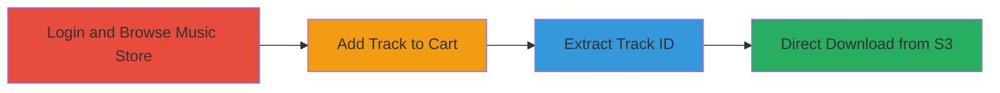

# Unauthorized Download of Paid Music Tracks via Missing Permission Check on Vimeo Music Store

Multi-stage attack chain demonstrating a complete attack workflow exploiting Vimeo's music store to bypass payment for downloading tracks stored on Amazon S3.

## Chain Metrics Dashboard

| Metric | Value |
|--------|-------|
| Chain Status | Unverified |
| Total Steps | 4 |
| Execution Time | ~5 minutes |
| Skill Level | Intermediate |
| Complexity | Medium |
| Impact Level | High |

## Attack Flow Visualization

## Prerequisites & Requirements

### Required Tools

- Web browser with developer tools (e.g., Chrome DevTools)

### Target Environment

- Vimeo web application
- Access to https://vimeo.com/musicstore
- Amazon S3 integration for track storage

### Initial Access Requirements

- Valid Vimeo user account (standard user credentials)
- Network access to Vimeo's web services
- No prior payment or purchase history required

## Detailed Attack Procedures

### Step 1: Login and Browse to Music Store
procedure: [[procedures/Login-and-Browse-Vimeo-Music-Store]]

**Objective**: Gain authenticated access to the Vimeo music store to prepare for track selection.

**Instructions**: Log in to Vimeo with a standard user account and navigate to the music store page to view available tracks.

**Expected Output**: Successful login and display of the music store catalog at https://vimeo.com/musicstore.

**Success Indicators**:
- User is authenticated and can browse tracks
- No access errors on the music store page

### Step 2: Add Non-Free Track to Cart
procedure: [[procedures/Add-Non-Free-Track-to-Cart-and-Extract-Track-ID]]

**Objective**: Select a paid track and trigger the add-to-cart action to generate the necessary request containing the track ID.

**Instructions**: Locate a non-free track (priced track) in the store, click the Add to Cart icon, and monitor the network request to capture the POST to /cart/music.

**Expected Output**: Track added to cart temporarily, with a POST request including track_id in the parameters.

**Success Indicators**:
- POST request to /cart/music observed with parameters like track_id, price, and license_id
- Track appears in cart without completing payment

### Step 3: Extract Track ID from Cart Request
procedure: [[procedures/Copy-Track-ID-from-Cart-Request]]

**Objective**: Inspect the network traffic from the add-to-cart action to obtain the track_id for the paid track.

**Instructions**: Use browser developer tools to inspect the POST request body or parameters from the /cart/music endpoint and copy the track_id value.

**Expected Output**: track_id value extracted, e.g., track_id=110947.

**Success Indicators**:
- Valid track_id copied from request (numeric ID for the target track)
- No errors in network inspection

### Step 4: Access Direct Download URL
procedure: [[procedures/Access-Direct-Download-URL-with-Track-ID]]

**Objective**: Use the extracted track_id to construct and access the download endpoint, bypassing payment verification.

**Instructions**: Construct the URL https://vimeo.com/musicstore/download?track_id=[extracted_track_id]&license_id=4 and send a GET request, which redirects to Amazon S3 for the track file.

**Expected Output**: Redirect to S3 URL and successful download of the paid track MP3 file.

**Success Indicators**:
- Download initiates without payment prompt
- Track file retrieved from S3 storage

## Attack Chain Summary

### Key Achievements

1. Authenticated access to Vimeo's music store without elevated privileges.
2. Extraction of sensitive track_id from cart addition requests.
3. Bypassing payment checks to directly download paid content from Amazon S3.
4. Demonstration of improper authentication leading to unauthorized data access.

## Technique & Tactic Coverage

### MITRE ATT&CK Techniques

- [[Exploit Public-Facing Application]]

### MITRE ATT&CK Tactics

- [[Collection]]

---
*Last updated: 2023-10-01T00:00:00Z*
