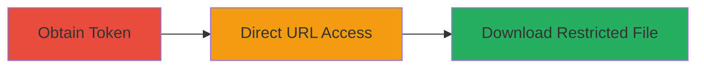

---
tags:
  - privilege-escalation
  - unauthorized-access
  - file-download
  - token-bypass
  - web-vulnerability
type: attack_chain
tools: []
tactics:
  - '[[Privilege Escalation]]'
  - '[[Initial Access]]'
verified: false
platforms:
  - Web
submitted: true
complexity: medium
created_at: '2023-10-01T00:00:00Z'
procedures:
  - '[[procedures/Obtain-File-Token-for-Restricted-Access]]'
  - '[[procedures/Bypass-Permissions-via-Direct-URL-Access]]'
step_count: 2
techniques:
  - '[[Exploitation for Privilege Escalation]]'
  - '[[Exploit Public-Facing Application]]'
updated_at: '2025-12-14T17:29:36.595Z'
description: >-
  A privilege escalation vulnerability allowing unauthorized users to download
  restricted files by directly accessing file URLs with a valid token, bypassing
  permission checks.
skill_level: intermediate
impact_level: medium
id: 44597f83-a9a3-4203-bb35-dcad934a8438
validated: true
mitre_tactics:
  - '[[Privilege Escalation]]'
  - '[[Initial Access]]'
mitre_techniques:
  - '[[Exploitation for Privilege Escalation]]'
  - '[[Exploit Public-Facing Application]]'
---
# Unauthorized Download of Restricted Files via Token-Bypassed URL Access in Lark Technologies

Multi-stage attack chain demonstrating a complete attack workflow for exploiting a permission bypass in file access mechanisms.

## Chain Metrics Dashboard

| Metric | Value |
|--------|-------|
| Chain Status | Unverified |
| Total Steps | 2 |
| Execution Time | ~5 minutes |
| Skill Level | Intermediate |
| Complexity | Medium |
| Impact Level | Medium |

## Attack Flow Visualization



## Prerequisites & Requirements

### Required Tools

- Web browser or [[commands/curl-download-file]]

### Target Environment

- Web platform (Lark Technologies application)
- Access to file sharing or collaboration features
- Knowledge of file tokens (via enumeration or prior access)

### Initial Access Requirements

- Valid file token for a restricted file
- Network access to the application's file download endpoints
- No special credentials beyond basic user access

## Detailed Attack Procedures

### Step 1: Obtain File Token
procedure: [[procedures/Obtain-File-Token-for-Restricted-Access]]

**Objective**: Acquire a valid token for a restricted file to enable direct URL construction.

**Instructions**: Enumerate or obtain the file token through legitimate application interactions, such as viewing file metadata in the Lark interface, or via API enumeration if exposed. Inspect network requests during normal file access to capture the token.

**Expected Output**: A string token associated with the target restricted file.

**Success Indicators**:
- Token extracted from application responses or metadata
- Token validated by attempting a legitimate access first

### Step 2: Bypass Permissions via Direct URL Access
procedure: [[procedures/Bypass-Permissions-via-Direct-URL-Access]]

**Objective**: Download the restricted file without permission checks by directly requesting the URL with the token.

**Instructions**: Construct the direct file URL using the obtained token (typically in the format `https://app.larksuite.com/file/download?token=VALID_TOKEN`). Use [[commands/curl-download-file]] to fetch the file:

```bash
curl -o restricted_file "https://app.larksuite.com/file/download?token=VALID_TOKEN"
```

Alternatively, paste the URL into a web browser to initiate the download.

**Expected Output**: The restricted file downloaded successfully to the local system.

**Success Indicators**:
- File contents accessible without permission prompts
- No access denied errors in response headers or body

## Attack Chain Summary

### Key Achievements

1. Bypassed permission validation on file download endpoints
2. Achieved unauthorized access to sensitive restricted files
3. Demonstrated medium-severity privilege escalation in web application

## Technique & Tactic Coverage

### MITRE ATT&CK Techniques

- [[Exploitation for Privilege Escalation]]
- [[Exploit Public-Facing Application]]

### MITRE ATT&CK Tactics

- [[Privilege Escalation]]
- [[Initial Access]]

---

*Last updated: 2023-10-01T00:00:00Z*
