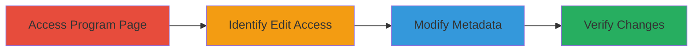

---
tags:
  - improper-authorization
  - authorization-bypass
  - web-vulnerability
type: attack_chain
tools: []
tactics:
  - '[[Privilege Escalation]]'
verified: false
platforms:
  - Web
submitted: true
complexity: low
created_at: '2023-10-01T00:00:00Z'
procedures:
  - '[[procedures/Exploit-Improper-Authorization-to-Edit-Program-Details]]'
step_count: 4
techniques:
  - '[[Exploitation for Privilege Escalation]]'
  - '[[Exploit Public-Facing Application]]'
updated_at: '2025-12-14T17:30:07.341Z'
description: >-
  Exploits improper authorization in HackerOne platform allowing privileged
  users to edit metadata of inactive public programs.
skill_level: intermediate
impact_level: medium
id: 04d4907a-9bfc-4d25-8dc9-63207f274277
validated: true
mitre_tactics:
  - '[[Privilege Escalation]]'
mitre_techniques:
  - '[[Exploitation for Privilege Escalation]]'
  - '[[Exploit Public-Facing Application]]'
---
# Unauthorized Editing of Churned Public Programs via Improper Authorization

Multi-stage attack chain demonstrating exploitation of improper authorization in HackerOne's platform, where users with external program maintenance privileges can access and modify details of churned (inactive) public programs. This leads to unauthorized changes to publicly visible metadata, compromising program integrity.

## Chain Metrics Dashboard

| Metric | Value |
|--------|-------|
| Chain Status | Unverified |
| Total Steps | 4 |
| Execution Time | ~5 minutes |
| Skill Level | Intermediate |
| Complexity | Low |
| Impact Level | Medium |

## Attack Flow Visualization

## Prerequisites & Requirements

### Required Tools

- Web browser (e.g., Chrome or Firefox)

### Target Environment

- HackerOne platform
- Access to a churned public program page (e.g., https://hackerone.com/uzbey)
- User account with external program maintenance privileges

### Initial Access Requirements

- Valid HackerOne account with privileges for maintaining external programs
- No additional authentication beyond standard login
- Direct network access to HackerOne (no VPN required)

## Detailed Attack Procedures

### Step 1: Navigate to Target Program Page
procedure: [[procedures/Exploit-Improper-Authorization-to-Edit-Program-Details]]

**Objective**: Access the page of a churned public program to begin reconnaissance for edit capabilities.

**Instructions**: Open a web browser and navigate to the URL of a churned public program, such as https://hackerone.com/uzbey. Ensure you are logged in with an account that has external program maintenance privileges.

**Expected Output**: The program page loads, displaying public details like the about section, website, and Twitter handle.

**Success Indicators**:
- Page loads without errors
- User is authenticated and can view program details

### Step 2: Observe the Edit Button
procedure: [[procedures/Exploit-Improper-Authorization-to-Edit-Program-Details]]

**Objective**: Identify the presence of an unauthorized edit button, indicating improper authorization checks.

**Instructions**: Inspect the program page for any edit functionality. Look for an 'edit' button near the program metadata sections, which should not appear for churned public programs.

**Expected Output**: An 'edit' button is visible and clickable, despite the program being inactive and public.

**Success Indicators**:
- Edit button appears on the page
- No authorization prompt blocks access to the button

### Step 3: Attempt to Edit the 'About' Field
procedure: [[procedures/Exploit-Improper-Authorization-to-Edit-Program-Details]]

**Objective**: Exploit the edit access to modify publicly visible program metadata, such as the about description.

**Instructions**: Click the 'edit' button to open the edit interface. Locate the 'about' section and enter test text, such as 'test @jobert', then save the changes.

**Expected Output**: The changes are saved without authentication challenges, allowing modification of fields like about description, website, Twitter handle, cover color, or logo.

**Success Indicators**:
- Edit interface opens without restrictions
- Changes are applied successfully

### Step 4: Verify the Change
procedure: [[procedures/Exploit-Improper-Authorization-to-Edit-Program-Details]]

**Objective**: Confirm the unauthorized modification has taken effect on the public program page.

**Instructions**: Refresh the program page or navigate back to the about section to check for the injected text.

**Expected Output**: The about page now displays the modified content, e.g., 'The goal of Uzbey is to create the worlds largest selfie to be launched into space. test @jobert'.

**Success Indicators**:
- Modified text appears publicly
- No reversion or error messages

## Attack Chain Summary

### Key Achievements

1. Gained unauthorized edit access to churned public program metadata
2. Modified visible fields like about description without proper checks
3. Demonstrated potential for broader impacts on program integrity, such as altering website or logo

## Technique & Tactic Coverage

### MITRE ATT&CK Techniques

- [[Exploitation for Privilege Escalation]] Exploitation for Privilege Escalation
- [[Exploit Public-Facing Application]] Exploit Public-Facing Application

### MITRE ATT&CK Tactics

- [[Privilege Escalation]] Privilege Escalation

---
*Last updated: 2023-10-01T00:00:00Z*
