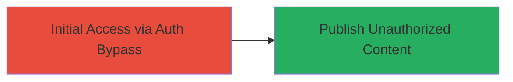

# Unauthorized Editorial Publishing in Phabricator Blog

Multi-stage attack chain demonstrating exploitation of improper authentication in Phabricator's blog publishing feature, enabling unauthorized posting to the live blog.

## Chain Metrics Dashboard

| Metric | Value |
|--------|-------|
| Chain Status | Unverified |
| Total Steps | 1 |
| Execution Time | ~5 minutes |
| Skill Level | Beginner |
| Complexity | Low |
| Impact Level | High |

## Attack Flow Visualization



## Prerequisites & Requirements

### Required Tools

- Web browser (e.g., Chrome or Firefox)

### Target Environment

- Phabricator instance with blog publishing enabled
- Access to blog.phacility.com or similar production blog
- No special ports required; standard HTTPS (443)

### Initial Access Requirements

- Public internet access to the target blog
- No credentials needed due to the vulnerability
- Basic understanding of web forms and HTTP requests

## Detailed Attack Procedures

### Step 1: Exploit Authentication Bypass and Publish Content
procedure: [[procedures/Exploit-Improper-Authentication-in-Phabricator-Blog]]

**Objective**: Bypass authentication checks to access and use the editorial publishing feature, posting unauthorized content to the live blog.

**Instructions**: Navigate to the Phabricator blog publishing interface without logging in. Use the web browser to access the editorial submission form directly. Fill in the form with malicious or unauthorized content and submit it. Alternatively, use developer tools or a proxy to inspect and replay the request if needed.

For verification, attempt to submit a test post using a simple HTTP request:

```bash
curl -X POST https://blog.phacility.com/editorial/submit \
  -d "title=Unauthorized Test Post" \
  -d "content=This is unauthorized content published via auth bypass." \
  -H "User-Agent: Mozilla/5.0"
```

**Expected Output**: The post appears live on the blog without any authentication prompt.

**Success Indicators**:
- Content published successfully on blog.phacility.com
- No login or auth error encountered
- Post visible publicly without admin intervention

## Attack Chain Summary

### Key Achievements

1. Bypassed authentication to access restricted publishing feature
2. Published unauthorized editorial content to production blog
3. Demonstrated high-impact unauthorized access leading to content manipulation

## Technique & Tactic Coverage

### MITRE ATT&CK Techniques

- [[Exploit Public-Facing Application]]

### MITRE ATT&CK Tactics

- [[Initial Access]]

---
*Last updated: 2023-10-01T12:00:00Z*
