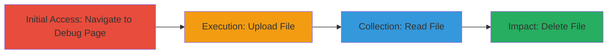

# Unauthorized File Upload, Read, and Delete via Exposed Debug Page

Multi-stage attack chain demonstrating exploitation of an improperly secured debug page on a web application, allowing unauthorized users to manipulate server files without authentication.

## Chain Metrics Dashboard

| Metric | Value |
|--------|-------|
| Chain Status | Unverified |
| Total Steps | 4 |
| Execution Time | ~5 minutes |
| Skill Level | Beginner |
| Complexity | Low |
| Impact Level | High |

## Attack Flow Visualization

## Prerequisites & Requirements

### Required Tools

- Standard web browser (e.g., Chrome, Firefox)

### Target Environment

- Web application with exposed debug endpoint
- No authentication required for the endpoint
- Network access to the target URL

### Initial Access Requirements

- Public internet access to the target domain
- No credentials needed
- Direct URL knowledge (e.g., https://target/debug)

## Detailed Attack Procedures

### Step 1: Initial Access
procedure: [[procedures/Access-Exposed-Debug-Page]]

**Objective**: Gain unauthorized entry to the debug page to access file management functions.

**Instructions**: Open a web browser and directly navigate to the exposed debug endpoint. No login or special tools are required as the page lacks access controls.

**Expected Output**: The debug page loads, displaying file upload, read, and delete interfaces.

**Success Indicators**:
- Page loads without authentication prompt
- Upload button and file list are visible

### Step 2: Execution
procedure: [[procedures/Upload-Arbitrary-Files-to-Server]]

**Objective**: Upload arbitrary files to the server, potentially introducing malicious or test files for further manipulation.

**Instructions**: On the debug page, click the 'Choose File' button to select a local file, enter the file path if needed, and click 'Upload Files' to submit. The file should appear in the server's file list.

**Expected Output**: Uploaded file listed on the page.

**Success Indicators**:
- File appears in the list after upload
- No error messages during submission

### Step 3: Collection
procedure: [[procedures/Read-JSON-File-Contents]]

**Objective**: Retrieve and view contents of uploaded or existing JSON files to access sensitive data.

**Instructions**: Select the target file from the list on the debug page and click 'Read File Content'. The contents will display if the file is in JSON format.

**Expected Output**: File contents rendered in the browser.

**Success Indicators**:
- JSON data visible without errors
- Ability to copy or screenshot contents

### Step 4: Impact
procedure: [[procedures/Delete-Files-from-Server]]

**Objective**: Remove files from the server to cover tracks or cause data loss.

**Instructions**: Select the file from the list and click 'Delete ENC Files' to remove it.

**Expected Output**: File disappears from the list.

**Success Indicators**:
- File no longer listed
- Confirmation of deletion (if provided)

## Attack Chain Summary

### Key Achievements

1. Bypassed access controls to reach sensitive file operations
2. Successfully uploaded and read arbitrary files, enabling data exposure
3. Deleted files, demonstrating potential for data loss

## Technique & Tactic Coverage

### MITRE ATT&CK Techniques

- [[Exploit Public-Facing Application]]

### MITRE ATT&CK Tactics

- [[Initial Access]]

---
*Last updated: 2023-10-01T00:00:00Z*
