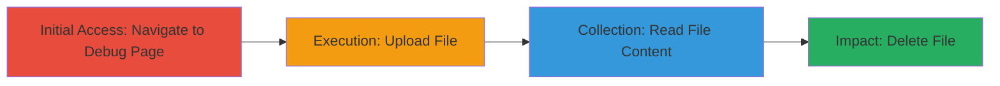

---
tags:
  - access-control
  - file-upload
  - file-read
  - file-delete
  - web-vulnerability
  - dod
type: attack_chain
tools: []
tactics:
  - '[[Initial Access]]'
verified: false
platforms:
  - Web
submitted: true
complexity: low
created_at: '2023-10-01T00:00:00Z'
procedures:
  - '[[procedures/Access-Unprotected-Debug-Endpoint]]'
  - '[[procedures/Upload-Arbitrary-File-via-Debug-Interface]]'
  - '[[procedures/Read-File-Content-from-Debug-Page]]'
  - '[[procedures/Delete-Files-using-Debug-Functionality]]'
step_count: 4
techniques:
  - '[[Exploit Public-Facing Application]]'
updated_at: '2025-12-14T05:32:10.290Z'
description: >-
  Multi-stage exploitation of an unprotected debug page on a DoD web
  application, enabling unauthorized file manipulation without authentication.
skill_level: beginner
impact_level: high
id: d3588090-509f-4a70-ae10-8e33660d2e87
validated: true
mitre_tactics:
  - '[[Initial Access]]'
mitre_techniques:
  - '[[Exploit Public-Facing Application]]'
---
# Unauthorized File Upload, Read, and Delete via Unprotected Debug Endpoint

Multi-stage attack chain demonstrating exploitation of an unprotected debug page on a U.S. Department of Defense web application, allowing unauthorized users to upload, read, and delete files without any authentication.

## Chain Metrics Dashboard

| Metric | Value |
|--------|-------|
| Chain Status | Unverified |
| Total Steps | 4 |
| Execution Time | ~5 minutes |
| Skill Level | Beginner |
| Complexity | Low |
| Impact Level | High |

## Attack Flow Visualization

## Prerequisites & Requirements

### Required Tools

- Web browser (e.g., Chrome, Firefox)

### Target Environment

- Web application hosted on DoD infrastructure
- Accessible public-facing endpoint (e.g., https://target-domain.com/debug)
- No prior authentication or network restrictions

### Initial Access Requirements

- Direct internet access to the target URL
- No credentials required due to lack of access controls
- Basic browser capabilities for form interactions

## Detailed Attack Procedures

### Step 1: Access Unprotected Debug Endpoint
procedure: [[procedures/Access-Unprotected-Debug-Endpoint]]

**Objective**: Gain entry to the debug interface without authentication to expose file manipulation features.

**Instructions**: Open a web browser and navigate directly to the debug endpoint URL, such as `https://█████/debug`. The page loads immediately, displaying UI elements for file operations including buttons for choosing, uploading, reading, and deleting files.

**Expected Output**: Debug page interface appears with no login prompt, showing file list and action buttons.

**Success Indicators**:
- Page loads successfully without errors or redirects
- UI buttons for file upload, read, and delete are visible and interactive

### Step 2: Upload Arbitrary File via Debug Interface
procedure: [[procedures/Upload-Arbitrary-File-via-Debug-Interface]]

**Objective**: Upload a malicious or test file to the server, potentially overwriting or adding sensitive data.

**Instructions**: On the debug page, click the 'Choose File' button to select a local file (e.g., a JSON file for testing). Enter the file path if needed, then click the 'Upload Files' button. The file is added to the server's file list visible on the page.

**Expected Output**: File appears in the debug page's file list, confirming successful upload.

**Success Indicators**:
- Selected file is processed and listed
- No error messages during upload

### Step 3: Read File Content from Debug Page
procedure: [[procedures/Read-File-Content-from-Debug-Page]]

**Objective**: Retrieve and view the contents of uploaded or existing files, enabling data exfiltration if sensitive information is present.

**Instructions**: From the file list on the debug page, select the target file (e.g., the recently uploaded JSON file) and click the 'Read File Content' button. The page displays the file's contents directly in the browser.

**Expected Output**: File contents are rendered on the page, particularly for JSON-formatted files.

**Success Indicators**:
- File contents load without errors
- Sensitive data (if present) is visible in plain text

### Step 4: Delete Files using Debug Functionality
procedure: [[procedures/Delete-Files-using-Debug-Functionality]]

**Objective**: Remove files from the server, potentially disrupting services or covering tracks by deleting evidence or critical application files.

**Instructions**: Select the target file from the list on the debug page and click the 'Delete ENC Files' button. The file is removed from the list and server storage.

**Expected Output**: File disappears from the list, confirming deletion.

**Success Indicators**:
- File is no longer listed or accessible
- No errors during deletion process

## Attack Chain Summary

### Key Achievements

1. Bypassed access controls to access sensitive debug features
2. Uploaded arbitrary files, risking tampering with application data
3. Read file contents, enabling potential data exposure
4. Deleted files, allowing service disruption

## Technique & Tactic Coverage

### MITRE ATT&CK Techniques

- [[Exploit Public-Facing Application]]

### MITRE ATT&CK Tactics

- [[Initial Access]]

---
*Last updated: 2023-10-01T00:00:00Z*
