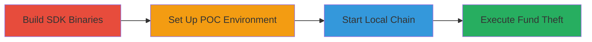

---

# Unauthorized Fund Transfer from Locking Accounts via Improper Sender Validation in Cosmos SDK

Multi-stage attack chain demonstrating exploitation of an improper access control vulnerability in the Cosmos SDK's lockup module, allowing arbitrary sender specification in SendCoins messages to steal unlocked funds from locking accounts.

## Chain Metrics Dashboard

| Metric | Value |
|--------|-------|
| Chain Status | Unverified |
| Total Steps | 4 |
| Execution Time | ~10 minutes |
| Skill Level | Intermediate |
| Complexity | Medium |
| Impact Level | High |

## Attack Flow Visualization



## Prerequisites & Requirements

### Required Tools

- [[tools/make]]
- [[tools/cargo]]
- [[tools/Go]]
- [[tools/Rust]]

### Target Environment

- Cosmos SDK-based blockchain (local testnet)
- Required services: Cosmos SDK lockup module, periodic-locking-account
- Network access: Localhost for chain startup

### Initial Access Requirements

- Access to Cosmos SDK source code repository
- Rust development environment
- No prior credentials needed; exploits public module vulnerability

## Detailed Attack Procedures

### Step 1: Build Cosmos SDK Binaries
procedure: [[procedures/Build-Cosmos-SDK-Binaries]]

**Objective**: Compile the latest Cosmos SDK binaries to ensure the vulnerable lockup module is available for local testing.

**Instructions**: Clone the Cosmos SDK repository and use [[commands/make-build]] to build the binaries, then update the path in the setup script.

```bash
make build
```

**Expected Output**: Compiled binaries in the build directory, ready for chain setup.

**Success Indicators**:
- Binaries compiled without errors
- Path updated in setup_chain script

### Step 2: Set Up Rust Project for POC
procedure: [[procedures/Set-Up-Rust-POC-Project]]

**Objective**: Prepare a Rust-based proof-of-concept client to interact with the Cosmos chain and craft malicious messages.

**Instructions**: Create a new Rust project using Cargo with the provided Cargo.toml, and add the necessary .rs files (main.rs, types.rs, client.rs, func.rs, msg.rs) to the src folder.

```bash
cargo init poc-project
# Copy Cargo.toml and .rs files to src/
```

**Expected Output**: Rust project initialized with dependencies for Cosmos SDK interaction.

**Success Indicators**:
- Project compiles without errors
- Dependencies resolved for blockchain client

### Step 3: Start the Local Cosmos Chain
procedure: [[procedures/Start-Local-Cosmos-Chain]]

**Objective**: Initialize and launch a local testnet chain using the built SDK to simulate the vulnerable environment.

**Instructions**: Make the setup script executable and run it to start the chain.

```bash
chmod +x setup_chain
./setup_chain
```

**Expected Output**: Local Cosmos chain started and running on localhost.

**Success Indicators**:
- Chain genesis block initialized
- Nodes listening on expected ports

### Step 4: Execute the Unauthorized Fund Transfer Attack
procedure: [[procedures/Execute-Unauthorized-Fund-Transfer]]

**Objective**: Create a locking account, lock funds, wait for unlock, and forge a MsgExecute to transfer funds to the attacker using an arbitrary sender.

**Instructions**: Run the Rust POC to perform the attack sequence: create periodic-locking-account (line 28 in main.rs), lock funds, wait for period end, and transfer via crafted message (line 55 in main.rs).

```bash
cargo run
```

**Expected Output**: Funds transferred from victim's locking account to attacker's address.

**Success Indicators**:
- Locking account created successfully
- Unlocked funds stolen without owner authorization

## Attack Chain Summary

### Key Achievements

1. Successful compilation of vulnerable Cosmos SDK
2. Local chain setup for reproducible exploitation
3. Demonstration of fund theft via sender forgery
4. Proof of full transfer capability from locking accounts

## Technique & Tactic Coverage

### MITRE ATT&CK Techniques

- [[Exploit Public-Facing Application]] Exploit Public-Facing Application
- [[Credentials In Files]] Credentials In Files (adapted for blockchain message forgery)

### MITRE ATT&CK Tactics

- [[Execution]] Execution
- [[Defense Evasion]] Defense Evasion

---

*Last updated: 2023-10-01T00:00:00Z*
