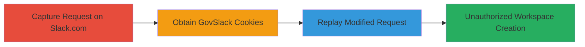

---

# Unauthorized GovSlack Workspace Creation via Authentication Bypass

Multi-stage attack chain demonstrating exploitation of authentication bypass in GovSlack to create unauthorized workspaces.

## Chain Metrics Dashboard

| Metric | Value |
|--------|-------|
| Chain Status | Unverified |
| Total Steps | 3 |
| Execution Time | ~5 minutes |
| Skill Level | Intermediate |
| Complexity | Medium |
| Impact Level | High |

## Attack Flow Visualization



## Prerequisites & Requirements

### Required Tools

- [[tools/Firefox]]
- [[tools/Firefox-DevTools]]

### Target Environment

- Web platform
- Access to slack.com and slack-gov.com
- No special ports required; standard HTTPS (443)

### Initial Access Requirements

- No prior credentials needed for slack.com signup
- Ability to attempt login on slack-gov.com
- Browser session management

## Detailed Attack Procedures

### Step 1: Capture Slack Workspace Creation Request
procedure: [[procedures/Capture-Slack-Workspace-Creation-Request]]

**Objective**: Obtain the HTTP POST payload for creating a workspace on slack.com to later modify for GovSlack.

**Instructions**: Use Firefox to create a test workspace on slack.com and capture the request via DevTools.

**Expected Output**: JavaScript fetch snippet for the /api/signup.createTeam endpoint.

**Success Indicators**:
- Fetch request copied successfully
- Payload includes multipart/form-data with parameters like email_misc, tz, locale

### Step 2: Obtain GovSlack Session Cookies
procedure: [[procedures/Obtain-GovSlack-Session-Cookies]]

**Objective**: Generate session cookies from a failed or restricted sign-in attempt on slack-gov.com.

**Instructions**: Attempt to sign in on slack-gov.com, where workspace creation is disabled, to capture cookies.

**Expected Output**: Browser cookies from the session, including any authentication-related ones.

**Success Indicators**:
- Cookies available in browser storage
- No successful login, but session established

### Step 3: Replay Modified Request to Create GovSlack Workspace
procedure: [[procedures/Replay-Modified-Request-to-Create-GovSlack-Workspace]]

**Objective**: Modify the captured request to target GovSlack API and execute with session cookies to bypass restrictions.

**Instructions**: Update the fetch URL to slack-gov.com, inject GovSlack cookies, and run the modified [[commands/fetch-create-slack-team]] in the browser console.

```javascript
await fetch("https://slack-gov.com/api/signup.createTeam?_x_id=noversion-1667355054.372", { ... });
```

**Expected Output**: Successful response creating a new GovSlack workspace, e.g., viomck.slack-gov.com.

**Success Indicators**:
- New workspace URL returned
- Access granted to GovSlack features without invitation

## Attack Chain Summary

### Key Achievements

1. Bypassed GovSlack's invitation-only creation controls
2. Created unauthorized workspace instances
3. Gained access to restricted government Slack environment

## Technique & Tactic Coverage

### MITRE ATT&CK Techniques

- [[Valid Accounts]]
- [[Exploit Public-Facing Application]]

### MITRE ATT&CK Tactics

- [[Initial Access]]

---

*Last updated: 2023-10-01T00:00:00Z*
