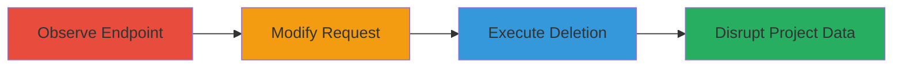

---
tags:
  - idor
  - privilege-escalation
  - web-vulnerability
  - php
type: attack_chain
tools: []
tactics:
  - '[[Privilege Escalation]]'
verified: false
platforms:
  - Web
submitted: true
complexity: medium
created_at: '2023-10-01T00:00:00Z'
procedures:
  - '[[procedures/Observe-Group-Creation-Endpoint-for-Abuse]]'
  - '[[procedures/Modify-Request-to-Target-Arbitrary-Project]]'
  - '[[procedures/Execute-Unauthorized-Group-Deletion]]'
step_count: 3
techniques:
  - '[[Exploitation for Privilege Escalation]]'
  - '[[Exploit Public-Facing Application]]'
updated_at: '2025-12-14T17:28:44.770Z'
description: >-
  A privilege escalation and IDOR vulnerability allowing authenticated users to
  delete groups in arbitrary projects by abusing the group creation endpoint.
skill_level: intermediate
impact_level: high
id: e3d584e3-6e31-4323-913b-01e713b141d8
validated: true
mitre_tactics:
  - '[[Privilege Escalation]]'
mitre_techniques:
  - '[[Exploitation for Privilege Escalation]]'
  - '[[Exploit Public-Facing Application]]'
---
# Unauthorized Group Deletion Across Projects in Localize via Endpoint Abuse

Multi-stage attack chain demonstrating a complete attack workflow exploiting a privilege escalation and IDOR vulnerability in the Localize platform.

## Chain Metrics Dashboard

| Metric | Value |
|--------|-------|
| Chain Status | Unverified |
| Total Steps | 3 |
| Execution Time | ~5 minutes |
| Skill Level | Intermediate |
| Complexity | Medium |
| Impact Level | High |

## Attack Flow Visualization



## Prerequisites & Requirements

### Required Tools

- Browser developer tools or proxy like Burp Suite for request manipulation

### Target Environment

- Localize web platform (PHP-based)
- Authenticated user session in at least one project
- No special services/ports required beyond standard HTTPS (443)

### Initial Access Requirements

- Valid user credentials for the Localize platform
- Network access to the application (typically over the internet)
- No prior elevated access needed; exploits from standard user context

## Detailed Attack Procedures

### Step 1: Observe Group Creation Endpoint
procedure: [[procedures/Observe-Group-Creation-Endpoint-for-Abuse]]

**Objective**: Identify the structure of the group creation endpoint to understand how it can be repurposed for deletion.

**Instructions**: Replicate a legitimate group creation request to inspect the endpoint behavior. Use [[commands/curl-observe-create-group]] to send a creation request and analyze the response for potential abuse vectors.

```bash
curl -X POST 'https://localize.example.com/pages/create_project/3F' \
  -H 'Content-Type: application/x-www-form-urlencoded' \
  -H 'Cookie: session=your_session_cookie' \
  -d 'CSRFToken=your_csrf_token&group_name=test_group'
```

**Expected Output**: Successful group creation response (e.g., JSON confirming new group ID), revealing the endpoint's parameter handling.

**Success Indicators**:
- Endpoint responds without errors
- Group creation succeeds, confirming parameter structure

### Step 2: Modify Request to Target Arbitrary Project
procedure: [[procedures/Modify-Request-to-Target-Arbitrary-Project]]

**Objective**: Alter the project ID in the URL to point to a different project, enabling cross-project manipulation.

**Instructions**: Change the project ID in the path from the user's owned project (e.g., '3F') to a target project (e.g., '8h'). Use [[commands/curl-modify-project-id]] to test the modified request without deletion parameters yet.

```bash
curl -X POST 'https://localize.example.com/pages/create_project/8h' \
  -H 'Content-Type: application/x-www-form-urlencoded' \
  -H 'Cookie: session=your_session_cookie' \
  -d 'CSRFToken=your_csrf_token&group_name=test'
```

**Expected Output**: Server processes the request for the foreign project without permission checks, indicating vulnerability.

**Success Indicators**:
- Request accepted for unauthorized project
- No 403/401 errors on project ID change

### Step 3: Execute Unauthorized Group Deletion
procedure: [[procedures/Execute-Unauthorized-Group-Deletion]]

**Objective**: Send the deletion parameter to remove a group in the target project by guessing sequential IDs.

**Instructions**: Include the `deleteGroup[id]` parameter with a guessed ID (e.g., 95) in the request to the modified endpoint. Use [[commands/curl-execute-group-deletion]] to perform the deletion.

```bash
curl -X POST 'https://localize.example.com/pages/create_project/8h' \
  -H 'Content-Type: application/x-www-form-urlencoded' \
  -H 'Cookie: session=your_session_cookie' \
  -d 'CSRFToken=your_csrf_token&deleteGroup[id]=95'
```

**Expected Output**: Server deletes the group without verifying permissions, returning a success or neutral response.

**Success Indicators**:
- Target group no longer visible in the project
- No permission errors; deletion succeeds

## Attack Chain Summary

### Key Achievements

1. Identified reusable endpoint for cross-project actions
2. Bypassed project-specific authorization via ID manipulation
3. Achieved unauthorized data disruption through group deletion

## Technique & Tactic Coverage

### MITRE ATT&CK Techniques

- [[Exploitation for Privilege Escalation]]
- [[Exploit Public-Facing Application]]

### MITRE ATT&CK Tactics

- [[Privilege Escalation]]

---
*Last updated: 2023-10-01T00:00:00Z*
