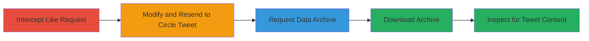

---
tags:
  - access-control-bypass
  - graphql
  - information-disclosure
  - twitter-circle
type: attack_chain
tools:
  - '[[tools/HTTP-Proxy-Tool]]'
tactics:
  - '[[Initial Access]]'
  - '[[Collection]]'
verified: false
platforms:
  - Web
submitted: true
complexity: medium
created_at: '2023-10-01T00:00:00Z'
procedures:
  - '[[procedures/Intercept-and-Modify-Like-Request]]'
  - '[[procedures/Request-Twitter-Data-Archive]]'
  - '[[procedures/Download-and-Inspect-Archive]]'
step_count: 5
techniques:
  - '[[Valid Accounts]]'
  - '[[Exploit Public-Facing Application]]'
  - '[[Data from Information Repositories]]'
updated_at: '2025-12-14T17:30:35.705Z'
description: >-
  Multi-stage attack exploiting improper access control in Twitter's
  FavoriteTweet GraphQL endpoint to like private Circle tweets and disclose
  their content through the user data archive.
skill_level: intermediate
impact_level: high
id: 86e3bc26-70ae-413b-9fea-01d3dda321ca
validated: true
mitre_tactics:
  - '[[Initial Access]]'
  - '[[Collection]]'
mitre_techniques:
  - '[[Valid Accounts]]'
  - '[[Exploit Public-Facing Application]]'
  - '[[Data from Information Repositories]]'
---
# Unauthorized Liking and Disclosure of Twitter Circle Tweets via FavoriteTweet GraphQL Endpoint

Multi-stage attack chain demonstrating exploitation of improper access control on Twitter's FavoriteTweet GraphQL endpoint to unauthorizedly like private tweets shared within a Twitter Circle, followed by extraction of the tweet content via the user's data archive.

## Chain Metrics Dashboard

| Metric | Value |
|--------|-------|
| Chain Status | Unverified |
| Total Steps | 5 |
| Execution Time | ~24 hours (due to archive preparation) |
| Skill Level | Intermediate |
| Complexity | Medium |
| Impact Level | High |

## Attack Flow Visualization

## Prerequisites & Requirements

### Required Tools

- [[tools/HTTP-Proxy-Tool]]

### Target Environment

- Web platform (Twitter.com)
- Required services: Twitter GraphQL API, Twitter data archive service
- Network access: Authenticated Twitter session

### Initial Access Requirements

- Valid Twitter account credentials (authenticated user)
- No membership in the target Twitter Circle
- Proxy tool configured to intercept HTTPS traffic (e.g., via browser proxy settings)

## Detailed Attack Procedures

### Step 1: Intercept Normal Like Request
procedure: [[procedures/Intercept-and-Modify-Like-Request]]

**Objective**: Capture a legitimate like request to understand the FavoriteTweet GraphQL endpoint structure.

**Instructions**: Configure your proxy tool to intercept traffic from your browser while logged into Twitter. Like a public tweet to trigger a POST request to the FavoriteTweet endpoint.

**Expected Output**: Intercepted POST request JSON payload containing the tweet_id and other parameters.

**Success Indicators**:
- Proxy captures the GraphQL mutation for liking a tweet
- Request includes variables like "tweetId" and authentication headers

### Step 2: Modify and Resend Request for Circle Tweet
procedure: [[procedures/Intercept-and-Modify-Like-Request]]

**Objective**: Alter the tweet_id to target a private Twitter Circle tweet and bypass access controls.

**Instructions**: In the proxy tool, edit the intercepted request's tweet_id variable to the ID of a target private Circle tweet (obtain ID via URL or API inspection). Forward the modified request.

**Expected Output**: 200 OK response from the GraphQL endpoint, indicating the like was accepted.

**Success Indicators**:
- Server responds with success without permission errors
- The like action completes despite no Circle membership

### Step 3: Request Account Data Archive
procedure: [[procedures/Request-Twitter-Data-Archive]]

**Objective**: Initiate download of the user's data archive, which will include liked tweets.

**Instructions**: Navigate to Twitter settings and submit a data archive request.

**Expected Output**: Confirmation email or page indicating the request is processing.

**Success Indicators**:
- Request submitted successfully
- Notification received that archive preparation has begun

### Step 4: Wait for and Download Data Archive
procedure: [[procedures/Request-Twitter-Data-Archive]]

**Objective**: Obtain the prepared archive containing the unauthorized like data.

**Instructions**: Monitor email for readiness notification (typically 24 hours), then download the ZIP archive from the provided link.

**Expected Output**: Downloadable ZIP file of the Twitter data archive.

**Success Indicators**:
- Email received with download link
- Archive file downloads without errors

### Step 5: Inspect Archive for Circle Tweet Content
procedure: [[procedures/Download-and-Inspect-Archive]]

**Objective**: Extract and view the full content of the private Circle tweet from the liked items.

**Instructions**: Unzip the archive, open the HTML index or data/like.js file, and search for the target tweet_id to reveal the tweet text, media, and metadata.

**Expected Output**: Full details of the private tweet displayed in the archive files.

**Success Indicators**:
- Tweet content visible in like.js or HTML
- Unauthorized private information disclosed

## Attack Chain Summary

### Key Achievements

1. Bypassed access controls on GraphQL endpoint to like private tweets
2. Leveraged Twitter's data archive feature for information exfiltration
3. Achieved disclosure of sensitive Circle-only content using a valid authenticated account

## Technique & Tactic Coverage

### MITRE ATT&CK Techniques

- [[Valid Accounts]] Valid Accounts
- [[Exploit Public-Facing Application]] Exploit Public-Facing Application
- [[Data from Information Repositories]] Data from Information Repositories

### MITRE ATT&CK Tactics

- [[Initial Access]] Initial Access
- [[Collection]] Collection

---

*Last updated: 2023-10-01T00:00:00Z*
